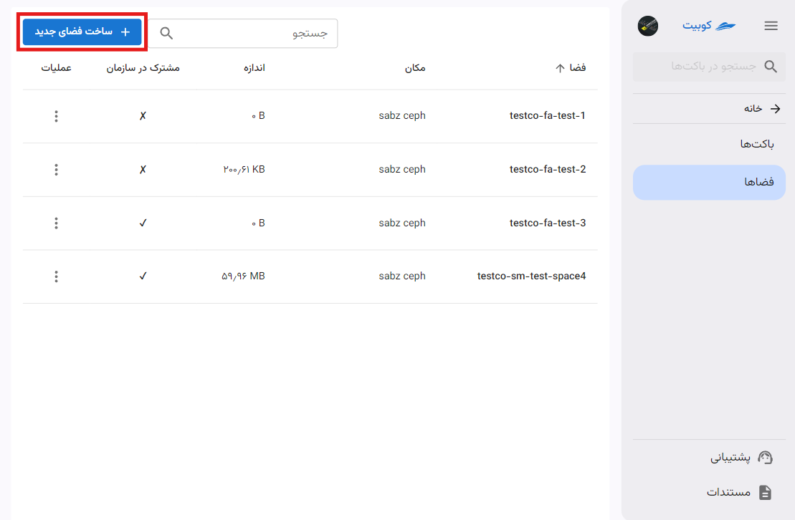
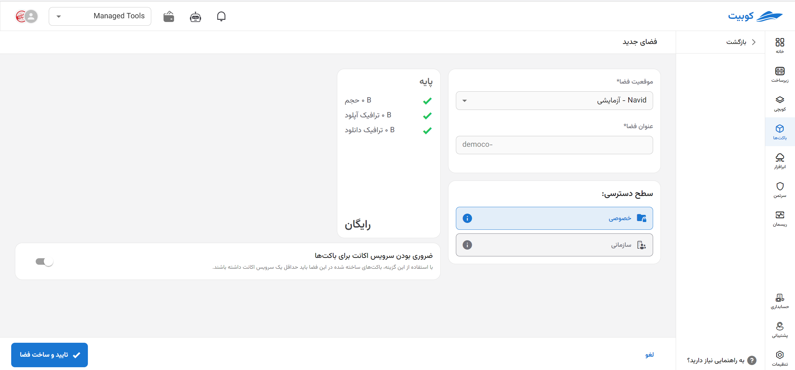
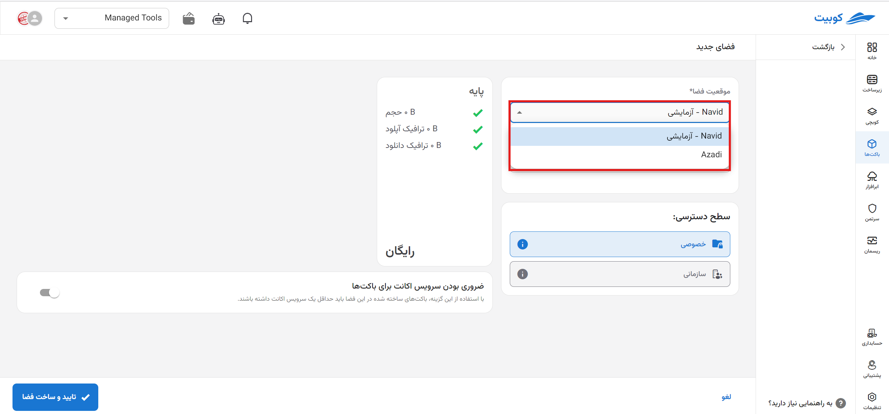
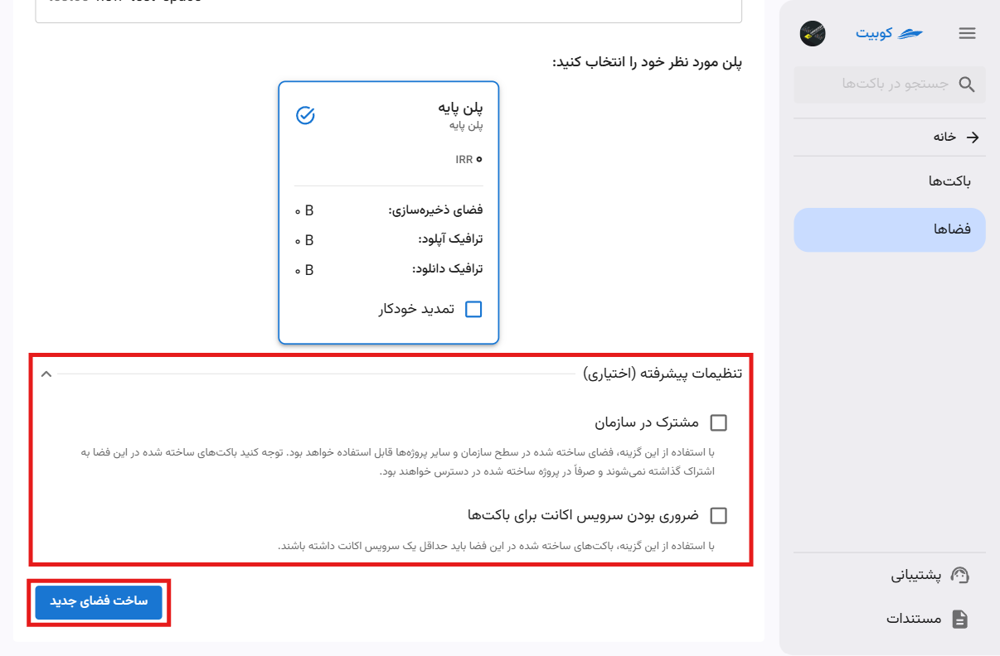

# ساخت فضای جدید

در صفحه سرویس باکت‌ها، پس از [انتخاب یک پروژه متصل](../bucket-settings#select-project)، به صفحه **فضاها** رفته و روی **ساخت فضای جدید** کلیک کنید:

ابتدا **مکان** را از لیست مکان‌های موجود انتخاب کرده و **نام** فضا را وارد کنید:

## تنظیمات پیشرفته (اختیاری)

### مشترک در سازمان

این گزینه فضا را در سطح سازمان و سایر پروژه‌های سازمان به اشتراک می‌گذارد و دیگر کاربران سازمان می‌توانند برای ساخت باکت، از این فضا استفاده کنند.
توجه داشته باشید که باکت‌های ساخته شده در این فضا تنها در پروژه منتسب به فضا قابل دسترس خواهند بود.

### ضروری بودن سرویس اکانت برای باکت‌ها

با فعال‌سازی این گزینه، باکت‌هایی که در این فضا ساخته می‌شوند، باید حداقل یک سرویس اکانت داشته باشند.
برای اطلاعات بیشتر درباره سرویس اکانت، می‌توانید به سند مفاهیم پایه، بخش [سرویس اکانت](../#service-account) مراجعه کنید.

در انتها روی **ساخت فضای جدید** کلیک کنید تا فضای موردنظر ایجاد شود.
