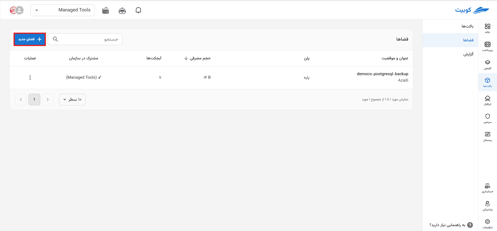

# ساخت فضای جدید

در صفحه سرویس باکت‌ها، پس از [اتصال](../getting-started#bind-project) / [انتخاب](../getting-started#select-project) پروژه، به صفحه **فضاها** رفته و روی **ساخت فضای جدید** کلیک کنید:

## گام اول: انتخاب مکان و نام

ابتدا **مکان** را از لیست مکان‌های موجود انتخاب کرده و **نام** فضا را وارد کنید:

## گام دوم: انتخاب پلن

از میان پلن‌های موجود، مطابق با نیاز خود یک پلن را انتخاب کنید:

:::info[پلن پیش‌فرض]
در صورت عدم انتخاب پلن در این مرحله، **پلن پایه** با فعال بودن گزینه **تمدید خودکار** به صورت پیش‌فرض انتخاب خواهد شد. همچنین پس از ساخت فضا، می‌توانید پلن انتخاب‌شده را تغییر دهید.
:::

## گام سوم: تنظیمات فضا

در بخش تنظیمات پیشرفته، تنظیمات بیشتری که برای فضا می‌توانید انجام دهید، شامل اشتراک‌گذاری فضا در سازمان و الزام انتخاب سرویس اکانت، وجود دارد که در ادامه به توضیح هرکدام پرداخته شده است.

:::info[اختیاری بودن تنظیمات پیشرفته]
تنظیمات اشتراک‌‌گذاری در سازمان و ضروری بودن سرویس اکانت برای باکت‌ها اختیاری بوده و پس از ساخت فضا، می‌توانید این تنظیمات را تغییر دهید.
:::

### مشترک در سازمان

این گزینه فضا را در سطح سازمان و سایر پروژه‌های سازمان به اشتراک می‌گذارد و دیگر کاربران سازمان می‌توانند برای ساخت باکت، از این فضا استفاده کنند.

:::tip[عدم دسترسی به فضای مشترک از پروژه‌های دیگر]
توجه داشته باشید که پروژه‌های دیگر به تنظیمات فضای به اشتراک‌گذاشته شده و باکت‌های آن، دسترسی نخواهند داشت و تنها می‌توانند برای ساخت باکت از فضای مشترک در سازمان استفاده کنند.
:::

### ضروری بودن سرویس اکانت برای باکت‌ها

با فعال‌سازی این گزینه، باکت‌هایی که در این فضا ساخته می‌شوند، باید حداقل یک سرویس اکانت داشته باشند.
برای اطلاعات بیشتر درباره سرویس اکانت، می‌توانید به سند مفاهیم پایه، بخش [سرویس اکانت](../#service-account) مراجعه کنید.

در انتها روی **ساخت فضای جدید** کلیک کنید تا فضای موردنظر ایجاد شود. اکنون می‌توانید نسبت به ساخت باکت در این فضا، اقدام کنید. برای مطالعه بیشتر به سند [ساخت باکت جدید](../create-bucket) مراجعه کنید.
