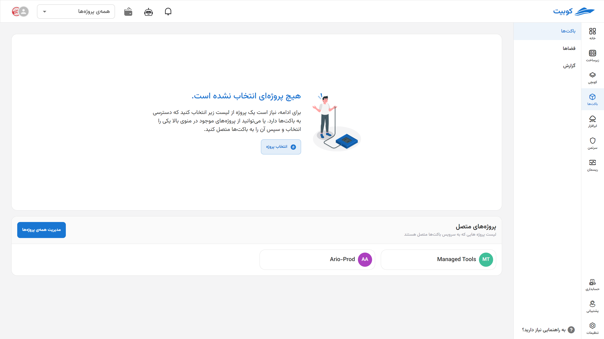

# شروع به کار

از سرویس باکت‌ها در پنل کوبیت، دسترسی به **باکت‌ها** و **فضاها** فراهم شده است.
همانطور که در [مفاهیم پایه](../#concepts) ذکر شد، باکت‌ها با فضا و فضاها با پروژه‌ها معنی پیدا می‌کنند. بنابراین، فضاهای سرویس باکت توسط پروژه‌ها تفکیک می‌شوند. برای شروع کار با باکت‌ها، ابتدا باید یکی از پروژه‌هایی که قبلا در قسمت [سازماندهی](../../organize) ساخته‌اید را به این سرویس متصل کنید، یا یکی از پروژه‌های متصل به باکت را انتخاب کنید. در ادامه به توضیح این فرآیند می‌پردازیم.

ابتدا از پنل کوبیت، وارد سرویس **باکت‌ها** شوید:

## اتصال پروژه به سرویس باکت{#bind-project}

- از طریق گزینه **همه‌ی‌ پروژه‌ها**، لیست پروژه‌های فعلی سازمان را باز کنید.
- از میان پروژه‌ها، پروژه موردنظر خود را انتخاب کنید.
- سپس خطای عدم اتصال پروژه ظاهر می‌شود. برای اتصال پروژه، روی دکمه **اتصال** کلیک کنید.

در انتها، پروژه به سرویس باکت متصل شده و به صفحه باکت‌های پروژه هدایت می‌شوید.

## انتخاب پروژه{#select-project}

در صفحه اول سرویس، لیستی از پروژه‌های متصل قابل مشاهده است. ابتدا باید پروژه موردنظر را از میان این لیست انتخاب کنید:

پس از انتخاب پروژه، به صفحه لیست باکت‌های پروژه، هدایت می‌شوید که حاوی نموداری از وضعیت فضای ذخیره‌سازی سازمان شامل **تعداد باکت‌ها**، **حجم فضای استفاده شده**، **ترافیک آپلود** و **ترافیک دانلود** است و در انتها لیست باکت‌های پروژه و مشترک در سازمان وجود دارد:

برای توضیحات بیشتر به مستندات [مدیریت باکت‌ها](../buckets) و [مدیریت فضاها](../spaces) مراجعه کنید.

:::tip[ساخت پروژه]
همچنین اگه تمایل به ایجاد پروژه جدید دارید، می‌توانید از طریق گزینه **ایجاد پروژه جدید** اقدام کنید:

سپس **عنوان** و **کلید** پروژه را وارد کرده و روی **ایجاد** کلیک کنید:

:::

## قطع اتصال پروژه

:::warning[عدم قطع اتصال]
در صورتی که منابع و داده‌هایی در باکت‌های پروژه وجود داشته باشند، امکان قطع اتصال پروژه از سرویس باکت وجود ندارد. ابتدا نسبت به خالی بودن و حذف باکت‌های پروژه اطمینان حاصل کنید.
:::

- برای قطع اتصال پروژه از سرویس باکت، می‌توانید از آیکون قطع اتصال روی کارت پروژه موردنظر اقدام کنید.
- سپس در صورت اطمینان، روی دکمه **تایید** دیالوگ باز شده کلیک کنید.
  
  
