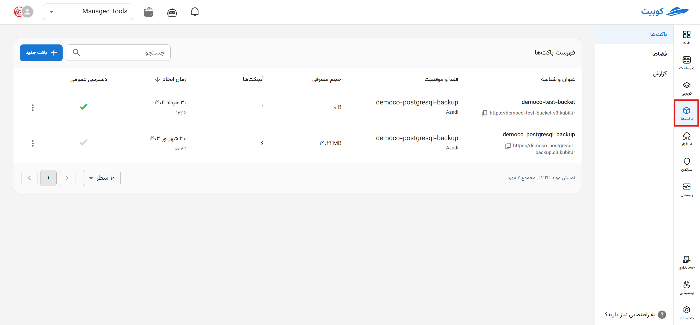

---
subDocuments:
  - concepts
  - getting-started
  - create-space
  - create-bucket
  - buckets
  - spaces
---

# فضای ابری (باکت‌ها)

فضای ذخیره سازی ابری مبتنی بر S3 سرویسی برای ذخیره سازی و بازیابی هر نوع داده ای از جمله دارایی های یک وبسایت، بک آپ ها، نرم افزار های مبتنی بر ابر است. این سرویس برخلاف مدل هایی مثل File System(ذخیره داده به صورت سلسله مراتب فایل ها مانند فایل اکسپلورر ویندوز) یا Block Storage (ذخیره داده به صورت بلوک های با اندازه مشخص) به شما اجازه می دهد تا داده ها به صورت آبجکت‌ها ذخیره کنید. هر آبجکت دارای شناسه و فراداده مربوط به خود است که می‌توان از آن برای دسترسی و دسته‌بندی بهتر آن آبجکت کمک گرفت.

پس از ایجاد [حساب کاربری](../account) خود در وبسایت کوبیک و [انتخاب پروژه](../organization) مربوطه، در ادامه از راه نمای گام به گام سرویس استفاده کنید.

### دسترسی سریع:

| [**استفاده از مرورگر تحت‌وب**](buckets/browser)                 | [**استفاده از مروگر S3**](buckets/browser#s3_Browser)                                      |
| --------------------------------------------------------------- | ------------------------------------------------------------------------------------------ |
| ابزار تحت وب پنل، ارائه شده به صورت گرافیکی برای مدیریت فایل‌ها | ابزاری ویندوزی که به شما امکان مدیریت و دسترسی آسان به فایل‌های فضای ذخیره‌سازی را می دهد. |

### توضیحات و راهنماهای گام به گام:

**\*نحوه استفاده با کد(SDK) در هر بخش مربوطه موجود است.**

- **نمای کلی [باکت](buckets) و [فضا](spaces)**: داشبورد اطلاعات کلی درباره هر باکت و فضا
- **[باکت ها و فضا ها](concepts)**: بررسی مفاهیم موجود در سرویس‌های مبتنی بر S3
- **[وبسایت استاتیک](buckets/static-website)**: استفاده از فضای ابری به عنوان بستر وبسایت
- **[مرورگر ها](buckets/browser)**: شیوه های دسترسی به فایل ها فضای ذخیره و مدیریت آن
- **مدیریت دسترسی [باکت](buckets/access-settings) و [فضا](spaces/access-settings)**: مدیریت سطح دسترسی کاربران از طریق سرویس اکانت ها
- **[مدیریت مجوز‌ها](buckets/policy) (Bucket Policy)**: مجوز‌های اعطایی عمومی برای مشخص کردن سطح دسترسی آبجکت و باکت در کار با باکت‌ها
- **[چرخه‌های عمر](buckets/lifecycle) (life cycles)**: مدت و نوع ماندگاری آبجکت‌ها در باکت‌ها
- **[تنظیمات CORS](buckets/cors)**: اشتراک گذاری منابع و آبجکت‌ها با مرورگرهای وب
