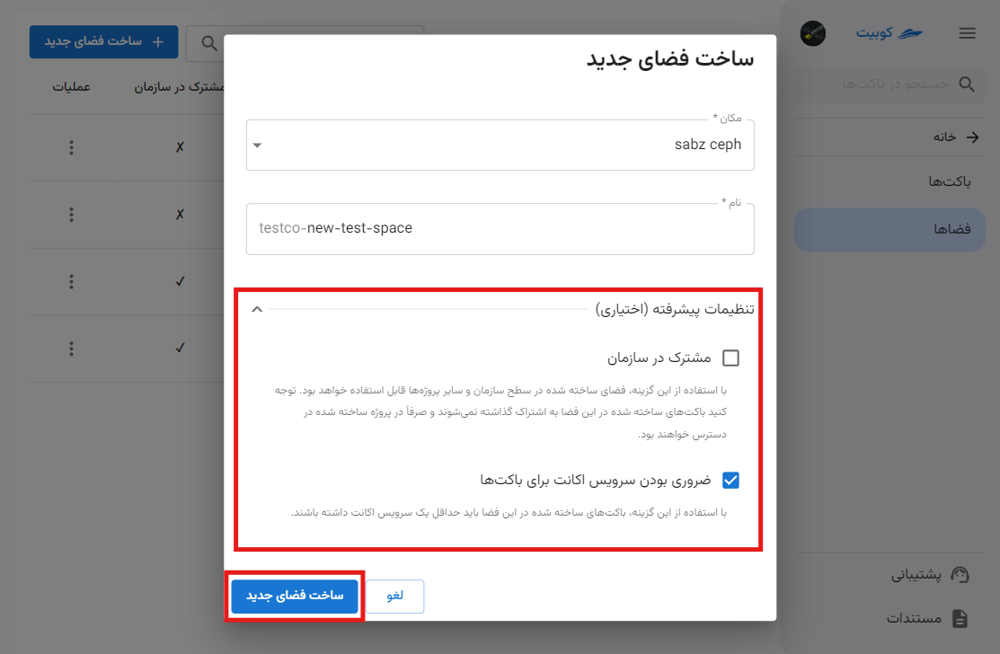

# فضا

در این صفحه، چارت گزارش از وضعیت فضای ذخیره‌سازی سازمان شما شامل **تعداد باکت‌ها**، **حجم فضای استفاده شده**، **ترافیک آپلود** و **ترافیک دانلود** به همراه لیستی از فضاهای سازمان (فضاهای پروژه انتخاب شده و فضاهای مشترک در سازمان) وجود دارد.

از صفحه سرویس باکت‌ها، روی **فضاها** کلیک کنید:

همانطور که مشاهده می‌کنید، در صفحه فضاها چارت گزارش در بازه‌های زمانی مختلف وجود دارد:

و لیست فضاهای پروژه انتخاب شده، در انتهای صفحه نیز قابل مشاهده می‌باشد:

## تنظیمات فضا

با کلیک روی نام هر فضا، به صفحه جزئیات آن شامل **نمای کلی** (چارت گزارش و باکت‌ها) و مدیریت **دسترسی‌ها** هدایت خواهید شد.
چارت گزارش:

لیست باکت‌های فضا:

با کلیک روی نام هر باکت، به صفحه آن باکت هدایت خواهید شد:

### مدیریت دسترسی‌ها

از منوی سمت راست صفحه جزئیات یک فضا، روی گزینه **دسترسی‌ها** کلیک کنید:

در این صفحه، به **کلیدهای دسترسی به فضا** و **لیست سرویس اکانت‌ها** دسترسی خواهید داشت:

#### سرویس اکانت‌ها

##### ساخت سرویس اکانت جدید

## ساخت فضای جدید

در پایین صفحه فضاها، روی **ساخت فضای جدید** کلیک کنید:

سپس فرم ایجاد فضا را با اطلاعات خواسته شده، شامل **مکان** و **نام** فضا پر کنید:

### تنظیمات پیشرفته (اختیاری)

- **مشترک در سازمان**

  این گزینه فضا را در سطح سازمان و سایر پروژه‌های سازمان به اشتراک می‌گذارد و دیگر کاربران سازمان می‌توانند برای ساخت باکت، از این فضا استفاده کنند.
  توجه داشته باشید که باکت‌های ساخته شده در این فضا تنها در پروژه منتسب به فضا قابل دسترس خواهند بود.

- **ضروری بودن سرویس اکانت برای باکت‌ها**

  با فعال‌سازی این گزینه، باکت‌هایی که در این فضا ساخته می‌شوند، باید حداقل یک سرویس اکانت داشته باشند.
  برای اطلاعات بیشتر درباره سرویس اکانت، می‌توانید به سند مفاهیم پایه، بخش [سرویس اکانت](../#service-account) مراجعه کنید.

در انتها روی **ساخت فضای جدید** کلیک کنید تا فضای موردنظر ایجاد شود.

## حذف فضا

- برای حذف فضا، کافیست روی دکمه سه نقطه فضای مربوطه کلیک کرده و گزینه **پاک کردن فضا** را انتخاب کنید.
- سپس با کلیک روی **پاک کردن**، فضا را حذف کنید.
  
  
