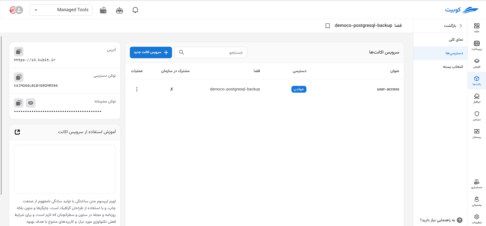
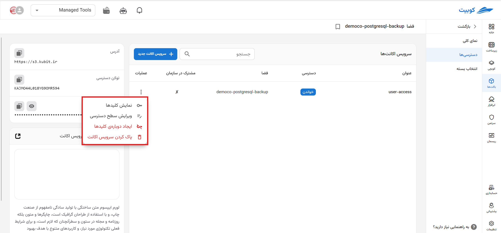
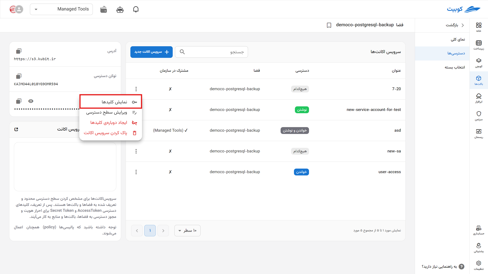
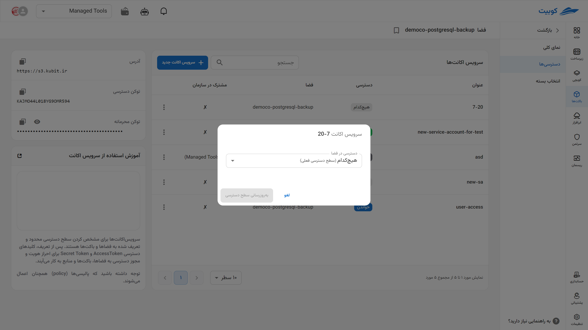
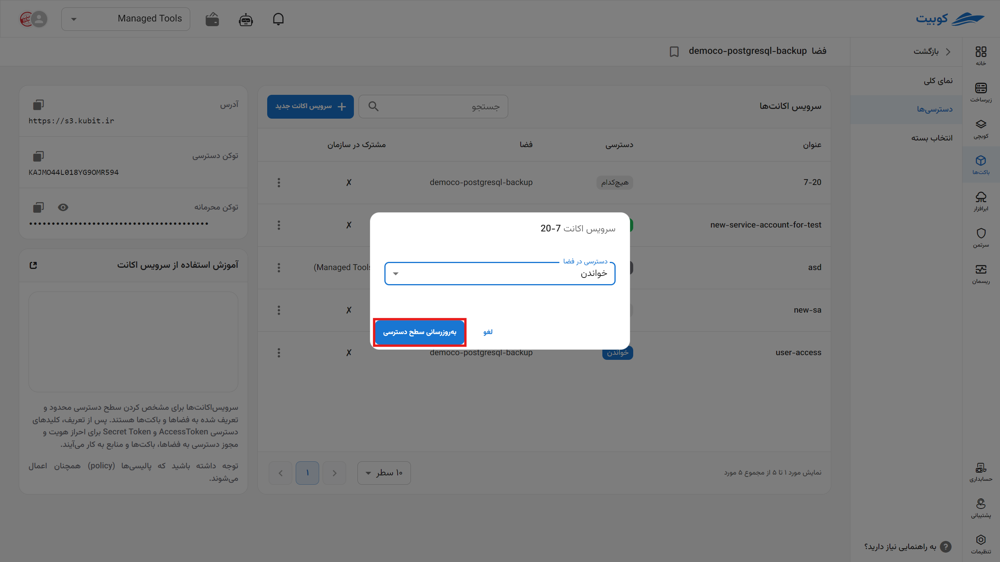
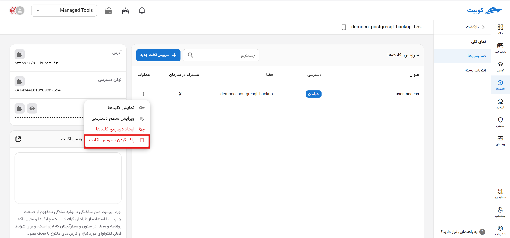

# دسترسی‌ها

در صفحه دسترسی‌ها، **توکن‌های دسترسی** و لیست **سرویس اکانت‌ها** وجود دارد:

در این صفحه، به **کلیدهای دسترسی به فضا** و **لیست سرویس اکانت‌ها** دسترسی خواهید داشت:

## سرویس اکانت‌ها

در این بخش، لیست سرویس اکانت‌های موجود به همراه اطلاعاتی چون **نام**، **وضعیت دسترسی در فضا**، **نام فضا** و **مشترک در سازمان** و امکان **ساخت سرویس اکانت جدید** وجود دارد.

### ساخت سرویس اکانت جدید

برای ساخت سرویس اکانت برای این فضا، روی دکمه **ساخت سرویس اکانت جدید** کلیک کنید:

**نام** را وارد کرده و نوع **دسترسی** را نیز انتخاب کنید:

در صورت تمایل برای به اشتراک گذاری سرویس اکانت در سطح سازمان، گزینه **مشترک در سازمان** را انتخاب کرده و روی **ایجاد** کلیک کنید:

سرویس اکانت با سطح دسترسی تعریف شده برای فضای انتخاب شده، ساخته می‌شود.

### عملیات‌های سرویس اکانت

در ستون عملیات و از طریق دکمه سه نقطه، لیستی از عملیات‌های موجود برای هر سرویس اکانت وجود دارد:

#### نمایش کلیدها

- ابتدا روی گزینه **نمایش کلیدها** کلیک کنید.
- در انتها پنجره‌ای حاوی کلیدهای Access Key و Secret Key منحصر به سرویس اکانت انتخاب شده، نمایش داده می‌شود.
  
  

#### ویرایش سطح دسترسی

- ابتدا روی گزینه **ویرایش سطح دسترسی** کلیک کنید.
- سپس از لیست دسترسی‌ها، سطح دسترسی موردنظر خود را انتخاب کنید.
- در انتها برای ویرایش سطح دسترسی روی **به‌روزرسانی سطح دسترسی** کلیک کنید.
  
  
  
  

#### ایجاد دوباره کلیدها

این عملیات، کلیدهای فعلی سرویس اکانت را باطل کرده و کلیدهای جدید را جایگزین آنها می‌کند.

- ابتدا روی گزینه **ایجاد دوباره کلیدها** کلیک کنید.
- در صورت اطمینان برای انجام این عملیات، روی گزینه **ایجاد دوباره‌ی کلیدها** کلیک کنید.
  
  

#### حذف سرویس اکانت

- ابتدا روی گزینه **حذف سرویس اکانت** کلیک کنید.
- در صورت تمایل برای حذف سرویس اکانت از باکت‌ها نیز، گزینه **پاک کردن سرویس اکانت از باکت‌های این فضا** را انتخاب کنید.
- در انتها برای انجام عملیات حذف، برای گزینه **پاک کردن سرویس اکانت** کلیک کنید.
  
  
