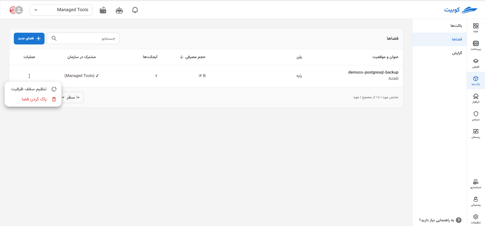
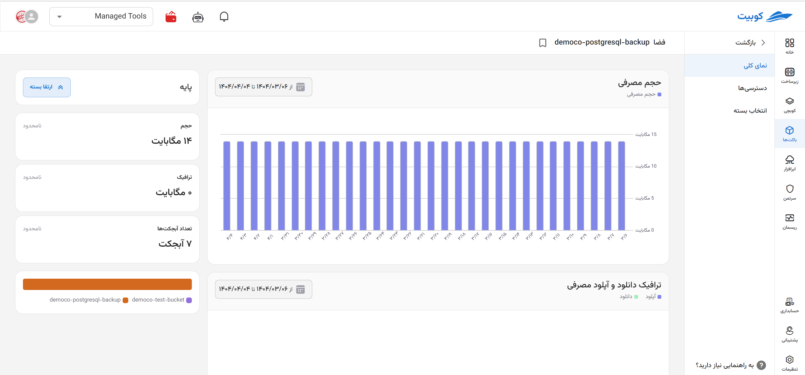
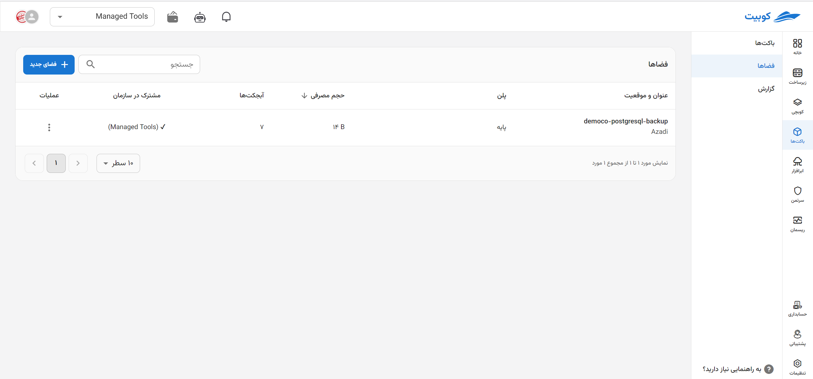
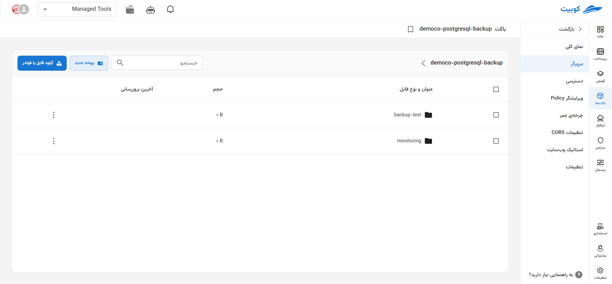

---
subDocuments:
  - access-settings
---

# مدیریت فضاها

در این صفحه، چارت گزارش از وضعیت فضای ذخیره‌سازی سازمان شامل **تعداد باکت‌ها**، **حجم فضای استفاده شده**، **ترافیک آپلود** و **ترافیک دانلود** به همراه **لیست فضاهای سازمان** (فضاهای پروژه انتخاب شده و فضاهای مشترک در سازمان) وجود دارد.

از صفحه سرویس باکت‌ها، پس از [اتصال](../getting-started#bind-project) / [انتخاب](../getting-started#select-project) پروژه، روی **فضاها** کلیک کنید:

همانطور که مشاهده می‌کنید، در صفحه فضاها چارت گزارش در بازه‌های زمانی مختلف وجود دارد:

## لیست فضاها

لیست فضاهای پروژه انتخاب شده، در انتهای صفحه نیز قابل مشاهده می‌باشد. در این لیست اطلاعاتی شامل **مکان**، **اندازه** و **مشترک در سازمان** به ازای هر فضا، وجود دارد:

## عملیات‌های هر فضا

در ستون عملیات و از طریق دکمه سه نقطه، لیستی از عملیات‌های موجود برای هر فضا وجود دارد. با کلیک روی هرکدام به صفحه/دیالوگ مربوطه هدایت خواهید شد:

### حذف فضا

:::warning[عدم حذف فضا]
در صورتی که باکتی در فضای انتخاب شده وجود داشته باشد، امکان حذف آن وجود ندارد. برای حذف، ابتدا باکت‌های موجود در فضا را حذف کنید.
:::

- برای حذف فضا، کافیست روی دکمه سه نقطه فضای مربوطه کلیک کرده و گزینه **پاک کردن فضا** را انتخاب کنید.
- سپس با کلیک روی **پاک کردن**، فضا را حذف کنید.
  
  

### نمای کلی

لیست باکت‌های فضا:

با کلیک روی نام هر باکت، به صفحه [مرورگر باکت](../buckets/browser) هدایت خواهید شد:

