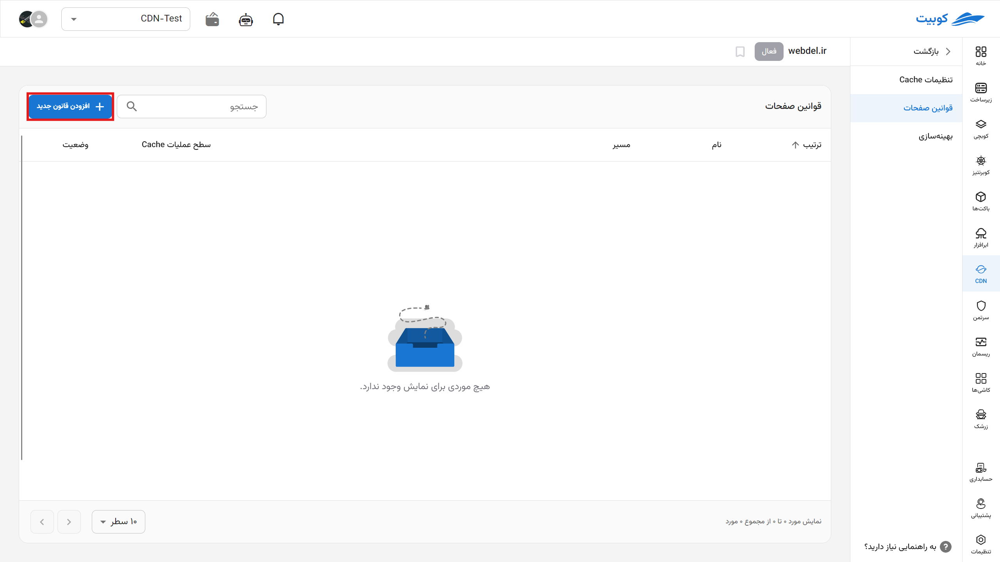
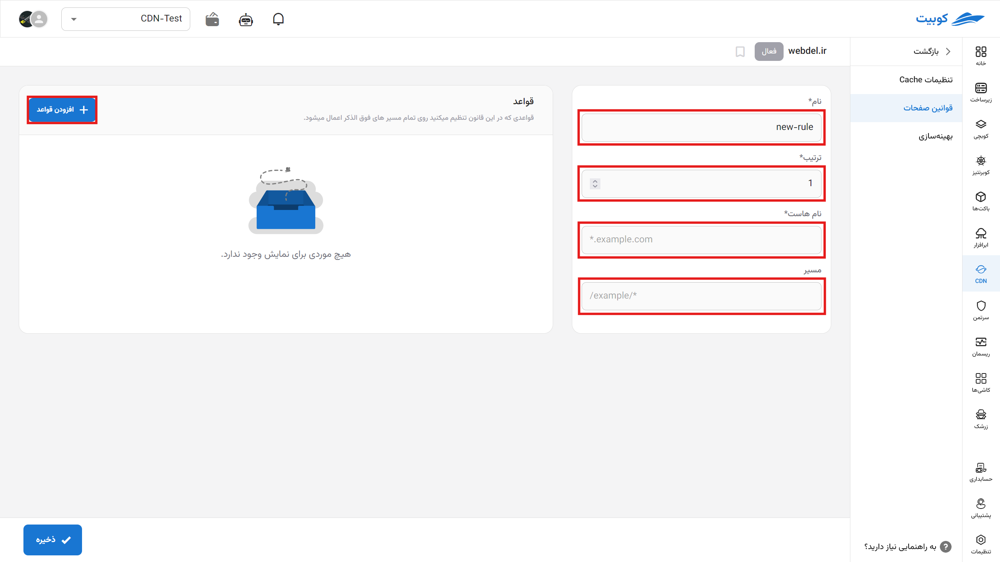
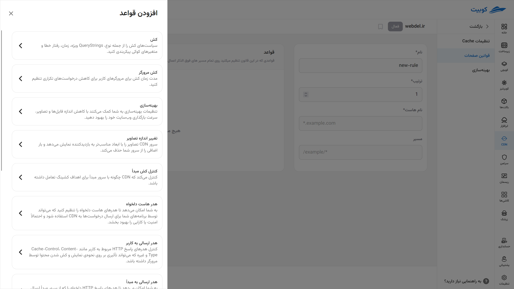

# قوانین صفحات

در این بخش قوانین cdn را مشخص نمایید و با افزودن قانون جدید به صورت پیشرفته ترافیک سایت را مدیریت کنید.

## افزودن قانون جدید

برای افزودن قانون جدید از این تب روی افزودن قانون جدید کلیک می‌کنیم.

در این بخش جزئیات مربوط به اجرای قانون را مشاهده می‌کنیم:

- نام قانون
- ترتیب اجرای آن (نزولی و مقدار کمتر زودتر)
- نام هاست
- مسیر
  

با انتخاب گزینه **افزودن قواعد** لیست قوانین را در این بخش مشاهده و براساس نیاز خود یک گزینه را انتخاب می‌کنیم.

## لیست قوانین صفحات

### کش (Cache)

#### سیاست‌های کش

امکان پیکربندی سیاست‌های کشینگ از جمله موارد زیر را فراهم می‌کند:

- **نوع کش** (مانند کش موقت یا دائم)
- **رفتار نسبت به Query String** (کش کردن نسخه‌های مختلف بر اساس پارامترهای URL)
- **مدت زمان اعتبار محتوا**
- **رفتار هنگام بروز خطا**
- **تأثیر متغیرهای کوکی بر کش**

#### کش مرورگر

مدت زمان ذخیره فایل‌ها در کش مرورگر کاربر را تعیین می‌کند تا از درخواست‌های مکرر به سرور جلوگیری شود. این کار به کاهش پهنای باند و افزایش سرعت سایت کمک می‌کند.

### بهینه‌سازی (Optimization)

#### فشرده‌سازی فایل‌ها

با فشرده‌سازی فایل‌های CSS، JavaScript و HTML، حجم محتوا کاهش یافته و زمان بارگذاری صفحات کوتاه‌تر می‌شود.

#### کاهش اندازه تصاویر

تصاویر به‌صورت خودکار فشرده یا بهینه می‌شوند تا بدون افت محسوس کیفیت، حجم آنها کاهش یابد.

#### تغییر اندازه تصاویر (Image Resizing)

تصاویر به‌صورت پویا بر اساس ابعاد مناسب دستگاه بازدیدکننده (مانند موبایل یا دسکتاپ) تغییر اندازه داده می‌شوند. این کار بار روی سرور را کاهش داده و تجربه کاربری را بهبود می‌دهد.

### کنترل کش مبدأ (Origin Cache Control)

تعیین می‌کند که CDN چگونه از دستورهای کشینگ ارسال‌شده از سرور مبدأ پیروی کند. این تنظیمات مشخص می‌کنند که آیا هدرهایی مانند `Cache-Control` و `Expires` از مبدأ رعایت شوند یا خیر.

### هدرها (HTTP Headers)

#### هدر هاست دلخواه

امکان تعیین یک مقدار سفارشی برای هدر `Host` در هنگام ارسال درخواست به سرور مبدأ را فراهم می‌کند. این قابلیت می‌تواند در تنظیمات پیشرفته مانند دسترسی به منابع مجزا یا تست محیط‌های مختلف مفید باشد.

#### هدر ارسالی به کاربر

کنترل هدرهای HTTP ارسال‌شده از سمت CDN به مرورگر کاربر مانند:

- `Cache-Control` (تنظیم رفتار کش در مرورگر)
- `Content-Type` (نوع محتوا)
- `Access-Control-Allow-Origin` (برای CORS)

#### هدر ارسالی به مبدأ

قابلیت تنظیم یا افزودن هدرهای HTTP در هنگام ارسال درخواست به سرور مبدأ، مانند:

- `Authorization`
- `X-Forwarded-For`
- `User-Agent`

#### نادیده‌ گرفتن هدر ارسالی به کاربر

تمام یا برخی از هدرهایی که از مبدأ ارسال می‌شوند و باید به کاربر برسند، نادیده گرفته شده و به‌جای آن از مقادیر پیش‌فرض CDN استفاده می‌شود.

#### نادیده‌ گرفتن هدر ارسالی به مبدأ

این تنظیم مشخص می‌کند که هنگام ارسال درخواست از سمت CDN به سرور مبدأ، هدرهای پیش‌فرض به‌جای هدرهای سفارشی‌شده توسط مرورگر یا کلاینت ارسال شوند.

### انتقال نشانی (URL Redirection)

پیکربندی رفتار انتقال URL هنگام مواجهه با تغییراتی مانند:

- انتقال از دامنه قدیمی به جدید
- تغییر ساختار URL
- هدایت از نسخه HTTP به HTTPS (یا بالعکس)

### زمان انقضا (Timeouts)

تنظیم محدودیت‌های زمانی برای ارتباط بین CDN و سرور مبدأ شامل:

- **Timeout اتصال**: حداکثر زمان انتظار برای اتصال به سرور
- **Timeout خواندن**: حداکثر زمان انتظار برای دریافت پاسخ از سرور
- **Timeout ارسال**: حداکثر زمان مجاز برای ارسال داده‌ها

### کش بر اساس نوع دستگاه (cache by device type)

محتوای متفاوت برای دستگاه‌های مختلف (موبایل، تبلت، دسکتاپ) کش می‌شود تا نسخه بهینه‌شده برای هر نوع نمایشگر ارسال گردد. این قابلیت برای سایت‌هایی با طراحی واکنش‌گرا (responsive) بسیار مفید است.
