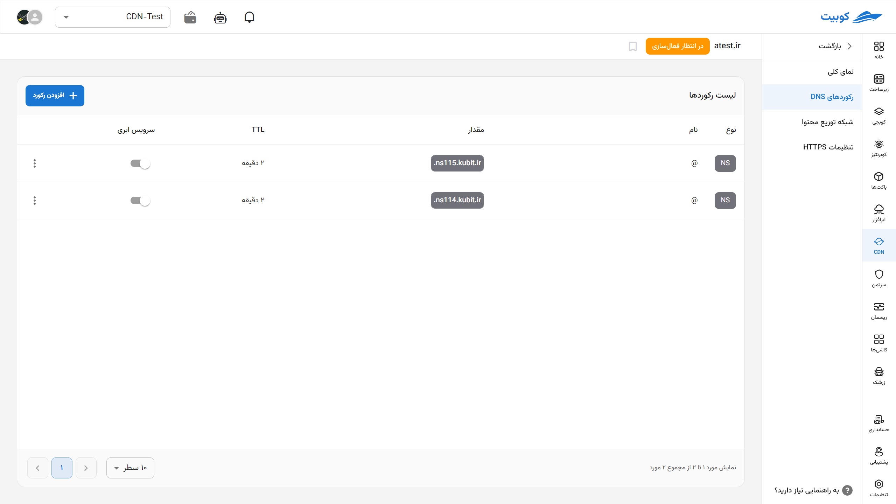
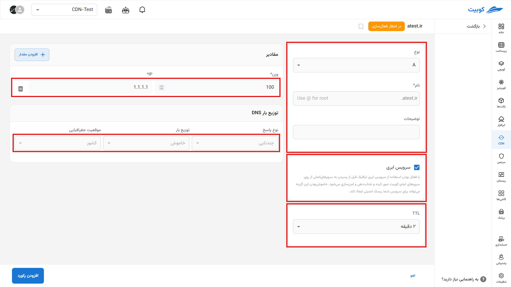
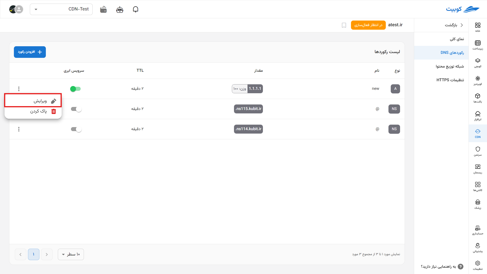

# تنظیمات DNS یا سامانه‌ی نام دامنه (گام اول)

در این بخش رکوردهای ثبت شده خود را می‌بینید و می‌توانید آن‌ها را ویرایش کنید یا یک مورد جدید اضافه کنید.

## تنظیم رکورد جدید

برای تنظیم رکورد جدید ابتدا روی رکورد جدید کلیک کنید.

سپس گزینه‌ها را با مقادیر لازم پر کنید:

- نوع رکورد را مشخص کنید.
- TTL را به صورت بهینه تنظیم کنید.
- باقی فیلدها را بر اساس نوع رکورد تنظیم کنید.
- در آخرین فیلد، توضیحات مربوط به این رکورد را وارد کنید.
- 

## ویرایش رکورد

با کلیک روی رکورد مد نظر می‌توانید تنظیمات آن را مانند بالا ویرایش کنید.

## تنظیم نوع رکورد (Record Type)

| نوع رکورد | توضیحات                                                                                                                                                                                                                                                          |
| --------- | ---------------------------------------------------------------------------------------------------------------------------------------------------------------------------------------------------------------------------------------------------------------- |
| **A**     | رکورد A (Address Record) یکی از پرکاربردترین رکوردهای DNS است که نام دامنه را به یک آدرس IPv4 نگاشت می‌کند. هر زمان که کاربری نام دامنه‌ای مانند `example.com` را وارد می‌کند، این رکورد به مرورگر می‌گوید به کدام آدرس IP (مثلاً `192.0.2.1`) مراجعه کند.       |
| **AAAA**  | مشابه رکورد A عمل می‌کند، با این تفاوت که رکورد AAAA برای نگاشت نام دامنه به یک آدرس **IPv6** به‌کار می‌رود. با افزایش استفاده از IPv6، این رکورد اهمیت بیشتری پیدا کرده است.                                                                                    |
| **ANAME** | این رکورد ترکیبی از ویژگی‌های A و CNAME است. بر خلاف CNAME که در ریشه دامنه مجاز نیست، ANAME می‌تواند در ریشه استفاده شود و به‌صورت خودکار به آدرس IP ترجمه می‌شود. این رکورد برای نگاشت دامنه‌ی اصلی (apex) به یک نام دیگر بسیار مفید است.                      |
| **CAA**   | رکورد CAA (Certification Authority Authorization) مشخص می‌کند که کدام شرکت‌ها یا مراجع صدور گواهی SSL مجاز هستند برای دامنه‌ی شما گواهی صادر کنند. این رکورد از صدور ناخواسته یا غیرمجاز گواهی‌ها جلوگیری می‌کند و امنیت سایت را افزایش می‌دهد.                  |
| **CNAME** | رکورد CNAME (Canonical Name) یک دامنه را به دامنه‌ای دیگر ارجاع می‌دهد. مثلاً اگر `blog.example.com` یک CNAME برای `example-blog.host.com` باشد، مرورگر ابتدا به مقصد دوم می‌رود. برای زیردامنه‌ها بسیار کاربردی‌ست، ولی نباید در ریشه (root) دامنه استفاده شود. |
| **MX**    | رکورد MX (Mail Exchange) تعیین می‌کند که ایمیل‌های ارسالی به دامنه شما به کدام سرور منتقل شوند. این رکورد برای راه‌اندازی سرویس‌های ایمیل مانند Gmail، Zoho یا Microsoft 365 ضروری است. اولویت‌دهی بین چند سرور نیز از طریق مقدار "priority" صورت می‌گیرد.       |
| **NS**    | رکورد NS (Name Server) مشخص می‌کند که کدام سرورها مسئول پاسخ‌دهی به درخواست‌های DNS برای یک دامنه هستند. این رکورد پایه‌ای برای کارکرد کل سیستم DNS است، زیرا تعیین می‌کند دامنه به کدام DNS سرورها متصل است.                                                    |
| **PTR**   | رکورد PTR (Pointer) در DNS معکوس استفاده می‌شود و آدرس IP را به یک نام دامنه نگاشت می‌کند. این رکورد برای تأیید هویت سرورها، به‌ویژه در ایمیل‌سرورها، اهمیت بالایی دارد.                                                                                         |
| **SRV**   | رکورد SRV برای تعریف سرویس‌هایی مانند VoIP، پیام‌رسانی، یا دایرکتوری (مثل LDAP) استفاده می‌شود. این رکورد شامل اطلاعاتی مانند شماره پورت، اولویت و وزن است و به برنامه‌ها اجازه می‌دهد که مستقیماً به سرویس مناسب متصل شوند.                                     |
| **TLSA**  | این رکورد در ترکیب با پروتکل DANE استفاده می‌شود و امکان بررسی گواهی‌های TLS (مثلاً HTTPS) را بر اساس اطلاعات منتشرشده در DNS فراهم می‌کند. هدف آن افزایش امنیت و جلوگیری از حملات به زنجیره گواهی‌هاست.                                                         |
| **TXT**   | رکورد TXT امکان ذخیره‌ی داده‌های متنی در DNS را فراهم می‌کند. این رکورد برای تأیید دامنه (مثلاً برای Google یا Facebook)، SPF، DKIM، و DMARC در ایمیل و همچنین اطلاعات سفارشی دیگر به‌کار می‌رود.                                                                |
