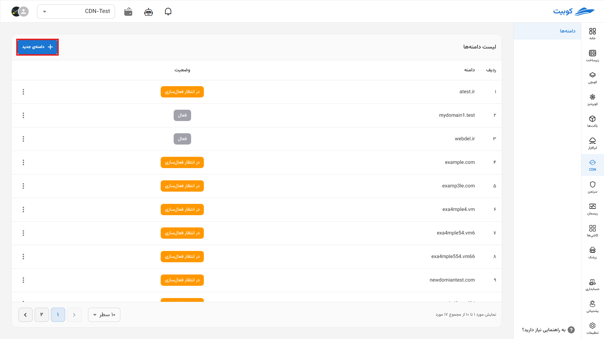
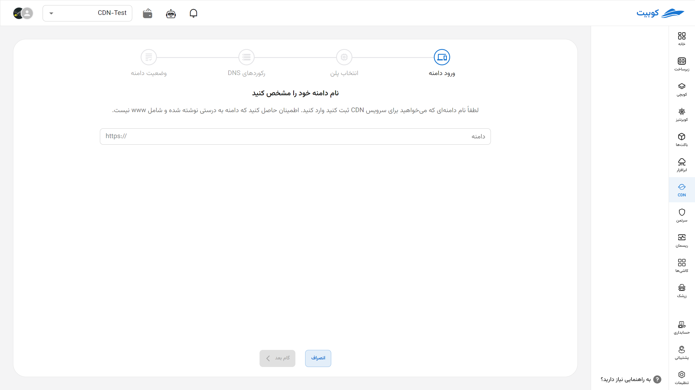
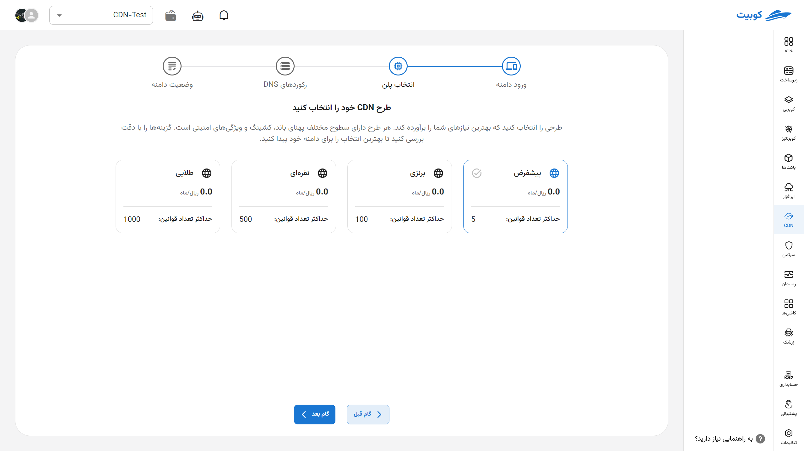
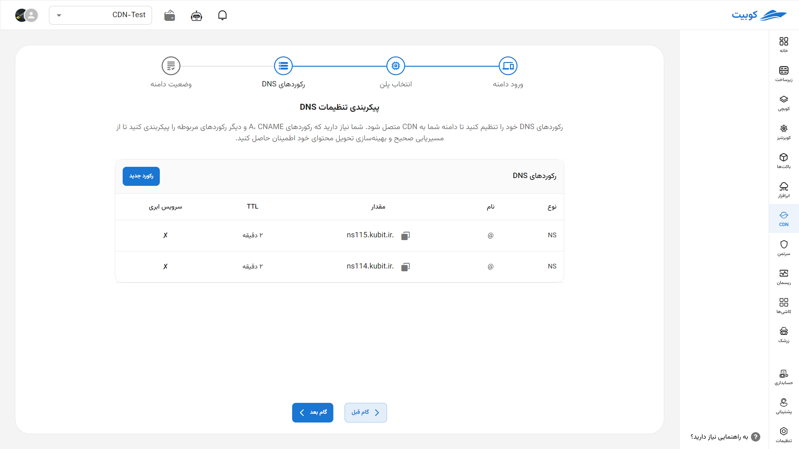
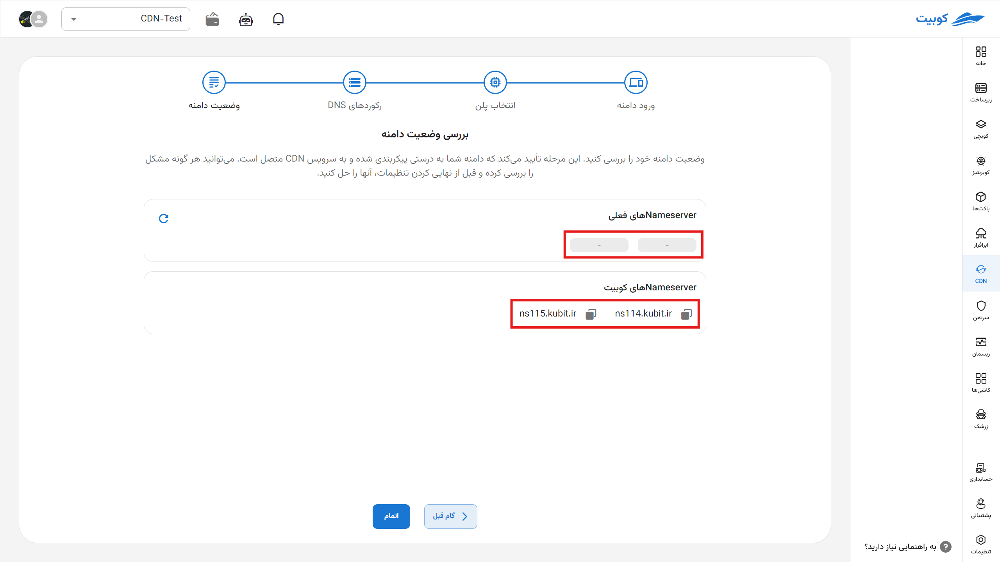
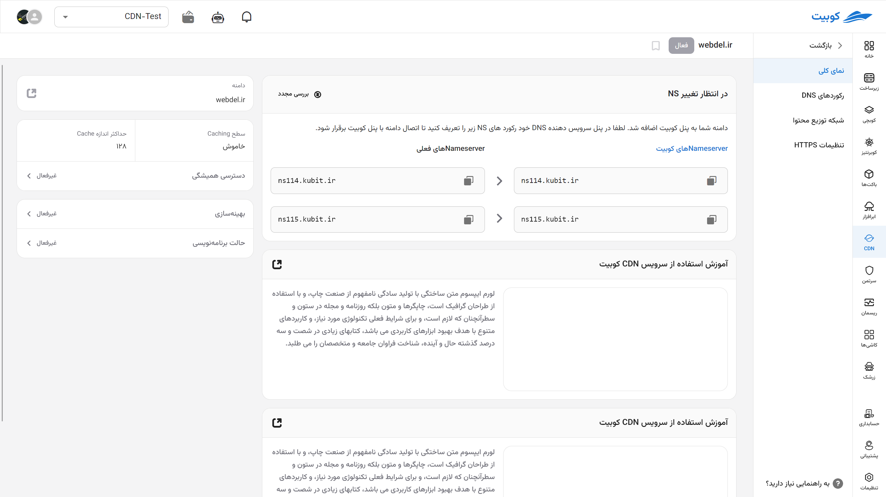
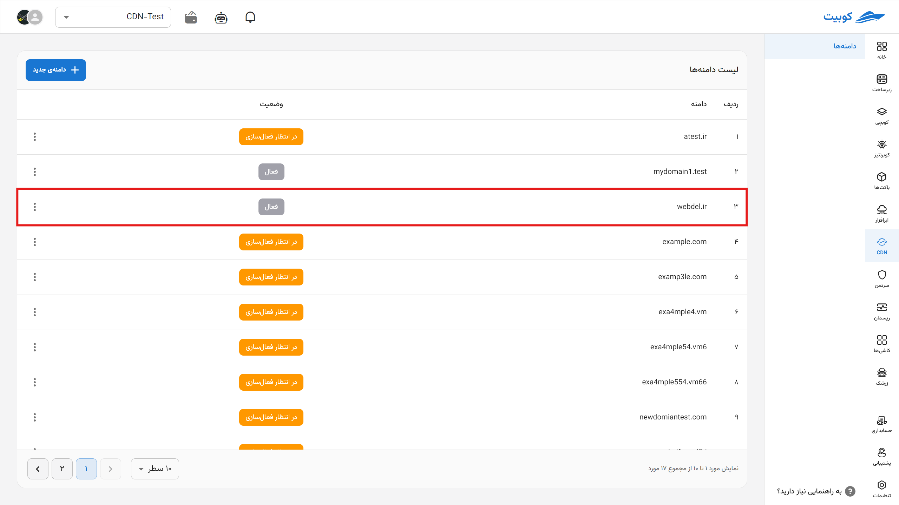
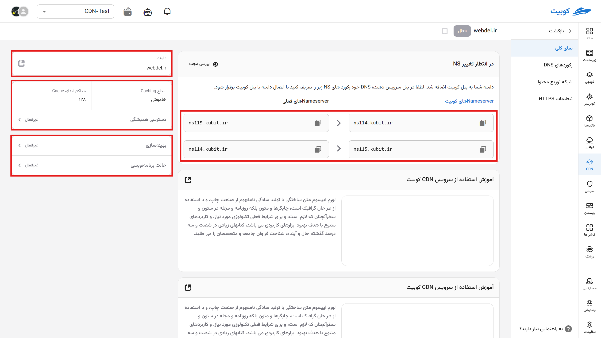

# شروع به کار (گام صفر)

وارد پنل خود شوید و روی **افزودن دامنه‌ی جدید** کلیک کنید.

## ثبت دامنه

برای شروع کار با سرویس، ابتدا نیاز است دامنه متعلق به خود را ثبت کنید.

در قدم بعدی، پلن خود را انتخاب کنید.

در بخش پیکربندی تنظیمات DNS، رکوردهای DNS خود را تنظیم کنید تا دامنه شما به CDN متصل شود؛ اگر رکوردی روی دامنه موجود باشد به صورت خودکار تشخیص و نمایش می‌شود. سپس شما نیاز دارید که رکوردهای A، CNAME و دیگر رکوردهای مربوطه را در صورت عدم وجود پیکربندی کنید تا از مسیریابی صحیح و بهینه‌سازی تحویل محتوای خود اطمینان حاصل کنید. می‌توانید باقی تنظیمات مربوط به این بخش را بعدا انجام دهید.

NSهای مشخص شده توسط کوبیت را در پنل ارائه دهنده دامنه خود ثبت کنید. سپس وضعیت دامنه خود را بررسی کنید. این مرحله تأیید می‌کند که دامنه شما به درستی پیکربندی شده و به سرویس CDN متصل است.

اکنون وارد بخش نمای کلی تنظیمات دامنه خود شده‌اید.

## نمای کلی دامنه

پس از انتخاب یا ایجاد یک دامنه جدید،

در بخش نمای کلی دامنه خود می‌توانید:

1. وضعیت NameServerهای خود را ببینید.
2. دامنه خود را ببینید.
3. اطلاعات کش شامل:
   - سطح کش
   - حداکثر اندازه کش
4. تنظیم دقیق بهینه‌سازی: - بهینه‌سازی: شامل تنظیمات عمومی اعمال شونده روی تمام زیردامنه‌ها - حالت برنامه‌نویسی: در این بخش جزئیات پیشرفته نوع بهینه‌سازی را با جزئیات مشخص کنید
   

پس از این قسمت می‌توانید وارد تب‌های مختلف شده و:

- [رکوردهای DNS](dns) را تنظیم کرده و زیردامنه‌های خود را ثبت کنید.
- [تنظیمات CDN](cdndns/cdn/index.md) را مشخص کنید و به این صورت دسترسی به سایت خود را سریع‌تر و راحت‌تر کنید.
- [گواهی HTTPS](https) را ثبت کنید و اتصال ایمنی به وبسایت و کش نودهای خود ایجاد کنید.
