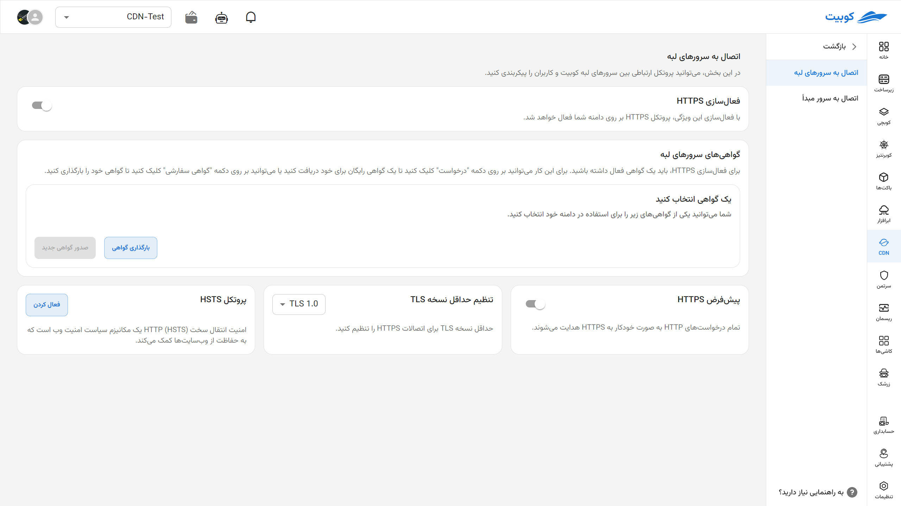
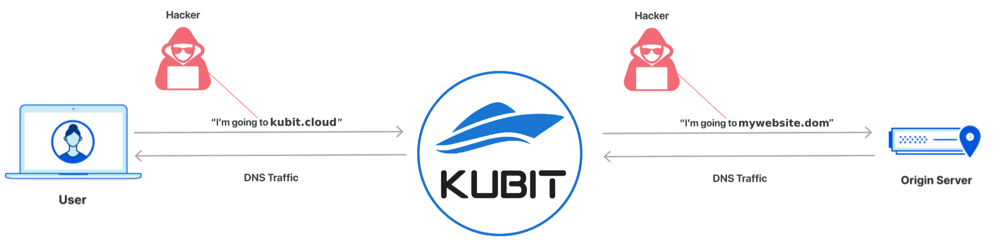
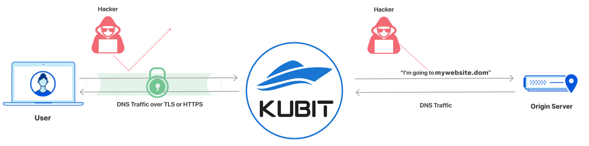
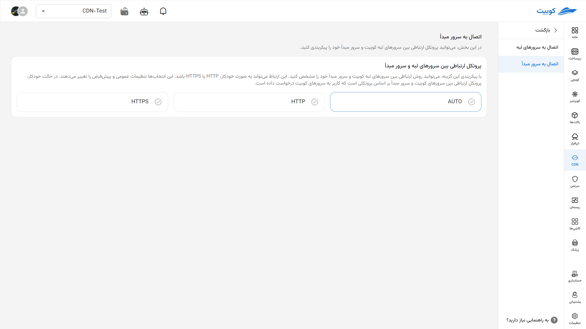
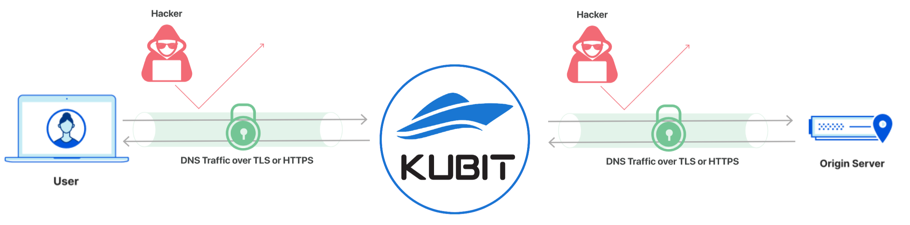

# تنظیمات HTTPS

در این بخش می‌توانید پروتکل‌های ارتباطی بین کاربر (User Client)، سرور لبه (Edge Node) و سرور اصلی (Original Server) را برای افزایش امنیت کاربران خود تنظیم کنید.

## اتصال به سرورهای لبه

در این بخش می‌توانید نحوه اتصال میان کاربران نهایی و سرورهای لبه کوبیت را تنظیم و پیکربندی کنید.

### فعال‌سازی HTTPS

با فعال‌سازی این گزینه، ارتباط بین کاربران و دامنه شما از طریق پروتکل امن HTTPS برقرار می‌شود.

حالت ارتباط بدون حفاظت (http):

حالت ارتباط حفاظت شده (https):

### گواهی‌های امنیتی سرورهای لبه

برای راه‌اندازی HTTPS، نیاز به یک گواهی معتبر دارید. می‌توانید با کلیک بر دکمه «درخواست»، یک گواهی رایگان دریافت کنید یا از طریق دکمه «گواهی سفارشی»، گواهی خود را بارگذاری نمایید.

### انتخاب گواهی

از بین گواهی‌های موجود، یکی را برای فعال‌سازی HTTPS بر روی دامنه خود انتخاب کنید.

### هدایت پیش‌فرض به HTTPS

با فعال‌سازی این قابلیت، تمامی درخواست‌های HTTP به صورت خودکار به نسخه امن HTTPS هدایت می‌شوند.

### تعیین حداقل نسخه TLS

در این بخش می‌توانید حداقل نسخه TLS مجاز برای ارتباطات HTTPS را مشخص نمایید.

### فعال‌سازی HSTS

پروتکل HSTS (HTTP Strict Transport Security) یک سیاست امنیتی است که مرورگرها را ملزم می‌کند همواره از HTTPS برای دسترسی به وب‌سایت استفاده کنند. این ویژگی نقش مهمی در افزایش امنیت ارتباطات دارد.

## اتصال به سرور مبدأ

در این بخش، می‌توانید پروتکل ارتباطی بین سرورهای لبه کوبیت و سرور مبدأ خود را پیکربندی کنید.

### پروتکل ارتباطی بین سرورهای لبه و سرور مبدأ

با فعال‌کردن این گزینه، می‌توانید روش ارتباط بین سرورهای لبه کوبیت و سرور مبدأ خود را تعیین کنید. این اتصال می‌تواند به صورت خودکار، فقط HTTP یا فقط HTTPS تنظیم شود. در حالت خودکار، پروتکل مورد استفاده برای ارتباط با سرور مبدأ بر اساس پروتکلی انتخاب می‌شود که کاربر هنگام ارسال درخواست به سرورهای کوبیت استفاده کرده است. این تنظیم، رفتار پیش‌فرض و کلی ارتباط بین سرورها را مدیریت می‌کند.

حالت ارتباط بدون حفاظت (http):

.

حالت ارتباط حفاظت شده (https):

