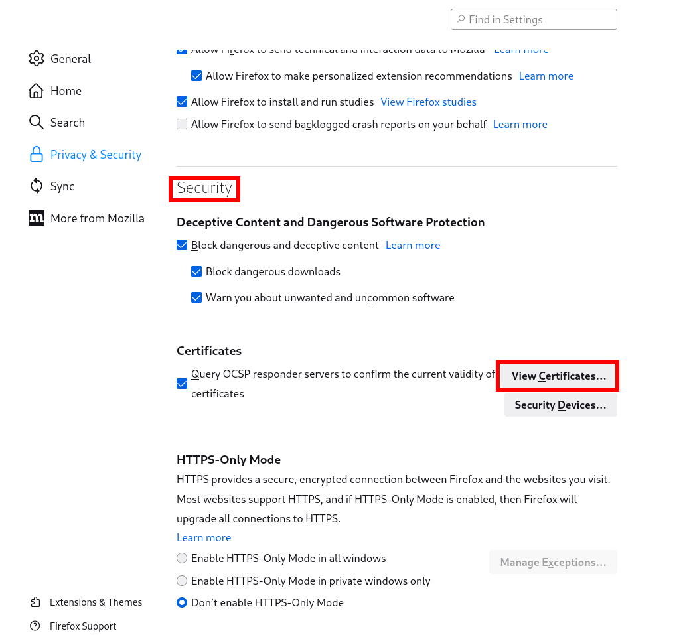
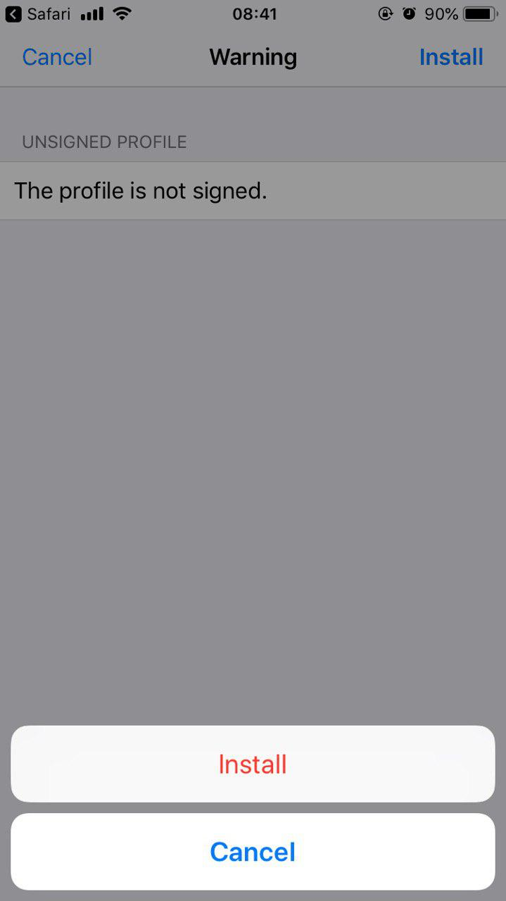

# نصب گواهی

راهنمای نصب روی [مرورگر](#install)، [اندروید](#android) و [IOS](#iphone) در این بخش شرح شده است.

## نصب گواهی بر روی مرورگر {#install}

برای نصب گواهی بر روی مرورگر خود، پس از دریافت آن از سامانه‌ی سرتمن، با توجه به نوع مرورگر به بخش مربوطه رفته و دستورالعمل‌ها را دنبال نمایید. توجه کنید که رمز عبور گواهی کلاینت همان شماره تلفن ثبت‌شده‌ی شما در سامانه است.

:::caution[توجه]
تمام مسئولیت استفاده از فایل Certificate و رمز آن با شماست. پس به هیچ وجه آن را در اختیار سایرین قرار ندهید.
:::

:::tip[نکته]
رمز گواهی شماره تلفن ثبت‌شده شماست.
:::

### نصب گواهی بر روی مرورگر کروم {#chrome}

برای نصب گواهی بر روی کروم مراحل زیر را دنبال کنید:

- به قسمت تنظیمات مرورگر بروید
- از منوی سمت چپ گزینه‌ی Privacy and security را انتخاب کنید
- مطابق شکل زیر وارد بخش Security شوید

- در انتهای این بخش قسمت Manage certificates را انتخاب کنید
- در تب Your certificates از طریق دکمه‌ی Import فایل گواهی دریافت شده از سرتمن را انتخاب کرده و پس از وارد کردن رمز عبور، نصب گواهی بر روی کروم به اتمام خواهد رسید.

### نصب گواهی بر روی مرورگر فایرفاکس {#firefox}

برای نصب گواهی بر روی فایرفاکس مراحل زیر را دنبال کنید:

- به قسمت تنظیمات مرورگر بروید
- از منوی سمت چپ گزینه‌ی Privacy & Security را انتخاب کنید
- مطابق با تصویر زیر در انتهای این بخش بر روی دکمه‌ی View Certifiecates ذیل عنوان Security کلیک کنید

- در دیالوگ باز شده از طریق دکمه‌ Import فایل گواهی دریافت شده از سرتمن را انتخاب کرده و پس از وارد کردن رمز عبور، نصب گواهی بر روی فایرفاکس به اتمام خواهد رسید.

## نصب گواهی بر روی اندروید {#android}

### باز کردن فایل Certificate و وارد کردن رمز آن

بعد از اتمام دانلود، فایل Certificate را باز کنید. سپس در پنجره باز شده، Password خود را وارد کنید و دکمه تایید را انتخاب کنید.

### تعیین یک نام و انتخاب نوع استفاده

در مرحله بعد یک نام وارد نمایید و نوع استفاده را apps انتخاب کنید.

#### ریستارت مرورگر

سپس یک بار مرورگر خود را به طور کامل بسته و دوباره باز کنید.

### مراجعه به آدرس سرویس مورد نظر و انتخاب Certificate نصب شده

اکنون وارد آدرس سرویس مورد نظر شوید و در پنجره باز شده Certificate را انتخاب کنید و دکمه Allow را بزنید.

### ورود به سرویس مورد نظر

هم اکنون آدرس مورد نظر برای شما در دسترس می باشد.

## نصب گواهی بر روی iPhone {#iphone}

### باز کردن فایل Certificate و انتخاب گزینه Allow

بعد از اتمام دانلود، فایل Certificate را باز کنید. سپس در پنجره باز شده، گزینه Allow را انتخاب کنید.

### انتخاب گزینه Install

در صفحه ی باز شده گزینه Install را انتخاب کنید.

### وارد کردن رمز فایل Certificate

در مرحله بعد Password خود را وارد کنید.

### انتخاب گزینه Done

با انتخاب گزینه Done مراحل نصب تمام می شود.

### ورود به سرویس مورد نظر

هم اکنون آدرس مورد نظر برای شما در دسترس می باشد.
