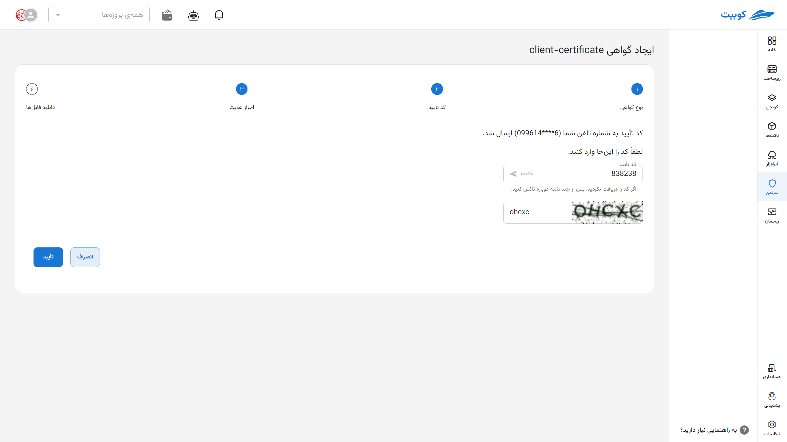
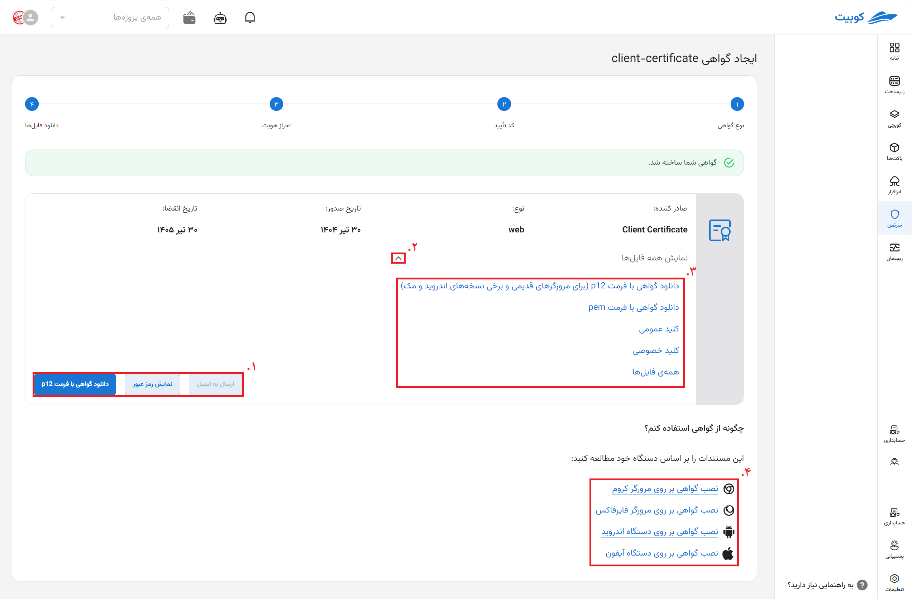
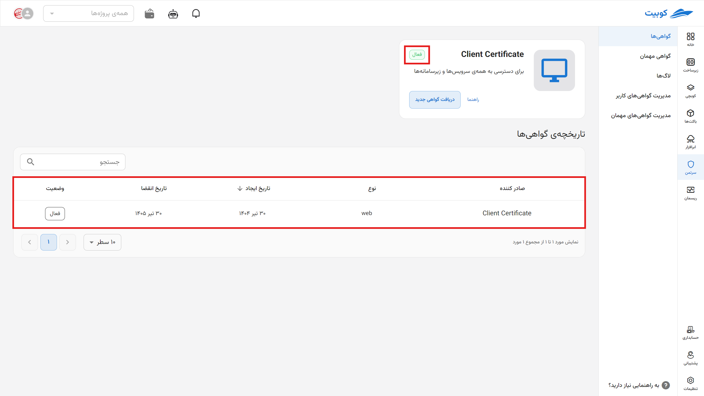
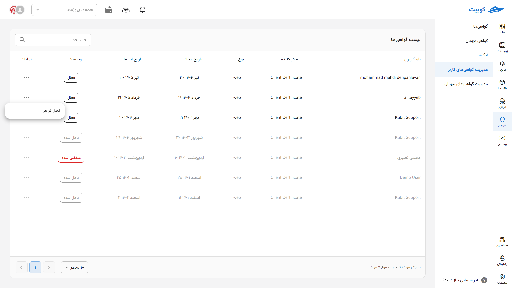

# گواهی‌ها

در این بخش، توضیحات مربوط به [گواهی‌های مختلف](#certs-intro) و همچنین [نحوه ایجاد](#cert-issue) آن‌ها ارائه شده است.

## انواع گواهی در کوبیت {#certs-intro}

### گواهی کلاینت {#client-cert}

به طور پیش‌فرض، تمامی سرویس‌ها و زیرسامانه‌های کوبیت در پشت لایه‌ای امنیتی قرار دارند. برای گذشتن از لایه‌ی امنیتی و دسترسی به هر یک از زیرسامانه‌ها، لازم است کاربر بر روی مرورگر خود گواهی مورد نیاز را نصب نماید. این گواهی از طریق زیرسامانه‌ی سرتمن ایجاد می‌شود.

:::caution[هشدار]
زیرسامانه‌ی سرتمن در پشت هیچ لایه‌ی امنیتی قرار ندارد
:::

برای دریافت گواهی کلاینت از سرتمن مراحل زیر را دنبال کنید:

- از منوی سمت راست گزینه‌ی «گواهی کلاینت» را انتخاب نمایید.
- بر روی دکمه‌ی «گواهی جدید» کلیک کنید.
- بر روی دکمه‌ی «ارسال کد تایید» کلیک نمایید.
- کد تایید پیامک شده بر روی شماره‌ی ثبت‌شده خود را به همراه رمز عبور سامانه‌ی سرتمن وارد نموده و دکمه‌ی «ارسال» را بزنید. (شماره و رمز عبور توسط کاربر در مرحله‌ی [تکمیل ثبت‌نام کاربر](#sso) مشخص می‌شوند)
- با پشت سر گذاشتن مراحل قبل شما به صفحه‌ی جزئیات گواهی خواهید رفت که امکان دانلود گواهی با فرمت p12 از این صفحه وجود دارد. گواهی دانلود شده را می‌توان مطابق با توضیحات [این بخش](#install) بر روی مرورگر نصب کرد. همچنین به خاطر داشته باشید که در هنگام نصب گواهی، مرورگر درخواست رمزی خواهد کرد که این رمز همان شماره ثبت‌شده شماست.

:::tip[نکته]
رمز گواهی شماره تلفن ثبت‌شده شماست.
:::

توجه داشته باشید که در هر زمان تنها یک گواهی فعال برای کاربر وجود دارد و با ایجاد گواهی جدید تمامی گواهی‌های قبلی شما باطل خواهند شد.

:::caution[هشدار]
هر کاربر حداکثر یک گواهی فعال (از هر نوع) می‌تواند داشته باشد.
:::

در صفحه‌ی جزئیات گواهی به غیر از فرمت p12 که برای نصب گواهی کلاینت بر روی مرورگر به کار می‌رود، فایل‌های دیگر مرتبط با گواهی، اعم از فرمت pem گواهی و نیز کلید خصوصی و عمومی آن، قرار داده شده است که می‌توان برای کاربردهای دیگر نظیر دستور curl و یا ارتباط با stunnel و … مورد استفاده قرار گیرد. همچنین لازم به ذکر است دانلود دوباره‌ی گواهی نیاز به ارسال مجدد کد به شماره‌ی همراه ثبت‌شده شما دارد.

بعد از نصب گواهی کلاینت بر روی مرورگر، شما می‌توانید به زیرسامانه‌ها (نظیر ریسمان، کوبچی، مدیریت کاربران و ...) و سرویس‌های (مانند گیت‌لب، جیرا، گرافانا و ...) دیگر کوبیت دسترسی پیدا کنید.

### گواهی open vpn {#vpn-cert}

مدیر سامانه‌ی سرتمن می‌تواند از طریق پنل ادمین، هر تعداد سرور vpn تعریف و به سامانه اضافه کند. به ازای هر سرور یک منو در سمت راست سامانه‌ی سرتمن ایجاد می‌شود که کاربر با کلیک بر روی آن می‌تواند گواهی امنیتی مورد نیاز برای دسترسی به آن سرور را ایجاد و دانلود نماید.

برای این منظور لازم است مراحل زیر را دنبال کنید:

- بر روی نام vpn مورد نظر از منوی سمت راست کلیک کنید
- دکمه‌ی «گواهی جدید» را بزنید.
- بر روی دکمه‌ی «ارسال کد تایید» کلیک نمایید.
- کد تایید پیامک شده بر روی شماره‌ی ثبت‌شده خود را به همراه رمز عبور سامانه‌ی سرتمن وارد نموده و دکمه‌ی «ارسال» را بزنید. (شماره و رمز عبور توسط کاربر در مرحله‌ی تکمیل ثبت‌نام کاربر مشخص می‌شوند)
- با پشت سر گذاشتن مراحل قبلی، صفحه‌ی جزئیات گواهی را مشاهده خواهید کرد که گواهی OpenVpn با فرمت ovpn از این صفحه قابل دانلود است. همچنین شما می‌توانید کلید عمومی و خصوصی گواهی را نیز در این صفحه دانلود نمایید.

به خاطر داشته باشید که برای استفاده از گواهی OpenVpn دانلود شده، نیازمند نام کاربری و رمز عبور هستید، که همان نام کاربری و رمز عبور یکپارچه‌ی سامانه‌ی سرتمن است.

:::tip[نکته]
نام کاربری و رمز گواهی vpn همان نام کاربری و رمز سامانه‌ی سرتمن است
:::

### گواهی kubeconfig {#kubeconfig}

بعد از ایجاد یک کلاستر در کوبرنتیز، لازم است مدیر سامانه تنظیمات مورد نیاز برای اضافه کردن یک صادرکننده‌ی گواهی kubeconfig را در پنل ادمین انجام دهد. به ازای هر صادرکننده (که متناظر با یک کلاستر کوبرنتیز است) یک تب در منوی سمت راست سرتمن ظاهر خواهد شد.

کاربران برای دسترسی به هر کلاستر کوبرنتیز (از طریق kubectl و …) نیازمند فایل kubeconfig هستند که محتوی گواهی لازم برای اتصال به آن کلاستر است. این فایل نیز از طریق سامانه‌ی سرتمن ایجاد و دانلود می‌شود.

مراحل ساخت و دریافت یک گواهی kubeconfig به شرح زیر است:

- بر روی نام صادرکننده‌ی گواهی kubeconfig در منوی سمت راست کلیک کنید.
- دکمه‌ی «گواهی جدید» را بزنید.
- بر روی دکمه‌ی «ارسال کد تایید» کلیک نمایید.
- کد تایید پیامک شده بر روی شماره‌ی ثبت‌شده خود را به همراه رمز عبور سامانه‌ی سرتمن وارد نموده و دکمه‌ی «ارسال» را بزنید. (شماره و رمز عبور توسط کاربر در مرحله‌ی تکمیل ثبت‌نام کاربر مشخص می‌شوند)
- پس از تکمیل مراحل قبلی شما به صفحه‌ی جزئیات گواهی خواهید رفت که فایل kubeconfig از این صفحه قابل دانلود می‌باشد. همچنین سایر فایل‌های مرتبط با گواهی مانند فرمت pem گواهی و نیز کلید خصوصی و عمومی، در این صفحه در دسترس کاربران قرار دارد.

## ایجاد گواهی جدید {cert-issue}

برای ایجاد یک گواهی جدید، ابتدا وارد بخش **گواهی‌ها** شوید و سپس روی گزینه‌ی **دریافت گواهی جدید** کلیک کنید. نوع گواهی موردنیاز خود را انتخاب نمایید (مانند `client-cert`، `openvpn` یا `kubeconfig`).

سپس در **بخش مشخصات**، جزئیات **نام گواهی** (با وارد کردن ایمیل به عنوان نام می‌توانید به صورت خودکار گواهی را برای شخص ارسال کنید.) و **مدت اعتبار آن تا زمان ابطال** را وارد کنید.

### ارسال خودکار گواهی {#send-cert}

:::success[ارسال خودکار گواهی به ایمیل]

اگر می‌خواهید گواهی صادرشده **مستقیماً برای شخص ارسال شود**، در قسمت **نام**، آدرس **ایمیل** او را وارد کنید. این کار باعث می‌شود فایل گواهی با فرمت‌های متفاوت به صورت خودکار به فرد ارسال گردد.

:::

در این بخش با زدن دکمه **ارسال کد**، یک کد تایید به شماره تماس یا ایمیل شما ارسال می‌گردد.

**کد تایید** ارسال شده و **CAPTCHA** را به درستی در این بخش وارد کنید.

گواهی شما با موفقیت صادر شد. آن را مانند [سایر گواهی‌ها](../certs) از طریق گزینه‌های موجود [دانلود کرده و نصب](../cert-install) نمایید.
در این صفحه گزینه‌های موجود شامل:

1. دانلود، نمایش رمز و ارسال به ایمیل
2. با زدن گزینه (▼) جزئیات دانلود را مشاهده می‌کنید.
3. دانلود با فرمت‌های مختلف و دسترسی به کلیدهای عمومی و خصوصی
4. [راهنماهای نصب](../cert-install)
   

### احراز هویت

اگر مدتی در این صفحه بمانید نیاز به احراز هویت مجدد دارید.

حال در بخش گواهی‌ها، یک **نمای کلی** از تمام **گواهی‌های شما** در دسترس است. می‌توانید وضعیت فعلی هر گواهی (فعال، منقضی‌شده، یا ابطال‌شده)، تاریخ ایجاد و انقضا، و تعداد روزهای باقی‌مانده را مشاهده کنید. همچنین، پس از **صدور گواهی جدید**، اطلاعات آن بلافاصله در همین لیست نمایش داده می‌شود و امکان **دانلود**، **نصب** آن از همین بخش وجود دارد. **با کلیک روی نام هر گواهی به جزئیات آن (عکس بالا) دسترسی پیدا می‌کنید**.

این نما به شما کمک می‌کند تا به‌سادگی همه گواهی‌های امنیتی‌تان را مدیریت و پیگیری کنید.

## مدیریت گواهی‌های کاربر

در این تب، لیست **گواهی‌های موجود** نمایش داده می‌شود که شامل اطلاعاتی مانند **نوع گواهی**، **تاریخ ایجاد**، **تاریخ انقضا**، **تعداد روزهای باقی‌مانده تا انقضا** و **وضعیت فعال بودن** آن‌هاست.

برای **ابطال یک گواهی**، روی آیکون **سه‌نقطه** مقابل گواهی مورد نظر کلیک کرده و گزینه‌ی **ابطال** را انتخاب کنید.

