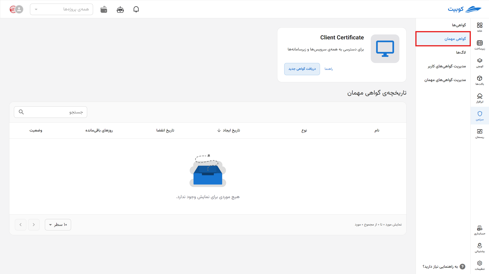
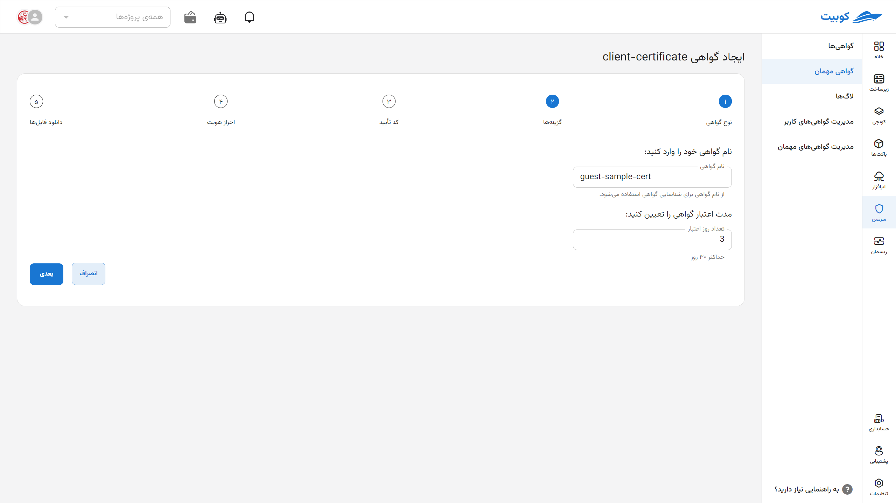
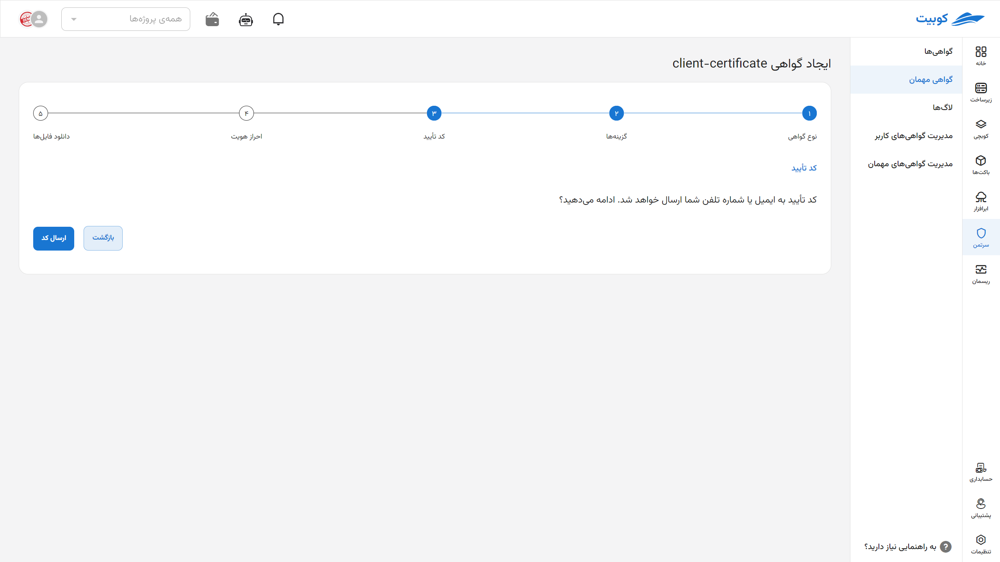
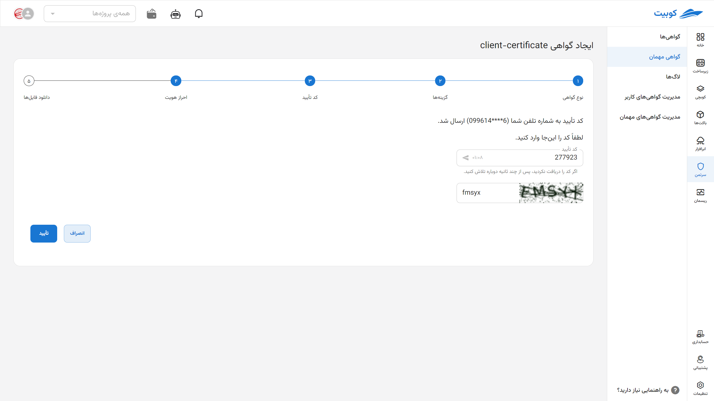
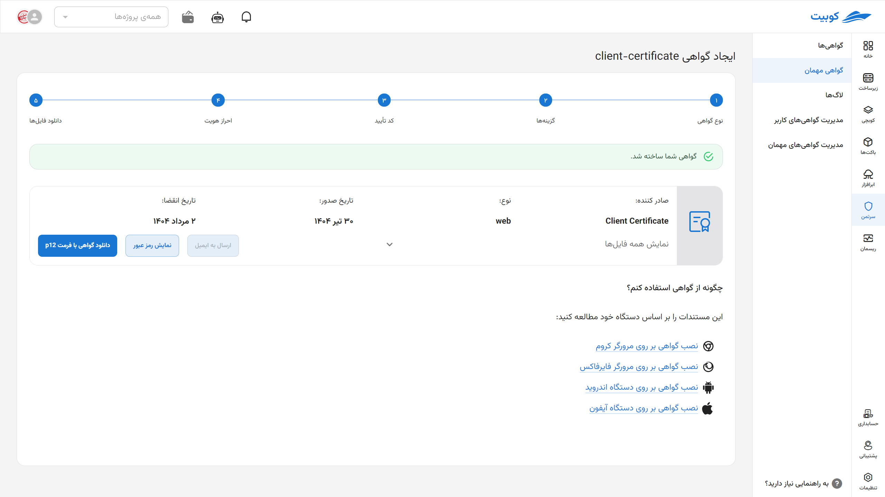
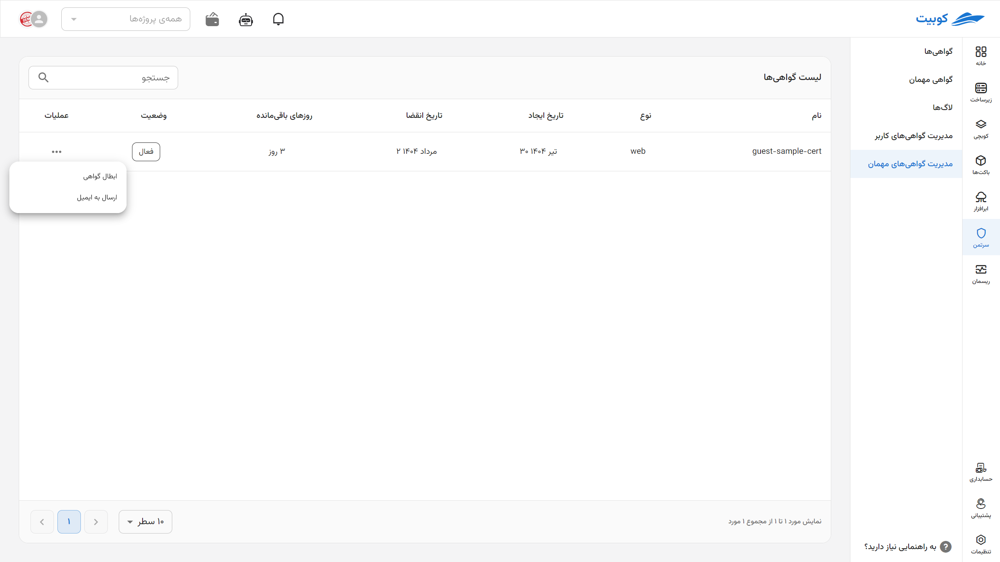
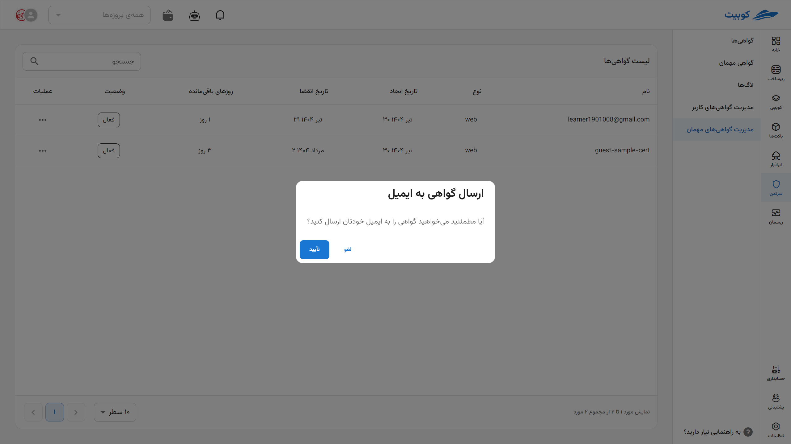
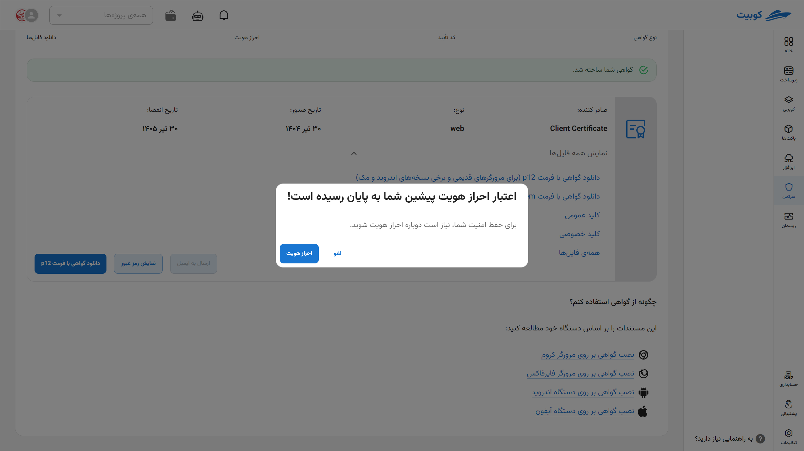

# گواهی مهمان

در این بخش، توضیحات مربوط به [گواهی مهمان](#guest-cert-intro) و همچنین [نحوه ایجاد](#guest-cert-issue) آن برای مدیران ارائه شده است. این گواهی‌ها معمولاً به‌صورت موقت و با مدت اعتبار مشخص برای کاربران مهمان صادر می‌شوند تا دسترسی کنترل‌شده و محدودی به سرویس‌های موردنیاز داشته باشند.

## دسترسی مدیریتی سامانه {#guest-cert-intro}

سامانه‌ی سرتمن دارای دو سطح دسترسی کاربران و مدیران است. با ورود به سامانه به عنوان مدیر، بخش‌ها و امکانات جدیدی قابل مشاهده است. از جمله‌ی این امکانات، قابلیت مشاهده لاگ همه‌ی کاربران، امکان ایجاد گواهی مهمان، امکان مدیریت کاربران و نیز مدیریت گواهی‌های ایشان می‌باشد.

در بخش مدیریت کاربران مدیر سامانه می‌تواند لیست تمام کاربران فعال و غیرفعال سامانه را دیده و بر اساس نام یا شماره‌ی موبایل جستجو کند. همچنین مدیر می‌تواند هر وضعیت هر یک از کاربران را غیرفعال کند تا اجازه‌ی ورود به سامانه را نداشته باشند. علاوه بر آن با غیرفعال کردن کاربر تمامی گواهی‌های آن کاربر باطل خواهند شد.

در بخش مدیریت گواهی‌های کاربران، مدیر میتواند ضمن مشاهده و فیلتر و جستجوی تمامی گواهی‌های صادرشده، هر گواهی دلخواه را باطل نماید. همچنین در بخش لاگ کاربران، لیستی از عملکرد تمامی کاربران به صورت یک‌جا موجود است که امکان فیلتر بر اساس کاربر و نوع عملکرد از اختیارات مدیر در این بخش است.

### گواهی مهمان

یکی از امکانات موجود برای مدیر سامانه ایجاد گواهی کلاینت مهمان یا گواهی موقت است. کاربرد گواهی مهمان زمانی است که فردی خارج از سازمان که عضو سامانه نیست نیازمند دسترسی موقت به آدرسی است که بدون لاگین ولی تنها با داشتن گواهی کلاینت امکان‌پذیر است. در این صورت مدیر سامانه می‌تواند از طریق سرتمن برای او یک گواهی موقت یا مهمان ایجاد کند.

مدیر در هنگام ایجاد گواهی مهمان می‌تواند تاریخ انقضاء آن را تعیین نماید و نیز با تعیین ایمیل توسط مدیر، سامانه گواهی ایجاد شده را به ایمیل مذکور خواهد فرستاد. همچنین مدیر سامانه در هر زمان که خواست می‌تواند هر یک از گواهی‌های مهمان را باطل نماید.

با انتخاب بخش «گواهی مهمان» در منوی سمت راست، مدیر می‌تواند لیستی از گواهی‌های مهمان ایجاد شده به همراه نام ایجادکننده، وضعیت گواهی، تاریخ انقضاء و … را مشاهده نماید. همچنین امکان فیلتر این لیست بر اساس نام ایجادکننده وجود دارد.

## ایجاد گواهی مهمان جدید {#guest-cert-issue}

برای ایجاد یک گواهی مهمان جدید ابتدا وارد بخش **گواهی مهمان** شده و روی **دریافت گواهی جدید** کلیک کنید.

سپس در **بخش مشخصات**، جزئیات **نام گواهی** (با وارد کردن ایمیل به عنوان نام می‌توانید به صورت خودکار گواهی را برای شخص ارسال کنید.) و **مدت اعتبار آن تا زمان ابطال** را وارد کنید.

### ارسال خودکار گواهی {#send-cert}

:::success[ارسال خودکار گواهی به ایمیل]

اگر می‌خواهید گواهی صادرشده **مستقیماً برای شخص ارسال شود**، در قسمت **نام**، آدرس **ایمیل** او را وارد کنید. این کار باعث می‌شود فایل گواهی با فرمت‌های متفاوت به صورت خودکار به فرد ارسال گردد.

:::

در این بخش با زدن دکمه **ارسال کد**، یک کد تایید به شماره تماس یا ایمیل شما ارسال می‌گردد.

**کد تایید** ارسال شده و **CAPTCHA** را به درستی در این بخش وارد کنید.

گواهی شما با موفقیت صادر شد. آن را مانند [سایر گواهی‌ها](../certs) از طریق گزینه‌های موجود [دانلود کرده و نصب](../cert-install) نمایید.

## مدیریت گواهی‌های مهمان

در این تب، لیست **گواهی‌های موجود** نمایش داده می‌شود که شامل اطلاعاتی مانند **نوع گواهی**، **تاریخ ایجاد**، **تاریخ انقضا**، **تعداد روزهای باقی‌مانده تا انقضا** و **وضعیت فعال بودن** آن‌هاست.  
برای **ابطال یک گواهی**، روی آیکون **سه‌نقطه** مقابل گواهی مورد نظر کلیک کرده و گزینه‌ی **ابطال** را انتخاب کنید.

اگر می‌‌خواهید [گواهی را ارسال کنید](#send-cert)، روی **ارسال به ایمیل** کلیک کنید.

برای **ابطال یک گواهی**، روی آیکون **سه‌نقطه** مقابل گواهی مورد نظر کلیک کرده و گزینه‌ی **ابطال** را انتخاب کنید.

