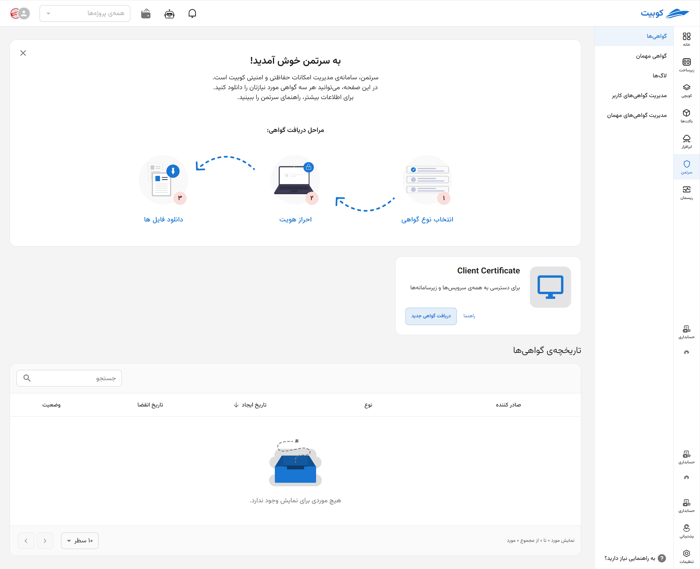
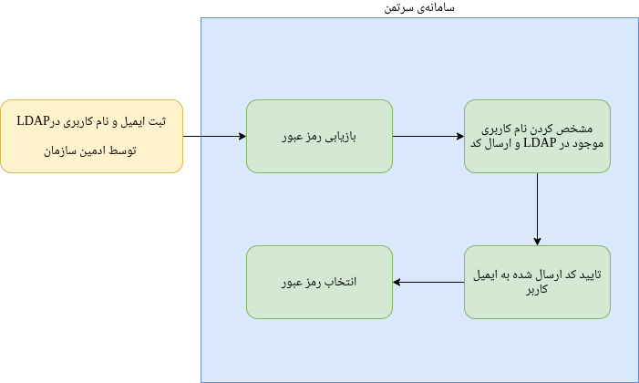

---
subDocuments:
  - certs
  - guest-cert
  - log
  - cert-install
---

# سرتمن (امنیت ابری)

**سرتمن**، زیرسامانه‌ای مرکزی در **کوبیت** است که تمامی نیازهای امنیتی و حفاظتی کاربران را به‌صورت متمرکز مدیریت می‌کند. به‌بیان ساده، سرتمن محل صدور و مدیریت **گواهی‌های امنیتی** برای دسترسی به سرویس‌ها و زیرساخت‌های کوبیت است. این سامانه همچنین از **[احراز هویت یکپارچه (SSO)](#sso)** پشتیبانی می‌کند.

گزینه‌هایی که سرتمن در اختیار [کاربران](#access-levels) قرار می‌دهد شامل:

**[بخش گواهی ها](certs):** کاربران و مدیران می‌توانند گواهی‌های جدید برای خود صادر کرده و فهرست گواهی‌های فعلی‌شان را مشاهده کنند

**[بخش گواهی‌های مهمان](geust-certs):** (ویژه مدیران)، امکان صدور گواهی‌های موقتی و زمان‌دار برای دیگران فراهم است

**[لاگ‌ها](log):** (ویژه مدیران) تاریخچه‌ی دقیق عملیات‌های هر کاربر را نمایش می‌دهد؛ اطلاعات مربوط به سایر کاربران تنها برای مدیران قابل مشاهده است

## معرفی اجمالی سرتمن

[سه نوع گواهی](certs) در این سامانه قابل ایجاد است:

- **Client Certificate:** برای احراز هویت در تمامی سرویس‌ها و زیرسامانه‌ها
- **OpenVPN Certificate:** برای اتصال به شبکه‌ی خصوصی سازمان
- **kubeconfig Certificate:** برای اتصال به کلاسترهای کوبرنتیز

از امکانات جانبی سرتمن می‌توان به موارد زیر اشاره کرد:

- ثبت و نمایش تاریخچه‌ی صدور گواهی‌ها
- مشاهده و بررسی لاگ عملیات‌های کاربران

### سطوح دسترسی {#access-levels}

این سامانه دارای **دو سطح دسترسی** است:

1. **کاربران:** فقط دسترسی به گواهی‌های شخصی خود
2. **مدیران:** امکان مشاهده تاریخچه و لاگ همه‌ی کاربران، مدیریت گواهی کاربران، و صدور گواهی‌های مهمان

همچنین سرتمن نقش کلیدی در **تکمیل ثبت‌نام کاربران LDAP** دارد. کاربرانی که توسط ادمین در OpenLDAP تعریف شده‌اند، برای فعال‌سازی حساب خود باید از طریق سرتمن اقدام کنند. مدیریت و بازیابی رمز عبور نیز از همین سامانه انجام می‌شود.

---

### مدیریت احراز هویت یکپارچه (SSO) {#sso}

برای دسترسی ایمن به سرویس‌ها و زیرسامانه‌های کوبیت، احراز هویت **یکپارچه (SSO)** انجام می‌شود؛ یعنی کاربران با یک نام کاربری و رمز عبور، به همه‌ی بخش‌ها دسترسی دارند. **این فرآیند نیز توسط سرتمن مدیریت می‌شود**.

#### مراحل فعال‌سازی اولیه حساب:

1. ادمین سازمان ایمیل و نام کاربری را در سیستم ثبت می‌کند.
2. کاربر وارد سرتمن شده و گزینه‌ی **بازیابی رمز عبور** را انتخاب می‌کند.
3. پس از وارد کردن نام کاربری، یک **کد تایید** به ایمیل او ارسال می‌شود.
4. با وارد کردن این کد در سرتمن، کاربر می‌تواند رمز عبور خود را تعیین کرده و ثبت‌نام را تکمیل کند.

پس از تعیین رمز عبور، **ورود به همه‌ی سرویس‌های کوبیت با همان نام کاربری و رمز انجام می‌شود**. در صورت فراموشی یا نیاز به تغییر رمز، همین مسیر مجدداً **از طریق سرتمن** طی می‌شود.
