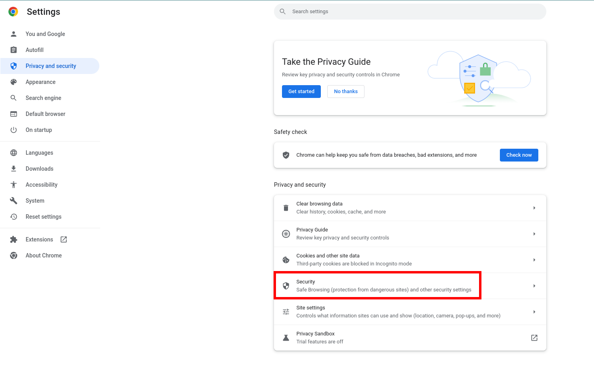
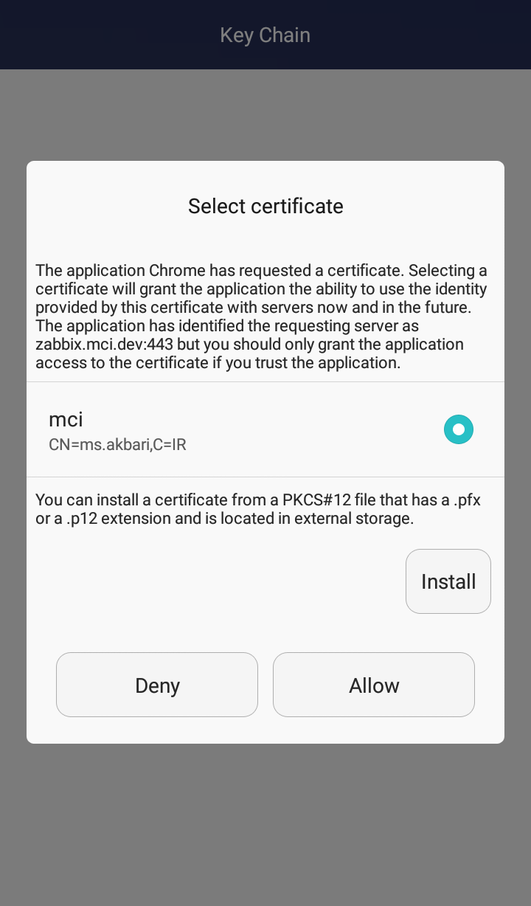
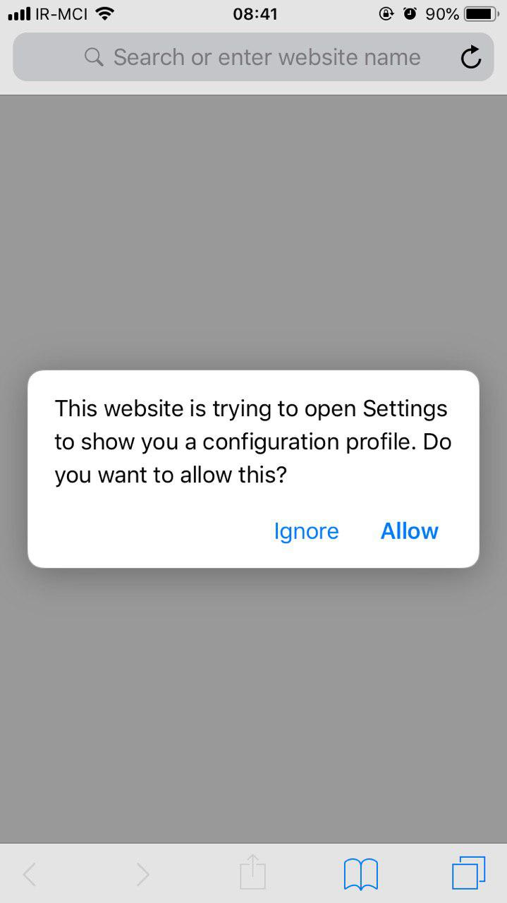

# سرتمن (امنیت ابری)

## معرفی

زیرسامانه‌ی سرتمن، سامانه‌ای متمرکز به منظور تجمیع مدیریت همه‌ی امکانات حفاظتی و امنیتی مورد نیاز برای کار با مجموعه‌ی ابری کوبیت است.

به دیگر بیان، سرتمن را می‌توان محل ایجاد گواهی‌های مختلف امنیتی دانست. سه نوع مختلف از گواهی‌ها در سرتمن قابل ایجاد است: گواهی کلاینت (مرورگر) برای دسترسی به همه‌ی سرویس‌ها و زیرسامانه‌ها، گواهی شبکه‌ی خصوصی برای اتصال به یک سرور OpenVpn و گواهی kubeconfig که برای اتصال به یک کلاستر کوبرنتیز به کار می‌رود.

:::info[انواع گواهی در سرتمن]
سه نوع گواهی در سرتمن ایجاد می‌شود: Client Certificate،‌ OpenVpn و kubeconfig
:::

از قابلیت‌های جانبی این سامانه می‌توان به ثبت و نمایش تاریخچه‌ای از تمام گواهی‌های کاربر و لاگ عملیات‌های مختلف کاربر، اشاره کرد.

لازم به ذکر است که سامانه‌ی سرتمن دارای دو سطح دسترسی است: کاربران و مدیران.

در سطح دسترسی مختص به مدیران، تاریخچه و لاگ تمامی کاربران قابل مشاهده است و همچنین امکان ایجاد گواهی مهمان، مدیریت گواهی کاربران دیگر و مدیریت خود کاربران، در کنار قابلیت‌های اصلی سامانه وجود دارد که در ادامه‌ی این مستند به توضیح هر یک از آن‌ها خواهیم پرداخت.

از دیگر وظایف سامانه‌ی سرتمن تکمیل ثبت‌نام کاربرانی است که ثبت‌نام اولیه آن‌ها توسط مدیر سازمان در OpenLDAP انجام گرفته است. همچنین تغییر یا بازیابی رمز عبور کاربران ثبت‌نام‌شده نیز از طریق همین سامانه انجام می‌گیرد.

:::info[مدیریت رمز عبور کاربر]
در کنار ایجاد گواهی، مدیریت رمز عبور برای ورود به کوبیت بر عهده‌ی سامانه‌ی سرتمن است.
:::

:::tip[نکته]
سرتمن برای احراز هویت کاربران به OpenLDAP متصل است.
:::

## گواهی کلاینت {#client-cert}

به طور پیش‌فرض، تمامی سرویس‌ها و زیرسامانه‌های کوبیت در پشت لایه‌ای امنیتی قرار دارند. برای گذشتن از لایه‌ی امنیتی و دسترسی به هر یک از زیرسامانه‌ها، لازم است کاربر بر روی مرورگر خود گواهی مورد نیاز را نصب نماید. این گواهی از طریق زیرسامانه‌ی سرتمن ایجاد می‌شود.

:::caution[هشدار]
زیرسامانه‌ی سرتمن در پشت هیچ لایه‌ی امنیتی قرار ندارد
:::

برای دریافت گواهی کلاینت از سرتمن مراحل زیر را دنبال کنید:

- از منوی سمت راست گزینه‌ی «گواهی کلاینت» را انتخاب نمایید.
- بر روی دکمه‌ی «گواهی جدید» کلیک کنید.
- بر روی دکمه‌ی «ارسال کد تایید» کلیک نمایید.
- کد تایید پیامک شده بر روی شماره‌ی ثبت‌شده خود را به همراه رمز عبور سامانه‌ی سرتمن وارد نموده و دکمه‌ی «ارسال» را بزنید. (شماره و رمز عبور توسط کاربر در مرحله‌ی [تکمیل ثبت‌نام کاربر](#sso) مشخص می‌شوند)
- با پشت سر گذاشتن مراحل قبل شما به صفحه‌ی جزئیات گواهی خواهید رفت که امکان دانلود گواهی با فرمت p12 از این صفحه وجود دارد. گواهی دانلود شده را می‌توان مطابق با توضیحات [این بخش](#install) بر روی مرورگر نصب کرد. همچنین به خاطر داشته باشید که در هنگام نصب گواهی، مرورگر درخواست رمزی خواهد کرد که این رمز همان شماره ثبت‌شده شماست.

:::tip[نکته]
رمز گواهی شماره تلفن ثبت‌شده شماست.
:::

توجه داشته باشید که در هر زمان تنها یک گواهی فعال برای کاربر وجود دارد و با ایجاد گواهی جدید تمامی گواهی‌های قبلی شما باطل خواهند شد.

:::caution[هشدار]
هر کاربر حداکثر یک گواهی فعال (از هر نوع) می‌تواند داشته باشد.
:::

در صفحه‌ی جزئیات گواهی به غیر از فرمت p12 که برای نصب گواهی کلاینت بر روی مرورگر به کار می‌رود، فایل‌های دیگر مرتبط با گواهی، اعم از فرمت pem گواهی و نیز کلید خصوصی و عمومی آن، قرار داده شده است که می‌توان برای کاربردهای دیگر نظیر دستور curl و یا ارتباط با stunnel و … مورد استفاده قرار گیرد. همچنین لازم به ذکر است دانلود دوباره‌ی گواهی نیاز به ارسال مجدد کد به شماره‌ی همراه ثبت‌شده شما دارد.

بعد از نصب گواهی کلاینت بر روی مرورگر، شما می‌توانید به زیرسامانه‌ها (نظیر ریسمان، کوبچی، مدیریت کاربران و ...) و سرویس‌های (مانند گیت‌لب، جیرا، گرافانا و ...) دیگر کوبیت دسترسی پیدا کنید.

## گواهی open vpn {#vpn-cert}

مدیر سامانه‌ی سرتمن می‌تواند از طریق پنل ادمین، هر تعداد سرور vpn تعریف و به سامانه اضافه کند. به ازای هر سرور یک منو در سمت راست سامانه‌ی سرتمن ایجاد می‌شود که کاربر با کلیک بر روی آن می‌تواند گواهی امنیتی مورد نیاز برای دسترسی به آن سرور را ایجاد و دانلود نماید.

برای این منظور لازم است مراحل زیر را دنبال کنید:

- بر روی نام vpn مورد نظر از منوی سمت راست کلیک کنید
- دکمه‌ی «گواهی جدید» را بزنید.
- بر روی دکمه‌ی «ارسال کد تایید» کلیک نمایید.
- کد تایید پیامک شده بر روی شماره‌ی ثبت‌شده خود را به همراه رمز عبور سامانه‌ی سرتمن وارد نموده و دکمه‌ی «ارسال» را بزنید. (شماره و رمز عبور توسط کاربر در مرحله‌ی تکمیل ثبت‌نام کاربر مشخص می‌شوند)
- با پشت سر گذاشتن مراحل قبلی، صفحه‌ی جزئیات گواهی را مشاهده خواهید کرد که گواهی OpenVpn با فرمت ovpn از این صفحه قابل دانلود است. همچنین شما می‌توانید کلید عمومی و خصوصی گواهی را نیز در این صفحه دانلود نمایید.

به خاطر داشته باشید که برای استفاده از گواهی OpenVpn دانلود شده، نیازمند نام کاربری و رمز عبور هستید، که همان نام کاربری و رمز عبور یکپارچه‌ی سامانه‌ی سرتمن است.

:::tip[نکته]
نام کاربری و رمز گواهی vpn همان نام کاربری و رمز سامانه‌ی سرتمن است
:::

## گواهی kubeconfig {#kubeconfig}

بعد از ایجاد یک کلاستر در کوبرنتیز، لازم است مدیر سامانه تنظیمات مورد نیاز برای اضافه کردن یک صادرکننده‌ی گواهی kubeconfig را در پنل ادمین انجام دهد. به ازای هر صادرکننده (که متناظر با یک کلاستر کوبرنتیز است) یک تب در منوی سمت راست سرتمن ظاهر خواهد شد.

کاربران برای دسترسی به هر کلاستر کوبرنتیز (از طریق kubectl و …) نیازمند فایل kubeconfig هستند که محتوی گواهی لازم برای اتصال به آن کلاستر است. این فایل نیز از طریق سامانه‌ی سرتمن ایجاد و دانلود می‌شود.

مراحل ساخت و دریافت یک گواهی kubeconfig به شرح زیر است:

- بر روی نام صادرکننده‌ی گواهی kubeconfig در منوی سمت راست کلیک کنید.
- دکمه‌ی «گواهی جدید» را بزنید.
- بر روی دکمه‌ی «ارسال کد تایید» کلیک نمایید.
- کد تایید پیامک شده بر روی شماره‌ی ثبت‌شده خود را به همراه رمز عبور سامانه‌ی سرتمن وارد نموده و دکمه‌ی «ارسال» را بزنید. (شماره و رمز عبور توسط کاربر در مرحله‌ی تکمیل ثبت‌نام کاربر مشخص می‌شوند)
- پس از تکمیل مراحل قبلی شما به صفحه‌ی جزئیات گواهی خواهید رفت که فایل kubeconfig از این صفحه قابل دانلود می‌باشد. همچنین سایر فایل‌های مرتبط با گواهی مانند فرمت pem گواهی و نیز کلید خصوصی و عمومی، در این صفحه در دسترس کاربران قرار دارد.

## تاریخچه

در منوی سمت راست سامانه، لیستی از صادرکنندگان گواهی شامل گواهی کلاینت، گواهی برای سرورهای OpenVpn و گواهی برای اتصال به کلاسترهای مختلف کوبرنتیز، موجود است. کاربر می‌تواند با کلیک بر روی هر صادرکننده‌ی گواهی فهرستی از گواهی‌های ایجاد شده توسط آن صادرکننده‌ی خاص برای خود را مشاهده نماید. در این لیست حداکثر یک گواهی فعال وجود دارد و مابقی گواهی‌ها منقضی یا باطل‌شده هستند. زیرا با ساخت یک گواهی جدید، گواهی‌های قبلی که توسط آن صادرکننده ایجاد شده باشند باطل می‌شوند.

:::caution[هشدار]
هر کاربر حداکثر یک گواهی فعال (از هر صادرکننده) می‌تواند داشته باشد.
:::

## لاگ {#log}

کاربر میتواند از طریق منوی سمت راست به بخش لاگ رفته و تمامی عملیات‌های خود درون سامانه را مشاهده نماید. این عملیات شامل ورود به سامانه، ایجاد گواهی، ارسال کد تایید، دانلود گواهی و هر یک از عملکردهای دیگر کاربر در سامانه است. شما می‌توانید در هر سطر از این صفحه علاوه بر نوع عملکرد خود، زمان انجام آن و IP ای که آن عملیات از طریق آن انجام شده است را مشاهده کنید. همچنین امکان فیلتر جدول عملکردها بر اساس نوع عملکرد وجود دارد.

## دسترسی مدیریتی سامانه

سامانه‌ی سرتمن دارای دو سطح دسترسی کاربران و مدیران است. با ورود به سامانه به عنوان مدیر، بخش‌ها و امکانات جدیدی قابل مشاهده است. از جمله‌ی این امکانات، قابلیت مشاهده لاگ همه‌ی کاربران، امکان ایجاد گواهی مهمان، امکان مدیریت کاربران و نیز مدیریت گواهی‌های ایشان می‌باشد.

در بخش مدیریت کاربران مدیر سامانه می‌تواند لیست تمام کاربران فعال و غیرفعال سامانه را دیده و بر اساس نام یا شماره‌ی موبایل جستجو کند. همچنین مدیر می‌تواند هر وضعیت هر یک از کاربران را غیرفعال کند تا اجازه‌ی ورود به سامانه را نداشته باشند. علاوه بر آن با غیرفعال کردن کاربر تمامی گواهی‌های آن کاربر باطل خواهند شد.

در بخش مدیریت گواهی‌های کاربران، مدیر میتواند ضمن مشاهده و فیلتر و جستجوی تمامی گواهی‌های صادرشده، هر گواهی دلخواه را باطل نماید. همچنین در بخش لاگ کاربران، لیستی از عملکرد تمامی کاربران به صورت یک‌جا موجود است که امکان فیلتر بر اساس کاربر و نوع عملکرد از اختیارات مدیر در این بخش است.

### گواهی مهمان

یکی از امکانات موجود برای مدیر سامانه ایجاد گواهی کلاینت مهمان یا گواهی موقت است. کاربرد گواهی مهمان زمانی است که فردی خارج از سازمان که عضو سامانه نیست نیازمند دسترسی موقت به آدرسی است که بدون لاگین ولی تنها با داشتن گواهی کلاینت امکان‌پذیر است. در این صورت مدیر سامانه می‌تواند از طریق سرتمن برای او یک گواهی موقت یا مهمان ایجاد کند.

مدیر در هنگام ایجاد گواهی مهمان می‌تواند تاریخ انقضاء آن را تعیین نماید و نیز با تعیین ایمیل توسط مدیر، سامانه گواهی ایجاد شده را به ایمیل مذکور خواهد فرستاد. همچنین مدیر سامانه در هر زمان که خواست می‌تواند هر یک از گواهی‌های مهمان را باطل نماید.

با انتخاب بخش «گواهی مهمان» در منوی سمت راست، مدیر می‌تواند لیستی از گواهی‌های مهمان ایجاد شده به همراه نام ایجادکننده، وضعیت گواهی، تاریخ انقضاء و … را مشاهده نماید. همچنین امکان فیلتر این لیست بر اساس نام ایجادکننده وجود دارد.

## مدیریت احراز هویت یکپارچه (SSO) {#sso}

دسترسی به هر یک از زیرسامانه‌ها و سرویس‌های کوبیت که در پشت لایه‌ی امنیتی قرار دارند، نیازمند احراز هویت است. این احراز هویت به صورت یکپارچه و با یک نام کاربری و رمز عبور انجام می‌گیرد که مدیریت آن بر عهده‌ی سرتمن است.

در ابتدا و پس از ثبت ایمیل و نام کاربری فرد توسط ادمین سازمان، مراحل تکمیل ثبت‌نام کاربر توسط خود او و با ورود به سامانه‌ی سرتمن انجام می‌گیرد. کاربر ابتدا باید به سامانه‌ی سرتمن رفته و «بازیابی رمز عبور» را انتخاب کند. سپس با وارد کردن نام کاربری خود، کدی به ایمیل ثبت‌شده کاربر توسط سامانه‌ی سرتمن ارسال می‌شود. در مرحله‌ی بعد کاربر کد ارسال شده را درون سامانه وارد نموده و پس از تایید کد توسط سرتمن، به مرحله‌ی انتخاب رمز عبور خواهیم رفت.

 مراحل تکمیل ثبت‌نام در سرتمن 

 
 

پس از تعیین رمز عبور و تکمیل ثبت‌نام توسط کاربر، ورود به هر یک از سرویس‌ها و زیرسامانه‌های کوبیت از طریق نام کاربری ثبت‌شده کاربر و همین رمز عبور تعیین شده توسط خود کاربر در سرتمن، انجام خواهد گرفت.

در صورت نیاز به تغییر رمز عبور یا بازیابی آن در صورت فراموشی، همین مراحل از طریق سامانه‌ی سرتمن طی می‌شود. بنابراین یکی از مهم‌ترین وظایف این سامانه، مدیریت رمز عبور برای ورود یکپارچه به تمامی اجزای کوبیت و تحقق احراز هویت کاربر است.

## نصب گواهی بر روی مرورگر {#install}

برای نصب گواهی بر روی مرورگر خود، پس از دریافت آن از سامانه‌ی سرتمن، با توجه به نوع مرورگر به بخش مربوطه رفته و دستورالعمل‌ها را دنبال نمایید. توجه کنید که رمز عبور گواهی کلاینت همان شماره تلفن ثبت‌شده‌ی شما در سامانه است.

:::caution[توجه]
تمام مسئولیت استفاده از فایل Certificate و رمز آن با شماست. پس به هیچ وجه آن را در اختیار سایرین قرار ندهید.
:::

:::tip[نکته]
رمز گواهی شماره تلفن ثبت‌شده شماست.
:::

### نصب گواهی بر روی مرورگر کروم {#chrome}

برای نصب گواهی بر روی کروم مراحل زیر را دنبال کنید:

- به قسمت تنظیمات مرورگر بروید
- از منوی سمت چپ گزینه‌ی Privacy and security را انتخاب کنید
- مطابق شکل زیر وارد بخش Security شوید

- در انتهای این بخش قسمت Manage certificates را انتخاب کنید
- در تب Your certificates از طریق دکمه‌ی Import فایل گواهی دریافت شده از سرتمن را انتخاب کرده و پس از وارد کردن رمز عبور، نصب گواهی بر روی کروم به اتمام خواهد رسید.

### نصب گواهی بر روی مرورگر فایرفاکس {#firefox}

برای نصب گواهی بر روی فایرفاکس مراحل زیر را دنبال کنید:

- به قسمت تنظیمات مرورگر بروید
- از منوی سمت چپ گزینه‌ی Privacy & Security را انتخاب کنید
- مطابق با تصویر زیر در انتهای این بخش بر روی دکمه‌ی View Certifiecates ذیل عنوان Security کلیک کنید

- در دیالوگ باز شده از طریق دکمه‌ Import فایل گواهی دریافت شده از سرتمن را انتخاب کرده و پس از وارد کردن رمز عبور، نصب گواهی بر روی فایرفاکس به اتمام خواهد رسید.

### نصب گواهی بر روی اندروید {#android}

#### باز کردن فایل Certificate و وارد کردن رمز آن

بعد از اتمام دانلود، فایل Certificate را باز کنید. سپس در پنجره باز شده، Password خود را وارد کنید و دکمه تایید را انتخاب کنید.

#### تعیین یک نام و انتخاب نوع استفاده

در مرحله بعد یک نام وارد نمایید و نوع استفاده را apps انتخاب کنید.

#### ریستارت مرورگر

سپس یک بار مرورگر خود را به طور کامل بسته و دوباره باز کنید.

#### مراجعه به آدرس سرویس مورد نظر و انتخاب Certificate نصب شده

اکنون وارد آدرس سرویس مورد نظر شوید و در پنجره باز شده Certificate را انتخاب کنید و دکمه Allow را بزنید.

#### ورود به سرویس مورد نظر

هم اکنون آدرس مورد نظر برای شما در دسترس می باشد.

### نصب گواهی بر روی iPhone {#iphone}

#### باز کردن فایل Certificate و انتخاب گزینه Allow

بعد از اتمام دانلود، فایل Certificate را باز کنید. سپس در پنجره باز شده، گزینه Allow را انتخاب کنید.

#### انتخاب گزینه Install

در صفحه ی باز شده گزینه Install را انتخاب کنید.

#### وارد کردن رمز فایل Certificate

در مرحله بعد Password خود را وارد کنید.

#### انتخاب گزینه Done

با انتخاب گزینه Done مراحل نصب تمام می شود.

#### ورود به سرویس مورد نظر

هم اکنون آدرس مورد نظر برای شما در دسترس می باشد.
