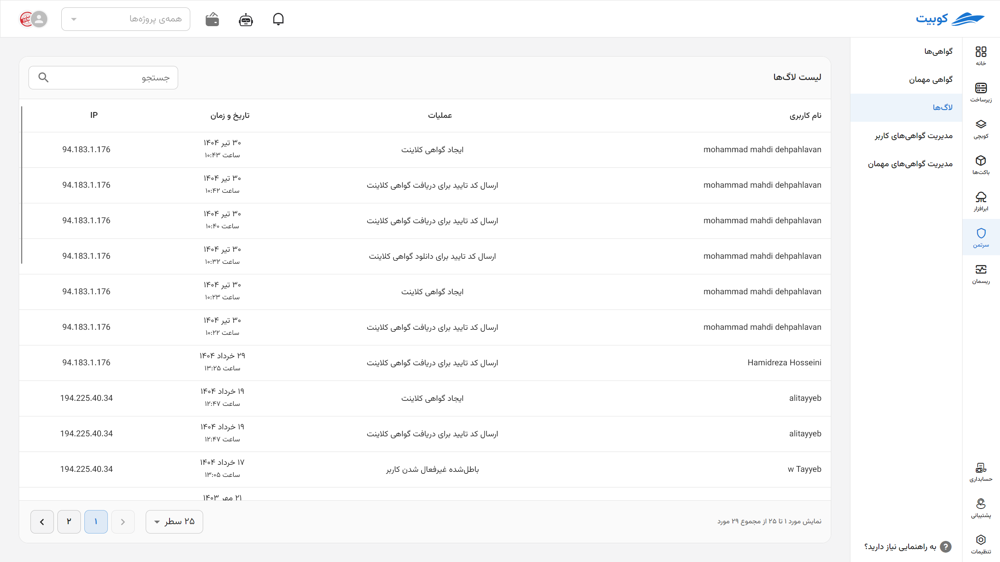

# لاگ‌ها

## تاریخچه

در منوی سمت راست سامانه، لیستی از صادرکنندگان گواهی شامل گواهی کلاینت، گواهی برای سرورهای OpenVpn و گواهی برای اتصال به کلاسترهای مختلف کوبرنتیز، موجود است. کاربر می‌تواند با کلیک بر روی هر صادرکننده‌ی گواهی فهرستی از گواهی‌های ایجاد شده توسط آن صادرکننده‌ی خاص برای خود را مشاهده نماید. در این لیست حداکثر یک گواهی فعال وجود دارد و مابقی گواهی‌ها منقضی یا باطل‌شده هستند. زیرا با ساخت یک گواهی جدید، گواهی‌های قبلی که توسط آن صادرکننده ایجاد شده باشند باطل می‌شوند.

:::caution[هشدار]
هر کاربر حداکثر یک گواهی فعال (از هر صادرکننده) می‌تواند داشته باشد.
:::

## لاگ {#log}

کاربر میتواند از طریق منوی سمت راست به بخش لاگ رفته و تمامی عملیات‌های خود درون سامانه را مشاهده نماید. این عملیات شامل ورود به سامانه، ایجاد گواهی، ارسال کد تایید، دانلود گواهی و هر یک از عملکردهای دیگر کاربر در سامانه است. شما می‌توانید در هر سطر از این صفحه علاوه بر نوع عملکرد خود، زمان انجام آن و IP ای که آن عملیات از طریق آن انجام شده است را مشاهده کنید. همچنین امکان فیلتر جدول عملکردها بر اساس نوع عملکرد وجود دارد.

