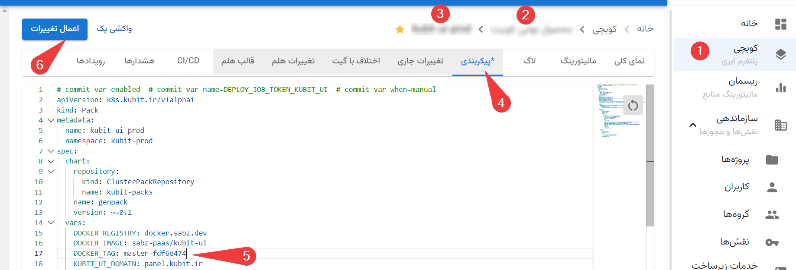
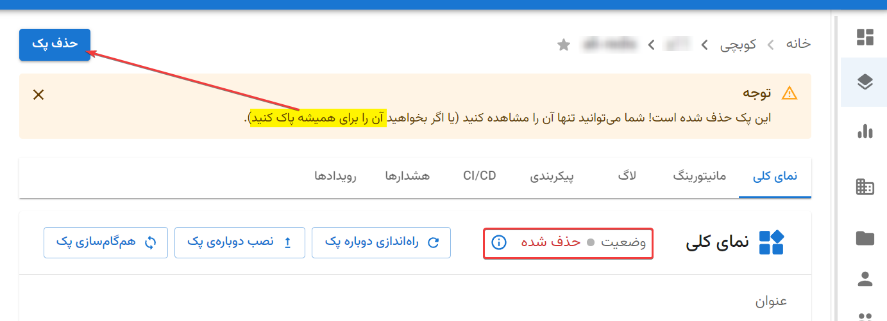
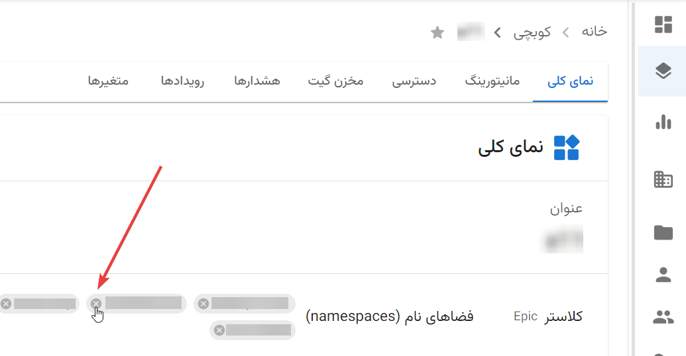
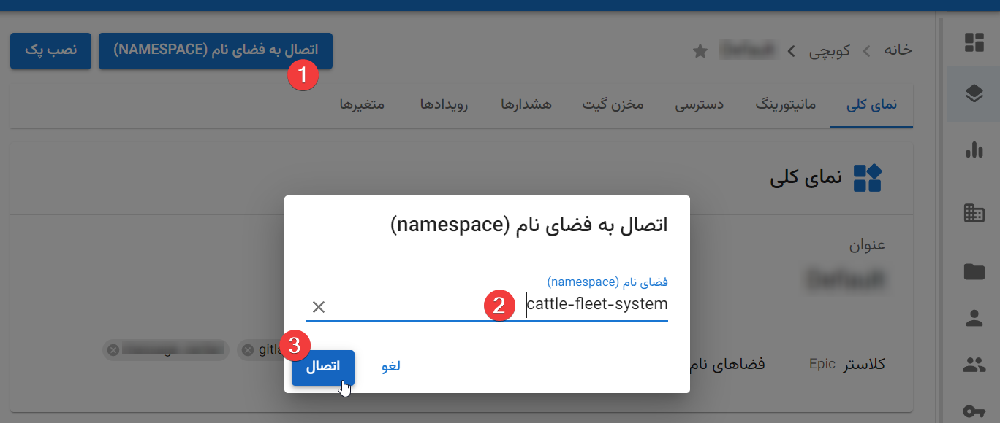

# پرسش‌های متداول

## چطور پک‌مون رو به‌روز کنیم (نسخه جدید deploy کنیم)؟

اگه [CI/CD](https://en.wikipedia.org/wiki/CI/CD) رو به صورت کامل پیکربندی کرده باشید که این کار به صورت خودکار انجام
می‌شه (معمولاً با push کردن روی برَنچ master/main).

اما اگه فقط [CI](https://en.wikipedia.org/wiki/Continuous_integration) دارید (
بدون [CD](https://en.wikipedia.org/wiki/Continuous_deployment)) … در این صورت هم خیلی ساده‌ست. کافیه به قسمت **
پیکربندی** پک‌تون برید و او‌ن‌جا `DOCKER_TAG` رو ویرایش کنید و **«اعمال تغییرات»** رو بزنید.

نکته مهم: پیش از این‌که **«اعمال تغییرات»** رو بزنید، مطمئن بشید imageتون build شده (یعنی CI pipline مربوط به commit
مورد نظر، باید به صورت موفقیت‌آمیز کامل شده باشه).

## وقتی وضعیت پکی «حذف شده» است، چه کار باید کرد؟

پک‌ها بعد از حذف توی این وضعیت قرار می‌گیرن. تنها کاربرد وجود پک توی این وضعیت، اینه که بتونید مشخصات و پیکربندی اونو
مشاهده کنید. اگه به این اطلاعات نیازی ندارید می‌تونید اون پک رو به طور کامل حذف کنید.

## چطور یک فضای نام (namespace) رو از یه پروژه به پروژه دیگه منتقل کنم؟

فقط کافیه اول به صفحه پروژه اول برید و namespace مورد نظر رو اون‌جا unbind کنید:

بعد به صفحه پروژه دوم برید و اون‌جا «اتصال به فضای نام (namespace)» رو بزنید:

