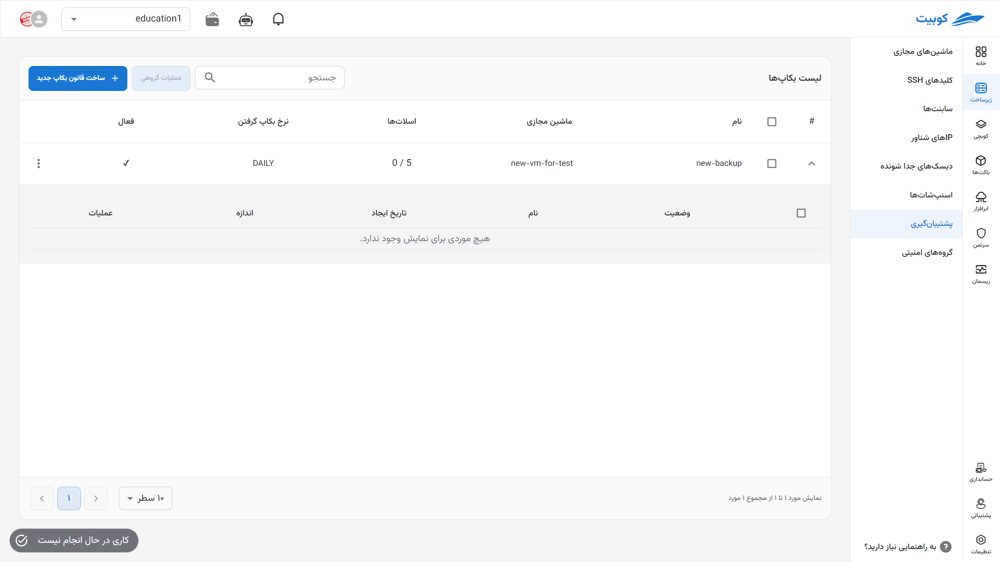
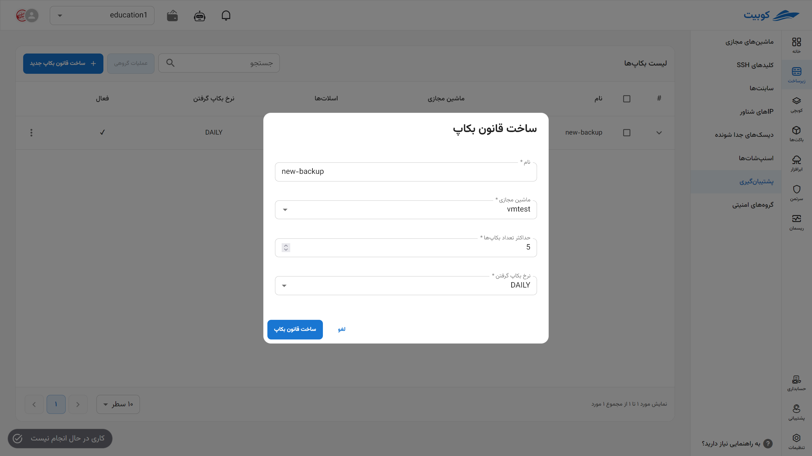
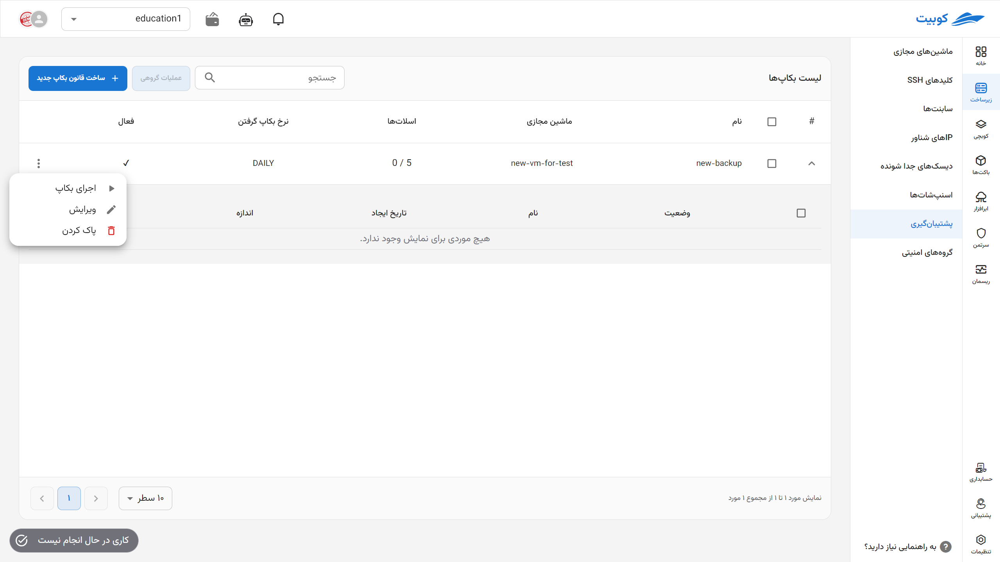
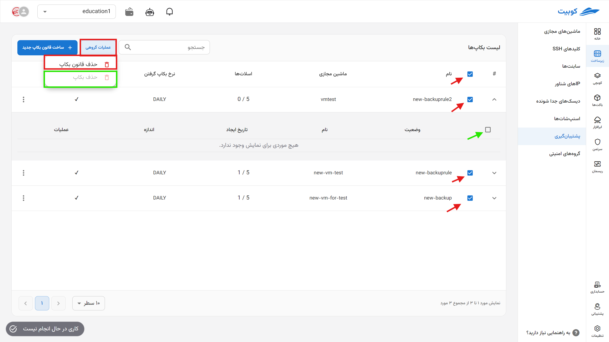

## پشتیبان گیری (Backup)

در این بخش می‌توانید **قوانین بکاپ‌گیری** را برای ماشین‌های مجازی موجود در پروژه ایجاد و مدیریت کنید. هر رول بکاپ به‌صورت **دوره‌ای (روزانه، هفتگی یا ماهانه)** از ماشین مجازی مشخص‌شده اسنپ‌شات گرفته و تا **تعداد نسخه‌ی مشخص‌شده** آن‌ها را نگه می‌دارد.  
عملیات‌های پشتیبانی‌شده شامل **ساخت رول جدید**، **حذف رول**، و **مدیریت نسخه‌های بکاپ** است.

## ساخت قانون بکاپ (Backup Rules)

- روی دکمه‌ی **ساخت قانون بکاپ جدید** کلیک کنید.
- یک **نام** برای رول وارد کرده و ماشین مجازی موردنظر را از لیست انتخاب کنید.
- **تعداد حداکثر نسخه**‌ی قابل نگهداری را مشخص کنید (مثلاً 3 نسخه).
- دوره‌ی زمانی را از بین گزینه‌های زیر انتخاب کنید:
  - **روزانه (Daily)**
  - **هفتگی (Weekly)**
  - **ماهانه (Monthly)**
- در پایان، روی دکمه‌ی **ایجاد رول بکاپ** کلیک کنید.
  

---

## جزئیات بکاپ‌های یک رول

برای مشاهده نسخه‌های بکاپ ایجادشده تحت هر رول، و انجام عملیات روی آن‌ها، روی آیکون (▼) در تصویر کلیک کنید:

### بازگردانی (Restore)

- روی آیکون **بازگردانی** نسخه‌ی موردنظر کلیک کنید.
- پس از بررسی، روی دکمه‌ی **تایید** در دیالوگ بازشده کلیک کنید تا ماشین مجازی به آن نسخه بازگردد.

### حذف نسخه (Delete)

- برای حذف یک نسخه‌ی بکاپ، روی آیکون **سطل زباله** در کنار آن کلیک کنید.
- در پنجره‌ی بازشده، گزینه‌ی **پاک کردن** را تأیید کنید.

## حذف کامل رول بکاپ

- در صورت عدم نیاز، قانون پشتیبان‌گیری قابل حذف خواهد بود. در صورتیکه قانون حاوی نسخه‌های پشتیبان باشد از حذف ان جلوگیری خواهد شد.
- گزینه‌ی **حذف رول** را انتخاب کنید.
- و در صورت اطمینان، روی دکمه‌ی **پاک کردن** در دیالوگ تأیید کلیک کنید.

## عملیات گروهی بکاپ‌ها

برای سهولت، اجرای عملیات همزمان روی چند بکاپ از طریق گزینه **عملیات گروهی** فراهم شده است. ابتدا یک یا چند بکاپ را انتخاب کنید. پس از انتخاب، دکمه‌ی **عملیات گروهی** فعال می‌شود:

