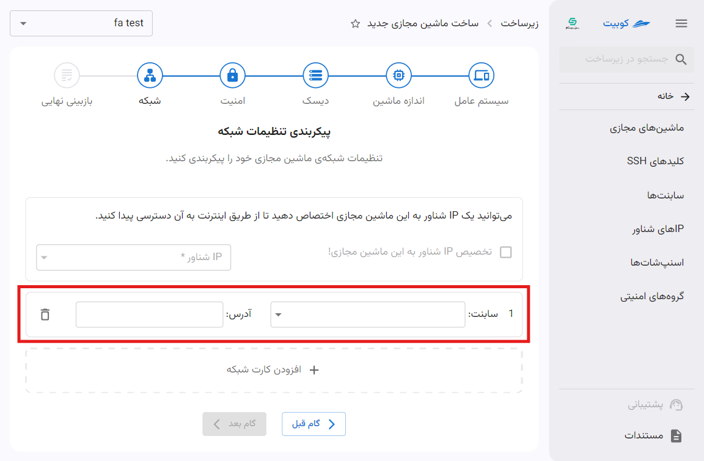
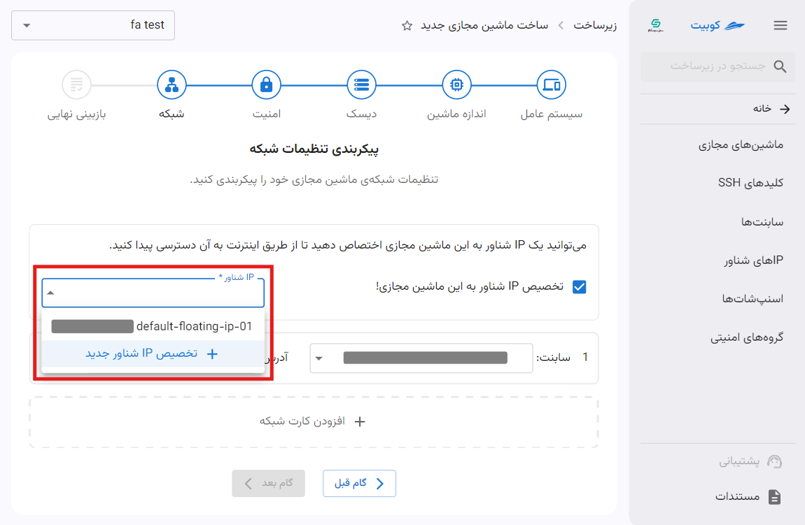
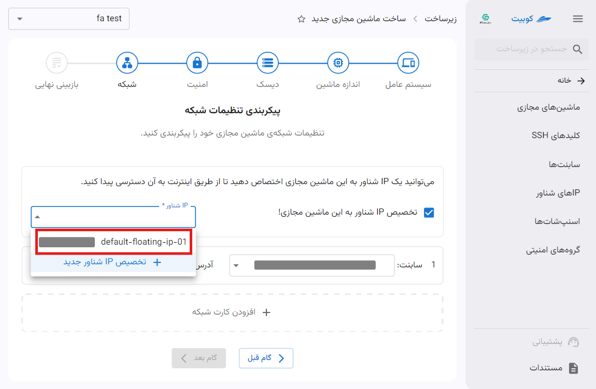
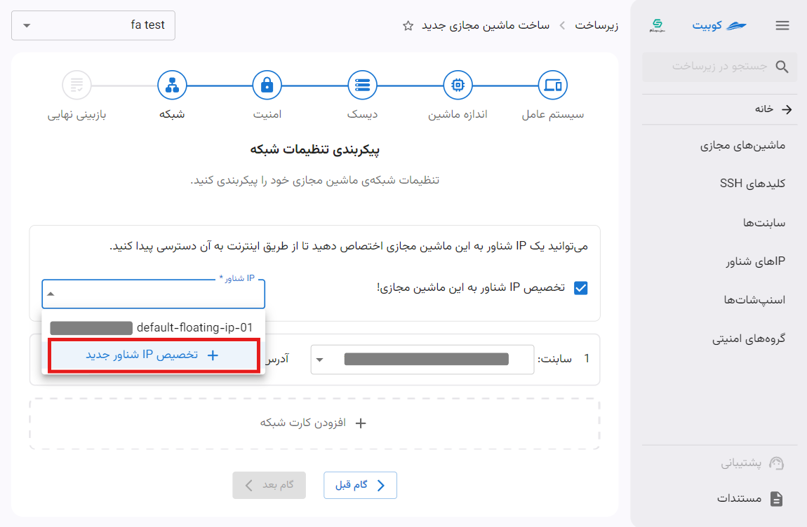

# ساخت ماشین مجازی جدید

در صفحه زیرساخت، پس از انتخاب یک پروژه متصل، برای ساخت اولین ماشین مجازی خود به بخش **ماشین‌های مجازی** بروید و روی دکمه‌ی **ساخت ماشین مجازی** کلیک کنید:

## گام اول: انتخاب سیستم عامل

اولین گام ساخت ماشین مجازی جدید، انتخاب **سیستم عامل** است. سیستم عامل موردنظر را انتخاب کنید:

## گام دوم: اندازه ماشین

در گام دوم، لیستی از منابع موجود در کوبیت وجود دارد. مطابق با نیاز خود، اندازه و مشخصات مناسب را انتخاب نمایید:

:::info[منابع بهینه‌سازی شده]
لیست منابع شامل دسته‌بندی‌های مختلف بر اساس معیار بهینه‌سازی می‌باشد. در هر کدام از این بخش‌ها، لیستی از منابع بهینه‌سازی‌شده بر اساس پردازنده، حافظه و ... وجود دارد. می‌توانید بر اساس نیاز خود، هرکدام از آنها را انتخاب کنید.

:::

:::tip[گام‌های اختیاری]
توجه داشته باشید، تنها دو گام **سیستم عامل** و **اندازه ماشین** الزامی می‌باشند و پس از گام دوم، می‌توانید به طور مستقیم به گام آخر که **بازبینی نهایی** می‌باشد، بروید.
:::

## گام سوم: دیسک

در صورتی که به فضای ذخیره‌سازی بیشتری نیاز دارید، در این گام می‌توانید دیسک اضافه برای ماشین خود انتخاب کنید. روی دکمه **افزودن دیسک جدید** کلیک کنید:

سپس **نام** و **ظرفیت** مورد نیاز خود را انتخاب کنید:

## گام چهارم: امنیت

برای تنظیمات امنیتی ماشین خود، می‌توانید از کلید SSH یا رمز عبور استفاده کنید. در صورت استفاده از کلید، می‌توانید چند کلید SSH را انتخاب کنید، و در صورتی که کلید SSH انتخاب نشده باشد، رمز عبور از طریق ایمیل ارسال می‌شود.

در این گام لیستی از کلیدهای ساخته شده در پروژه و کلیدهای مشترک در سازمان وجود دارد که می‌توانید از میان آنها انتخاب کنید و یا به صورت مستقیم، کلید جدیدی را اضافه کنید.

### انتخاب کلید از میان کلیدهای موجود{#select-key}

از بین کلیدهای فعلی، کلیدهای مورد نظر خود را انتخاب کنید و روی **گام بعدی** کلیک کنید:

:::tip[رمز عبور تصادفی]
توجه داشته باشید با وجود تنظیم کلید SSH همچنان امکان استفاده از رمز عبور برای ماشین، وجود دارد. با فعال کردن گزینه **رمز عبور تصادفی برای ماشین مجازی تولید شود.**، رمز عبور ماشین برای کاربر ایمیل خواهد شد.
:::

### افزودن کلید جدید

روی کادر **افزودن کلید SSH** کلیک کنید. سپس اطلاعات کلید شامل **نام** و **کلید عمومی SSH** را وارد کرده رو روی **افزودن کلید** کلیک کنید.

سپس کلید افزوده شده و می‌توانید آن را [انتخاب](#select-key) کنید.

## گام پنجم: شبکه

در این گام پیکربندی تنظیمات شبکه شامل **افزودن کارت شبکه** و تخصیص **IP شناور**، انجام می‌شود. برای تخصیص IP شناور، حداقل باید یک کارت شبکه برای ماشین خود تعریف کنید.

ابتدا روی **افزودن کارت شبکه** کلیک کنید تا فرم اطلاعات آن باز شود:

سپس می‌توانید از میان ساب‌نت‌های پروژه و مشترک در سازمان، انتخاب کنید و یا ساب‌نت جدید، ایجاد کنید:

### انتخاب ساب‌نت

از میان ساب‌نت‌های موجود، یک مورد را انتخاب کنید:

### افزودن ساب‌نت

روی دکمه **افزودن ساب‌نت جدید** کلیک کنید تا فرم ساخت ساب‌نت باز شود و سپس فرم را با اطلاعات موردنظر پر کنید:

برای اطلاعات بیشتر درمورد ساخت ساب‌نت و فیلدهای آن، به سند [افزودن ساب‌نت جدید](../subnets#add-new-subnet) مراجعه کنید.

## تخصیص IP شناور

پس از انتخاب ساب‌نت می‌توانید یک IP شناور نیز به ماشین اختصاص دهید. ابتدا گزینه **تخصیص IP شناور به این ماشین مجازی!** را انتخاب کنید:

سپس می‌توانید از میان IPهای شناور پروژه و مشترک در سازمان، انتخاب کنید و یا IP شناور جدید، ایجاد کنید:

### انتخاب IP شناور

از میان IPهای شناور موجود، یک مورد را انتخاب کنید:

### افزودن IP شناور

روی دکمه **تخصیص IP شناور جدید** کلیک کنید تا فرم تخصیص باز شود. سپس یک نام برای آن انتخاب کرده و روی دکمه **تخصیص IP شناور** کلیک کنید:

در انتها پس از انتخاب ساب‌نت و تخصیص IP شناور، به گام بعدی بروید.

## گام ششم: بازبینی نهایی

در بازبینی نهایی، اطلاعاتی از قبیل نام ماشین مجازی، مکان، سیستم عامل، پردازنده، حافظه، دیسک‌های اضافی، کلیدهای SSH و IP شناور و کارت شبکه تنظیم شده برای ماشین مجازی، وجود دارد.

برای ویرایش هر کدام از مشخصات به جز مکان، تنها کافیست روی آیکون مداد مشخص مربوطه کلیک کنید:

در انتها پس از مشخصات و تنظیمات ماشین، روی دکمه **ساخت ماشین مجازی** کلیک کنید:

سپس به صفحه **نمای کلی ماشین مجازی** هدایت می‌شوید و به طور موازی یک کار با عنوان **ساخت ماشین مجازی** ایجاد می‌شود که وضعیت ساخت ماشین جدید را نمایش می‌دهد:

پس از انجام موفقیت آمیز تمام کارها، دسترسی به ماشین مجازی ساخته شده، فراهم می‌شود.

مستندات مربوط به صفحه نمای کلی ماشین را از بخش [تنظیمات ماشین‌ مجازی](../vms) مطالعه کنید.
