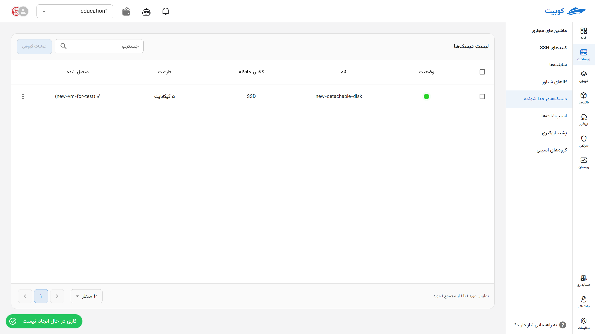
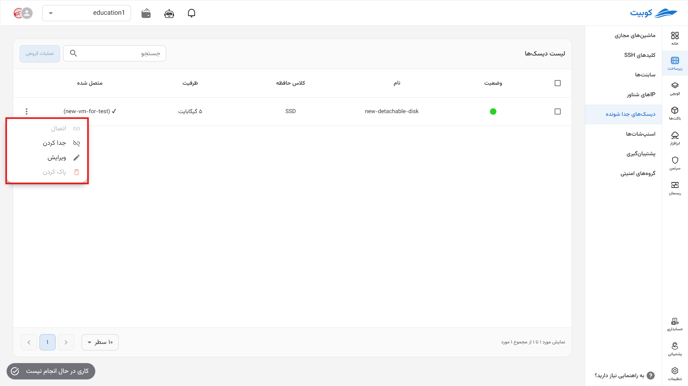
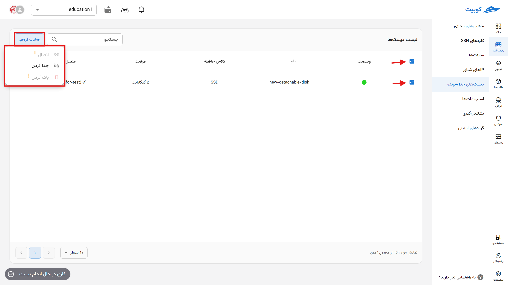

## دیسک‌های جداشونده (Detachable Disks)

در این بخش، می‌توانید لیست دیسک‌های جداشونده خود را مشاهده و مدیریت کنید. هر دیسک شامل اطلاعات زیر است:

- **وضعیت اتصال (Attached/Detached)**
- **کلاس حافظه (Storage Class)**
- **ظرفیت دیسک (GB)**
- **ماشین متصل‌شده (در صورت وجود)**

## عملیات قابل انجام بر روی دیسک‌ها

برای هر دیسک، گزینه‌های زیر از طریق منوی عملیات در دسترس است:

### اتصال (Attach)

اتصال دیسک به یکی از ماشین‌های مجازی فعال در پروژه.

### جدا کردن (Detach)

قطع اتصال دیسک از ماشین متصل‌شده، بدون حذف داده‌ها.

### ویرایش (Edit)

ویرایش مشخصاتی مانند نام دیسک یا توضیحات (در صورت امکان).

### حذف (Delete)

حذف کامل دیسک از پروژه (در صورتی که به هیچ ماشینی متصل نباشد).

## عملیات گروهی بکاپ‌ها

برای سهولت، اجرای عملیات همزمان روی چند دیسک از طریق گزینه **عملیات گروهی** فراهم شده است. ابتدا یک یا چند بکاپ را انتخاب کنید. پس از انتخاب، دکمه‌ی **عملیات گروهی** فعال می‌شود:

