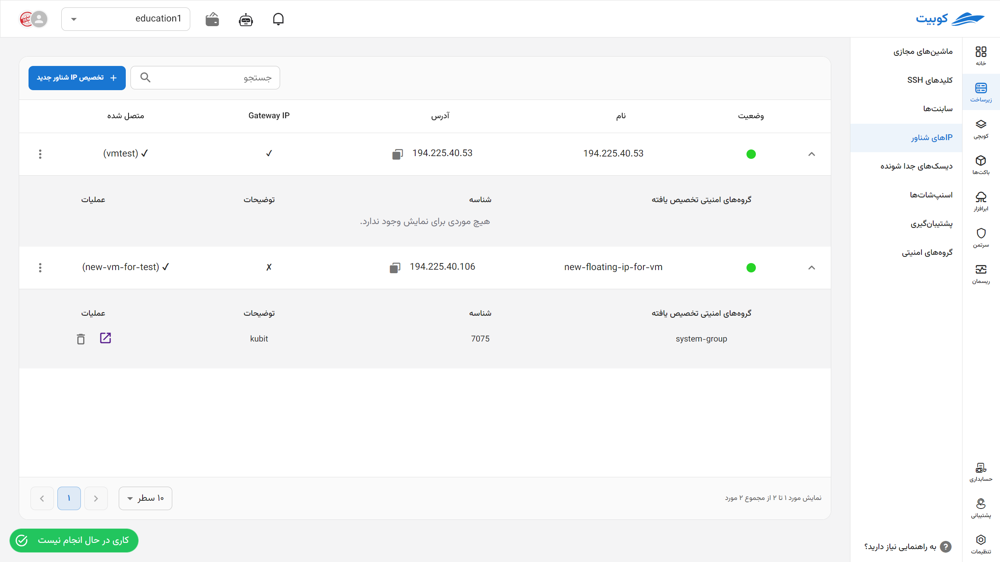
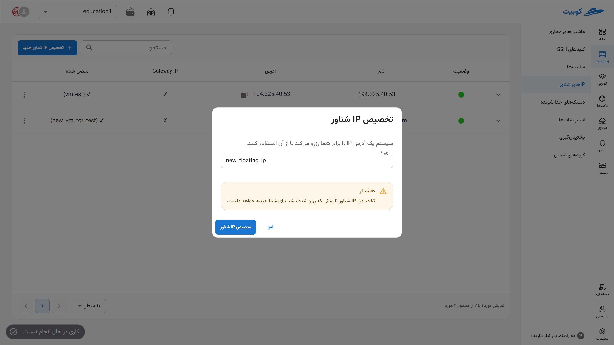
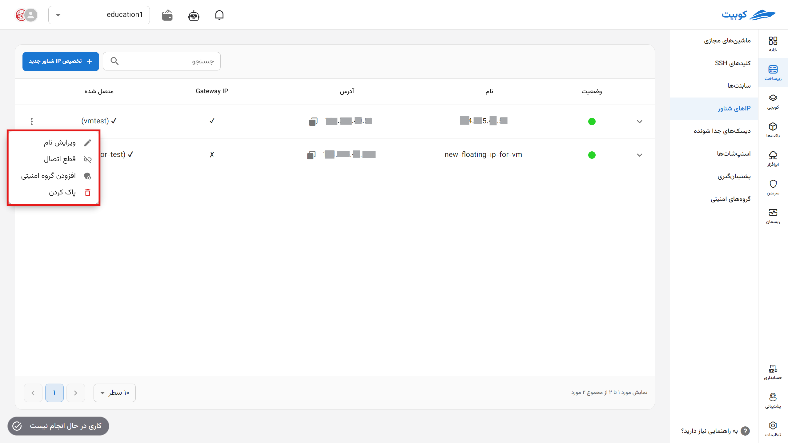
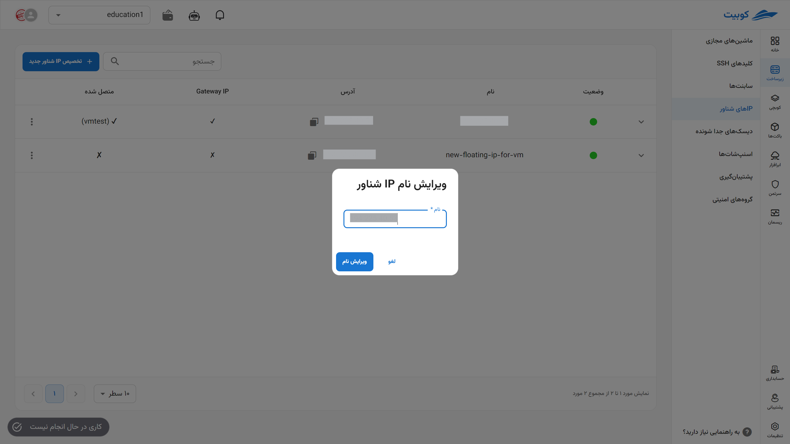
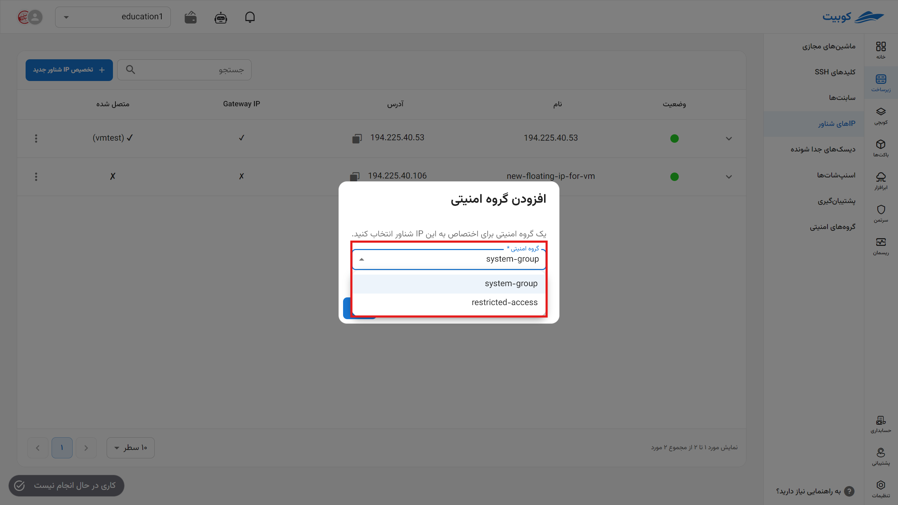
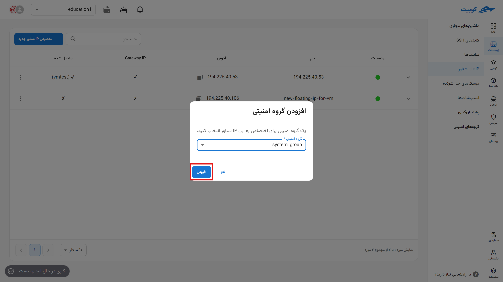

# IPهای شناور (Floating IPs)

در این بخش، لیست IPهای شناور موجود در پروژه، مدیریت آنها از قبیل **تخصیص**، **حذف** و **قطع اتصال** وجود دارد.

## تخصیص IP شناور

- روی گزینه **تخصیص IP شناور جدید** کلیک کنید.
- در دیالوگ باز شده، یک **نام معتبر و غیرتکراری** وارد کنید.
- سپس روی **تخصیص IP شناور** کلیک کنید. همچنین یک **کار** مرتبط با تخصیص IP شناور ایجاد می‌شود که وضعیت این درخواست را نشان می‌دهد.
- پس از اتمام موفقیت‌آمیز کار ایجاد شده، می‌توانید از IP شناور جدید خود، استفاده کنید.

  

:::caution[توجه!]
توجه داشته باشید که تخصیص IP شناور مادامی که رزرو شده باشد، برای شما هزینه خواهد داشت.
:::

## عملیات‌های یک IP شناور

برای مشاهده عملیات‌های ممکن برای یک IP شناور، روی دکمه سه نقطه در ستون **عملیات** کلیک کنید تا لیستی از عملیات‌ها نمایش داده شود:

### ویرایش نام

- برای ویرایش نام، روی دکمه سه نقطه در ستون **عملیات** کلیک کرده و گزینه **ویرایش نام** را انتخاب کنید.
- در دیالوگ باز شده نام جدید را انتخاب کنید و در نهایت روی دکمه **ویرایش نام** بزنید.
  

### قطع اتصال

- برای قطع اتصال از تمام منابع، روی دکمه سه نقطه در ستون **عملیات** کلیک کرده و گزینه **پاک کردن** را انتخاب کنید.
- سپس در صورت اطمینان از حذف، روی دکمه **تایید** در دیالوگ باز شده کلیک کنید.

### اتصال به گروه امنیتی

- برای افزودن یک گروه امنیتی به این آدرس IP ابتدا روی دکمه سه نقطه در ستون **عملیات** کلیک کرده و گزینه **افرودن به گروه امنیتی** را انتخاب کنید.
- از لیست گروه‌های امنیتی موجود، مورد مناسب را انتخاب کنید.
  
  

### حذف IP شناور

- برای حذف، روی دکمه سه نقطه در ستون **عملیات** کلیک کرده و گزینه **پاک کردن** را انتخاب کنید.
- سپس در صورت اطمینان از حذف، روی دکمه **پاک کردن** در دیالوگ باز شده کلیک کنید.
