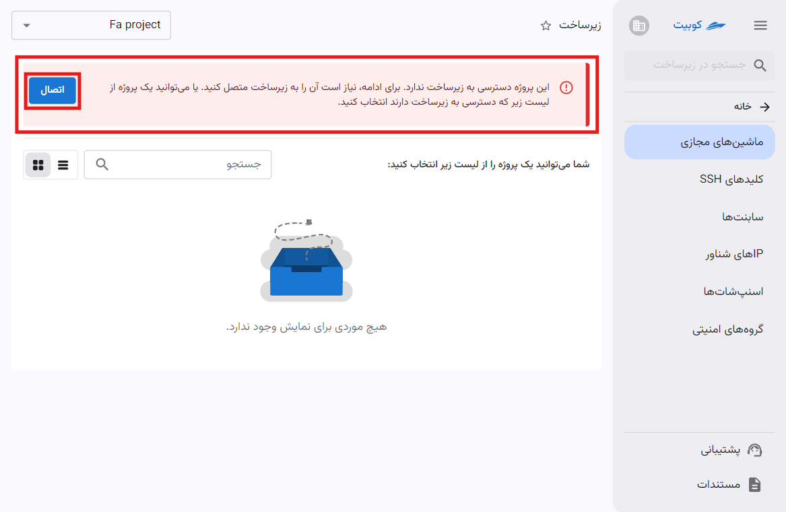
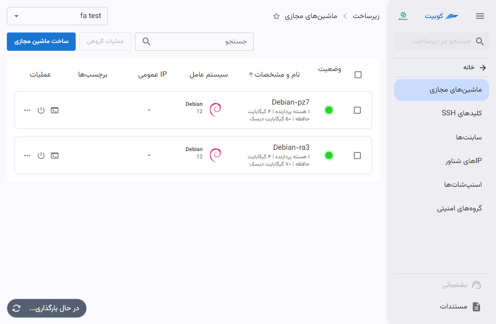

# مدیریت سرویس زیرساخت

‌در صفحه زیرساخت پنل کوبیت، قادر خواهید بود ماشین‌های مجازی خود را ایجاد کنید و به **مدیریت ماشین‌های مجازی**، **کلیدهای SSH**، **سابنت‌ها**، **IPهای شناور**، **اسنپ‌شات‌ها** و **گروه‌های امنیتی**، دسترسی داشته باشید.

## اتصال پروژه به سرویس زیرساخت

در صورتی که لیست پروژه‌های متصل خالی باشد، باید از طریق گزینه **همه‌ی‌ پروژه‌ها**، پروژه موردنظر خود را انتخاب و به سرویس زیرساخت متصل کنید:

از لیست همه‌ی پروژه‌ها، پروژه موردنظر خود را انتخاب کنید:

با کلیک روی پروژه، خطای عدم اتصال پروژه را مشاهده می‌کنید. روی دکمه **اتصال** کلیک کنید:

سپس، مکان موردنظر خود را از میان مکان‌های موجود در کوبیت انتخاب کرده و روی **اتصال** کلیک کنید:

در انتها، پروژه به سرویس زیرساخت متصل شده و به صفحه **ماشین‌های مجازی** پروژه هدایت می‌شوید:

:::info[تنظیمات پیش‌فرض پروژه پس از اتصال]
پس از اتصال پروژه به زیرساخت، مقادیر **ساب‌نت**، **IP شناور** و **گروه امنیتی** پیش‌فرض نیز برای آن تنظیم می‌شود.

در صورتی که پیش از این در سازمان فعلی مقادیر بالا به صورت مشترک در سازمان ایجاد شده باشند، از آن مقادیر برای پروژه جدید استفاده می‌شود و در غیر این صورت، مقادیر جدید برای پروژه جدید ساخته می‌شود.
:::

## انتخاب پروژه{#select-project}

در صفحه اول سرویس، لیستی از پروژه‌های متصل قابل مشاهده است. ابتدا باید پروژه موردنظر را از میان این لیست انتخاب کنید:

### لیست ماشین‌های مجازی

پس از انتخاب پروژه، به صفحه ماشین‌های مجازی آن پروژه هدایت می‌شوید. در این لیست، اطلاعاتی از هر ماشین قابل نمایش است که در ادامه به شرح و عملکرد آنها می‌پردازیم.

- **وضعیت**: نمایش وضعیت خاموش/روشن بودن ماشین با رنگ خاکستری/سبز
- **نام و مشخصات**: نمایش نام ماشین به همراه، اندازه ماشین و دیسک
- **سیستم عامل**: نمایش نام و نسخه سیستم عامل ماشین
- **IP** **عمومی**: نمایش IPهای عمومی تنظیم شده برای ماشین
- **برچسب‌ها**: نمایش برچسب‌های ماشین
- **عملیات**: دسترسی به خاموش/روشن کردن، هدایت به کنسول، راه‌اندازی مجدد، ویرایش نام، تغییر اندازه، قطع برق، پاک کردن
  

#### عملیات گروهی ماشین‌ها

## قطع اتصال پروژه

- برای قطع اتصال پروژه از سرویس زیرساخت، می‌توانید از آیکون قطع اتصال روی کارت پروژه موردنظر اقدام کنید.
- سپس در صورت اطمینان، روی دکمه **تایید** دیالوگ باز شده کلیک کنید.
  
  

:::tip[ساخت پروژه]
همچنین اگه تمایل به ایجاد پروژه جدید دارید، می‌توانید از طریق گزینه **ایجاد پروژه جدید** اقدام کنید:
سپس **عنوان** و **کلید** پروژه را وارد کرده و روی **ایجاد** کلیک کنید:

:::

## کارها

دکمه پایین صفحه زیرساخت، دسترسی سریع به لیستی از کارهای انجام شده/در حال انجام فراهم می‌کند. در صورت وجود کار جاری، وضعیت آن را نشان داده و در غیر این صورت، وضعیت آخرین کار انجام شده را نمایش می‌دهد.

:::tip[کارها در سطوح مختلف]
کارها در دو سطح مختلف پروژه و ماشین وجود دارند. متناسب با صفحه‌ای که در آن هستید، می‌توانید به کارهای همان صفحه و سطح دسترسی پیدا کنید.
:::

