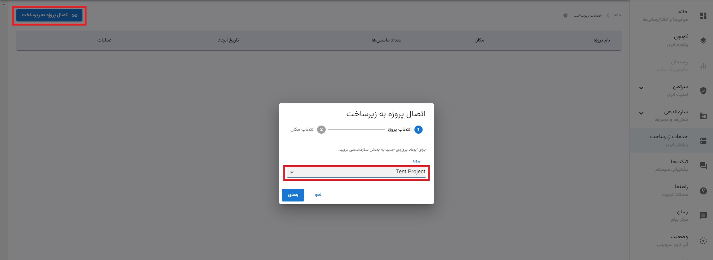
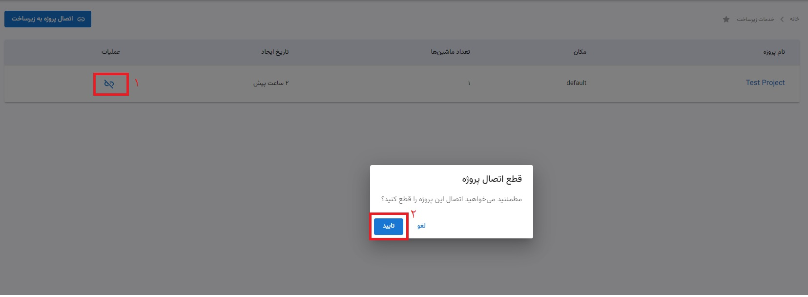
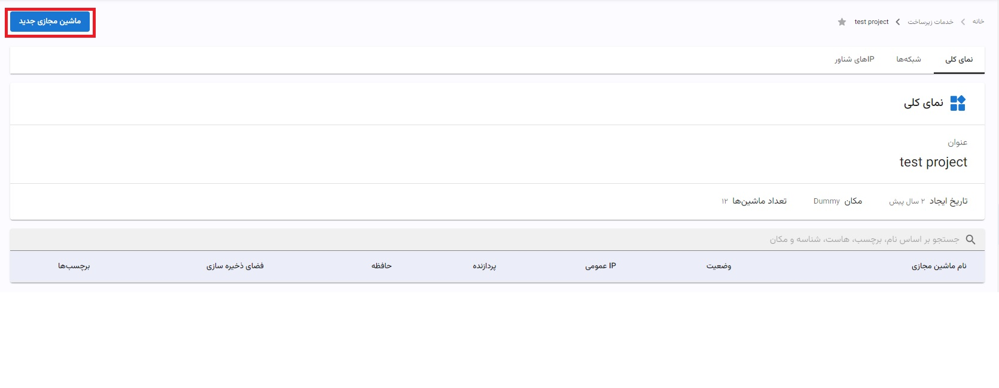
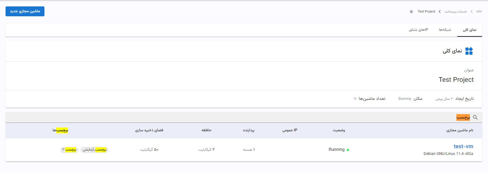
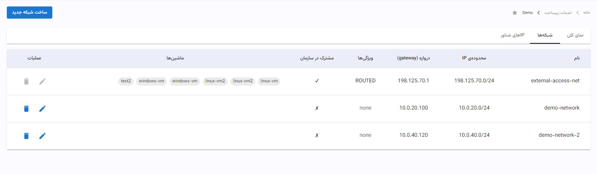
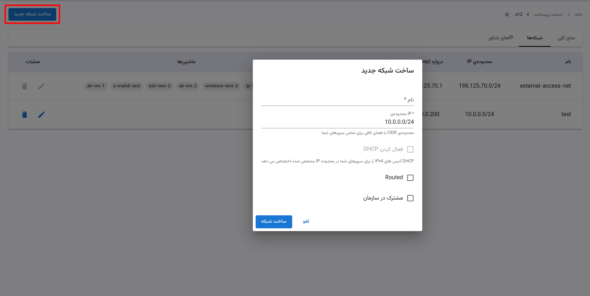
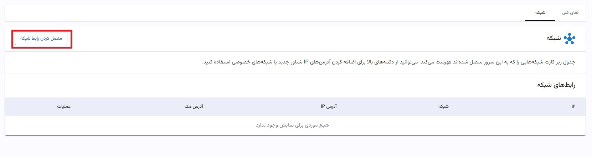

# زیرساخت (رایانش ابری)

## معرفی

بخش خدمات زیرساخت کوبیت عهده‌دار ارائه‌ی منابع ابری نظیر پردازنده، حافظه، دیسک و شبکه، بر اساس تقاضا و به صورت پرداخت به میزان استفاده، به کاربر است.

در این بخش شما قادر خواهید بود به تعداد دلخواه، ماشین‌های مجازی خود را ذیل پروژه‌های مخلتف بسازید و برای هر ماشین، انتخاب کنید نیازمند چه سیستم‌عاملی و با چه میزان ظرفیت منابع هستید و مایلید هر ماشین در چه دیتاسنتری ساخته شود.

عملیات ابتدایی نظیر روشن/خاموش کردن و یا ریستارت ماشین از طریق این بخش در دسترس شما خواهد بود. همان طور که می‌توانید در هر زمان دلخواه از ماشین خود پشتیبان‌گیری نموده و نیز به کنسول آن به سادگی دسترسی داشته باشید.

در این بخش می‌توان برای هر پروژه تعدادی شبکه با محدوده‌ی IP مشخص تعریف کرد و ماشین‌های موجود در آن پروژه را به شبکه‌های تعریف‌شده متصل نمود. همچنین امکان اضافه کردن IP شناور برای هر کارت شبکه‌ی متصل‌شده‌ی ماشین وجود دارد.

در بخش خدمات زیرساخت کوبیت از دو VMProvider قدرتمند و معروف Proxmox و vCloud استفاده شده است و کاربر وابسته به انتخاب مکان دیتاسنتر ممکن است از هر یک از این دو سرویس بگیرد.

## شروع به کار

با انتخاب بخش خدمات زیرساخت از منوی اصلی کوبیت و ورود به این قسمت، لازم است تا در اولین قدم یکی از پروژه‌هایی که قبلا در قسمت سازماندهی ساخته‌اید را به بخش زیرساخت متصل کنید. برای این کار مطابق شکل زیر با استفاده از دکمه‌ی «اتصال پروژه به زیرساخت» در دیالوگ باز شده، در مرحله‌ی اول یکی از پروژه‌های قبلا ساخته شده را انتخاب کرده و سپس محل دیتاسنتر مورد نظر خود را تعیین نموده و در انتها با زدن دکمه‌ی «اتصال» اولین پروژه را به لیست پروژه‌های زیرساخت اضافه کنید.

شما می‌توانید با طی مراحل قبل، هر تعداد از پروژه را به قسمت زیرساخت متصل کنید. سپس در لیست پروژه‌های متصل‌شده با کلیک بر روی هر یک از پروژه‌ها می‌توانید به امکاناتی نظیر ساخت ماشین مجازی و شبکه دسترسی داشته باشید.

همچنین در هر زمان امکان قطع اتصال پروژه از زیرساخت از طریق دکمه‌ی «قطع اتصال» مطابق شکل زیر فراهم است.

با ورود به هر پروژه سه تب «نمای کلی»، «شبکه‌ها» و «IPهای شناور» قابل مشاهده است. در تب نمای کلی جزئیات و آماری از پروژه‌ی جاری، به همراه لیست ماشین‌های مجازی آن پروژه را خواهید دید. در تب شبکه‌ها میتوانید شبکه‌های ساخته‌شده در این پروژه را مشاهده کنید. همچنین در تب IPهای شناور می‌توانید یک کارت شبکه از ماشین‌های این پروژه را به یک IP عمومی متصل کنید.

## ساخت یک ماشین مجازی

برای ساخت اولین ماشین مجازی خود به تب نمای کلی بروید و بر روی دکمه‌ی «ماشین مجازی جدید» کلیک کنید.

در صفحه‌ی ساخت ماشین مجازی جدید لازم است تا ابتدا نام ماشین مجازی خود را انتخاب کنید و سپس مواردی نظیر دیتاسنتر، سیستم‌عامل و میزان ریسورس‌ها (که قبلا به صورت پلن‌های آماده تعریف شده‌اند) را انتخاب نمایید. همچنین میباید در قسمت کلیدهای ssh کلید خود را تعریف نموده.

رزورو یک IPv4 اختصاصی هم امکان پذیر است که در صورت انتخاب هزینه ای ماهانه (وابسته به محل دیتا سنتر است) را متقبل می شوید. پس از تکمیل فرم می‌توانید ماشین مجازی خود را بسازید.

## عملیات بر روی ماشین مجازی

در تب «نمای کلی» از صفحه‌ی مختص به پروژه، شما می‌توانید لیستی از ماشین‌های مجازی ساخته‌شده در آن پروژه را مشاهده نمایید. در این لیست مشخصات کلی ماشین‌ها وجود داشته و همچنین امکان جستجو بر روی مقادیر مختلف از پارامترهای ماشین در دسترس است.

## مدیریت شبکه در زیرساخت

برای ایجاد شبکه بین ماشین های هر پروژه، میتوان شبکه های متعددی در پروژه تعریف کرد. هر شبکه متشکل از یک نام و یک بازه‌ی IP است که میتوان از آن ها برای ایجاد کارت شبکه (NIC) در ماشین مجازی استفاده کرد.

:::info[شبکه‌ی external-access-net]
شبکه‌ی external-access-net شبکه‌ی پیش فرض سازمان است و به صورت پیش فرض در تمامی پروژه ها وجود دارد.
:::

### ساخت شبکه‌ی جدید

شما میتوانید از مسیر تب شبکه ها و دکمه‌ی ساخت شبکه جدید، یک شبکه جدید ایجاد کنید. در دیالوگ مربوط به ساخت یک شبکه شما نام و محدوده IP را مشخص میکنید. در صورتی که DHCP را فعال کنید آدرس های IP شما از طریق پروتکل DHCP مشخص میشود.

شبکه های routed از شبکه های دیگر نیز قابل مشاهده هستند و میتوان از آن ها برای ایجاد ارتباط بین چند شبکه استفاده کرد.

شبکه های مشترک در سازمان را میتوان در پروژه های دیگر نیز استفاده کرد. یعنی میتوان از این شبکه ها برای ایجاد کارت شبکه در ماشین های پروژه های دیگر استفاده کرد.

:::tip[نکته]
شبکه های مشترک در سازمان تنها در آن پروژه ای که ایجاد شده اند قابل ویرایش اند.
:::

 

### ایجاد کارت شبکه برای ماشین مجازی

برای ایجاد کارت شبکه در ماشین مجازی باید ابتدا آن را به یک شبکه متصل کنید و یک آدرس IP از بازه‌ی IP شبکه را به آن اختصاص دهید.

با ایجاد کارت شبکه، ماشین مد نظر با IP اختصاص داده شده در شبکه قابل مشاهده است.

برای اینکار از تب نمای کلی، ماشین مجازی مد نظرتان را انتخاب کنید و سپس در صفحه جزییات آن به تب شبکه بروید و از آنجا متصل کردن رابط شبکه را بزنید.

### IP شناور

آدرس‌های IP شناور، آدرس‌های IPv4 عمومی هستند که می‌توانند به هر سرور ابری در همان منطقه متصل شوند. ترافیک را در هر زمان به یک سرور هدایت می‌کنند و می توانند، بدون نیاز به راه‌اندازی مجدد سرور، به سرور دیگری در همان منطقه، بدون قطعی، منتقل شوند.
