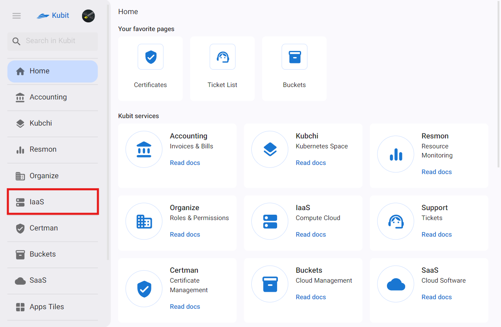

---
subDocuments:
  - iaas-settings
  - vms
  - ssh-keys
  - subnets
  - floating-ips
  - snapshots
  - security-groups
---

# زیرساخت (رایانش ابری)

بخش خدمات زیرساخت کوبیت عهده‌دار ارائه‌ی منابع پردازش ابری نظیر پردازنده، حافظه، دیسک و شبکه، بر اساس تقاضا و به صورت پرداخت به میزان استفاده (Pay as You Go) به کاربر است. در این بخش قادر خواهید بود ذیل پروژه‌های مخلتف ماشین‌های مجازی خود را با انتخاب نوع سیستم عامل، ظرفیت CPU و Memory، سایز و تعداد دیسک‌ها، تنظیمات شبکه و موارد امنیتی نظر کلیدهای SSH، ایجاد کنید.

## مفاهیم پایه

### ماشین مجازی

ماشین مجازی (Virtual Machine) یک شبیه‌سازی نرم‌افزاری از یک کامپیوتر فیزیکی است. هر ماشین مجازی سیستم‌عامل و برنامه‌های خود را به صورت ایزوله از سایر نرم‌افزارها بر روی همان سخت‌افزار فیزیکی اجرا می‌کند. این ایزولاسیون امکان همزیستی چندین ماشین مجازی بر روی یک ماشین فیزیکی را فراهم می‌کند و منابعی مانند CPU، حافظه و فضای ذخیره‌سازی را به اشتراک می‌گذارند. ماشین مجازی‌ها برای بهینه‌سازی استفاده از سخت‌افزار، آزمایش نرم‌افزار در محیط‌های کنترل شده و اجرای برنامه‌هایی که به سیستم‌عامل‌های مختلف نیاز دارند بر روی یک دستگاه، استفاده می‌شوند. آن‌ها انعطاف‌پذیری و کارایی را در مدیریت منابع محاسباتی ارائه می‌دهند.

### کلید SSH

کلید SSH یک ویژگی امنیتی حیاتی است که برای احراز هویت و دسترسی به ماشین‌های مجازی (VMs) استفاده می‌شود. این کلید شامل یک جفت کلید رمزنگاری است: یک کلید عمومی که روی سرور ذخیره می‌شود و یک کلید خصوصی که نزد کاربر نگهداری می‌شود. این جفت کلید امکان ورود امن و بدون رمز عبور به ماشین‌های مجازی را فراهم می‌کند و اطمینان می‌دهد که فقط کاربران مجاز با کلید خصوصی صحیح می‌توانند دسترسی پیدا کنند.

### ساب‌نت

ساب‌نت به یک تقسیم‌بندی منطقی از یک شبکه IP درون یک ابر خصوصی مجازی (VPC) اشاره دارد. این زیرشبکه‌ها VPC را به بخش‌های متمایز تقسیم می‌کنند، که هر کدام دارای محدوده آدرس IP خاص خود هستند، تا منابع مختلف را مدیریت و جدا کنند. زیرشبکه‌ها برای سازماندهی معماری شبکه، اجرای کنترل‌های امنیتی و بهینه‌سازی مدیریت ترافیک در یک محیط ابری ضروری هستند. که تخصیص کارآمد منابع و امنیت بهبود یافته را ممکن می‌سازند.

### IP شناور

آدرس‌های IP شناور، آدرس‌های IPv4 عمومی هستند که می‌توانند به هر سرور ابری در همان منطقه متصل شوند. ترافیک را در هر زمان به یک سرور هدایت می‌کنند و می‌توانند بدون نیاز به راه‌اندازی مجدد سرور به سرور دیگری در همان منطقه، بدون قطعی منتقل شوند.

### اسنپ‌شات

اسنپ‌شات وضعیت ذخیره شده‌ای از یک ماشین مجازی یا حجم در یک نقطه زمانی خاص است. این اسنپ‌شات پیکربندی و داده‌های منبع را ثبت می‌کند و امکان بازگردانی سریع در صورت از دست رفتن داده‌ها یا سایر مشکلات را فراهم می‌کند. اسنپ‌شات‌ها برای پشتیبان‌گیری، بازیابی پس از خرابی و کلون کردن ماشین‌های مجازی برای مقیاس‌بندی یا آزمایش استفاده می‌شوند و یک مکانیزم قابل اعتماد برای مدیریت داده‌ها و وضعیت سیستم‌ها در یک محیط ابری فراهم می‌کنند.

### گروه امنیتی

گروه امنیتی به عنوان یک فایروال مجازی عمل می‌کند و قوانینی را تعریف می‌کند که ترافیک شبکه ورودی و خروجی به و از ماشین‌های مجازی یا سایر منابع را کنترل می‌کند. این قوانین پروتکل‌ها، پورت‌ها و محدوده‌های IP مجاز را مشخص می‌کنند، بنابراین دسترسی به منابع را کنترل می‌کنند.
