# گروه‌های امنیتی

در این بخش، به لیست گروه‌های امنیتی پروژه و مدیریت آنها از جمله **ایجاد**، **افزودن قانون**، **مشاهده وضعیت گروه** و **حذف**، دسترسی خواهید داشت.

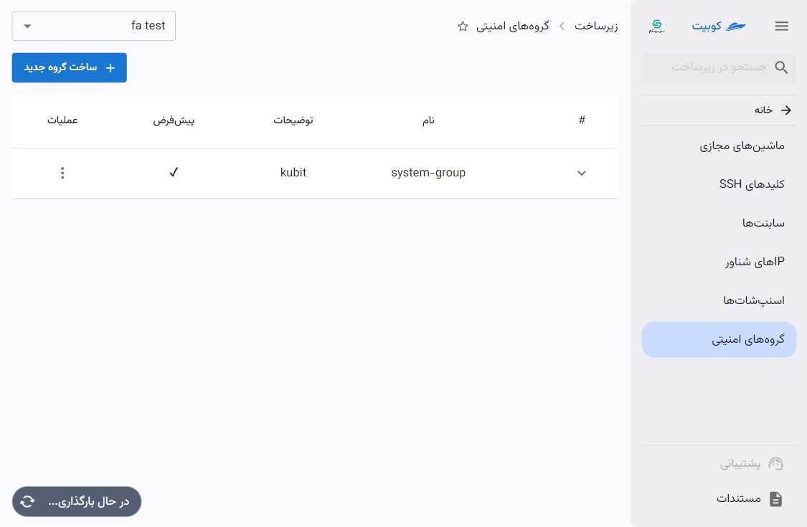

:::info[گروه پیش‌فرض]
پس از اتصال پروژه به سرویس، یک گروه امنیتی پیش‌فرض توسط کوبیت برای پروژه ایجاد می‌شود که این گروه، از طریق ستون **پیش‌فرض** با دیگر گروه‌ها، قابل تفکیک می‌باشد.
:::

## قوانین گروه امنیتی

پیش از آموزش گروه‌های امنیتی، ابتدا باید به بررسی قوانین آن پرداخت. قوانین به مجموعه‌ای از معیارها و اقدامات گفته می‌شود که تعیین می‌کند چه ترافیکی مجاز به عبور از فایروال است. این قوانین معمولاً براساس معیارهایی مانند آدرس‌های IP، پروتکل‌ها، پورت‌ها و جهت ترافیک (ورودی یا خروجی) تعریف می‌شوند.

## ساخت گروه جدید

- برای تعریف گروه امنیتی جدید، روی دکمه **ساخت گروه جدید** کلیک کنید.
- سپس **نام** و **توضیحات** گروه را وارد کرده و روی دکمه **ایجاد** کلیک کنید.
  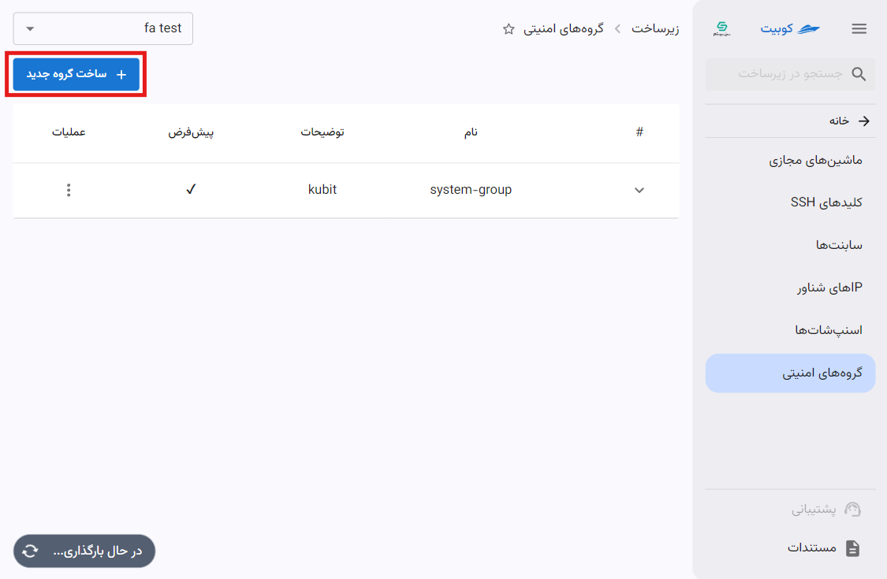
  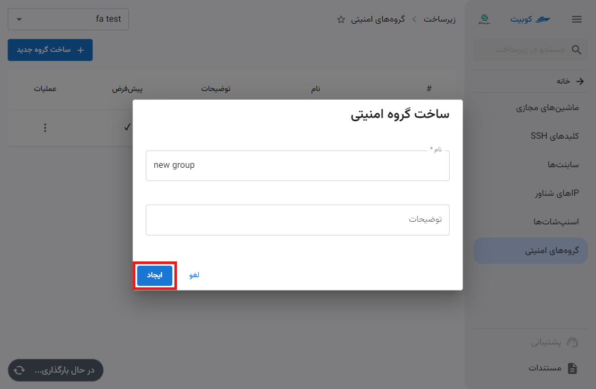

پس از ایجاد گروه جدید، می‌توانید برای آن قوانین خود را تعریف کنید یا به ماشین مجازی و ساب‌نت، تخصیص دهید.

## مشاهده جزئیات و وضعیت

با کلیک روی آیکون مشخص شده هر گروه، لیستی از قوانین گروه و جزئیات آنها نمایش داده می‌شود:
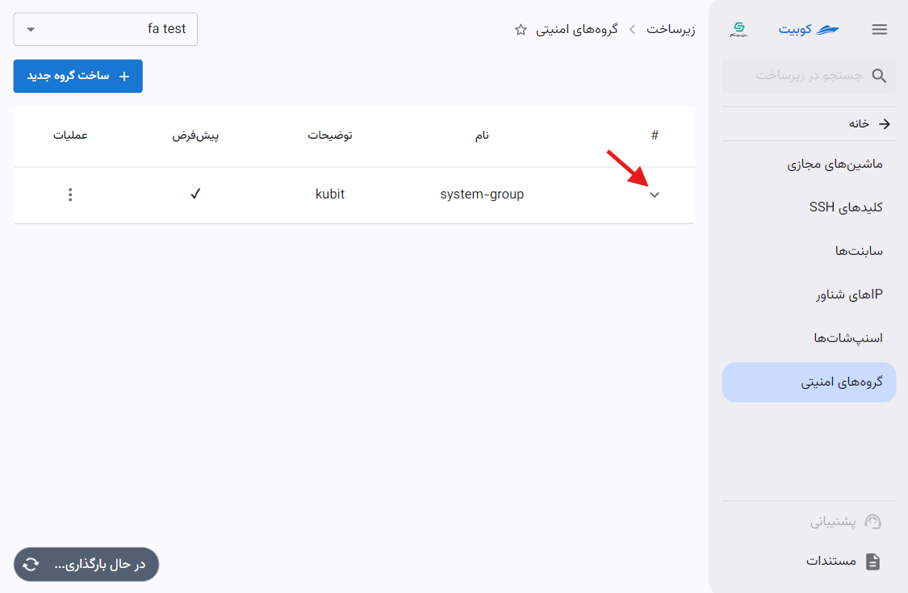
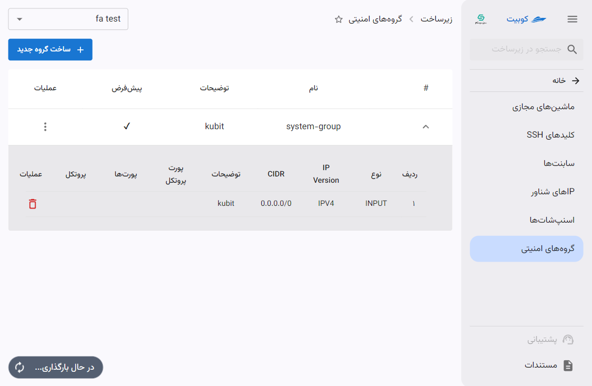

### حذف قانون از گروه

- برای حذف قانون از گروه، تنها کافیست روی آیکون **سطل زباله** مرتبط با قانون، کلیک کنید.
- سپس در صورت اطمینان از حذف، روی دکمه **تایید** در دیالوگ باز شده کلیک کنید.

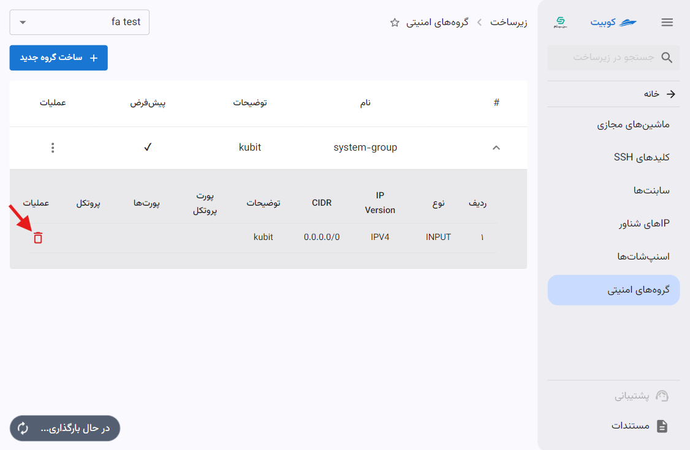
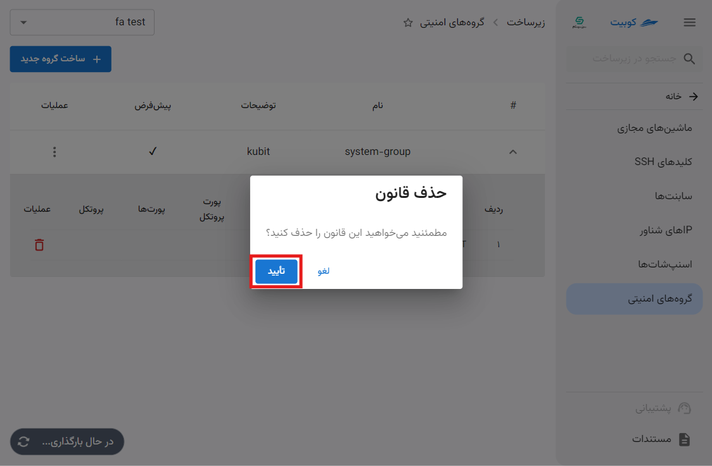

## عملیات‌های یک گروه

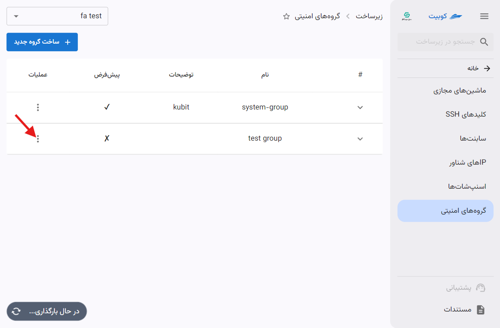

### افزودن قانون جدید

قانون‌های هر گروه، تعیین‌کننده سطح دسترسی و نوع دسترسی می‌باشند. برای تخصیص قانون جدید، روی **افزودن قانون جدید** کلیک کنید:
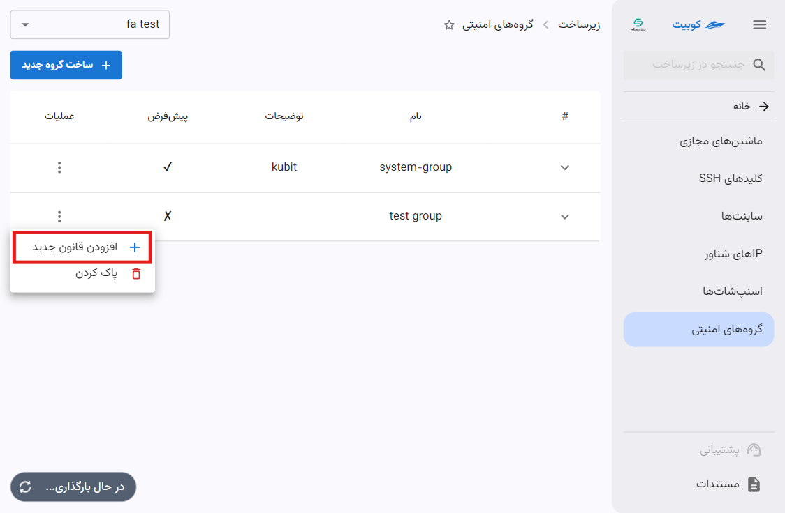
سپس باید اطلاعات موردنیاز برای قانون را تعریف کنید:

- **ورودی/خروجی**: تعیین جهت ترافیک
- **نسخه IP**: تعیین نسخه IP
- **CIDR**: بازه IP ای که از طریق این قانون، به منابع دسترسی پیدا می‌کند.
- **پورت پروتکل**: انتخاب پورت پروتکلی که قصد باز کردن دسترسی برای آن را دارید. در این بخش لیستی از پورت پروتکل‌های پرکاربرد وجود دارد و در صورت نیاز به تعریف پروتکل دیگر، می‌توانید گزینه **سفارشی** را انتخاب کنید و اطلاعات موردنظر خود را وارد کنید.
  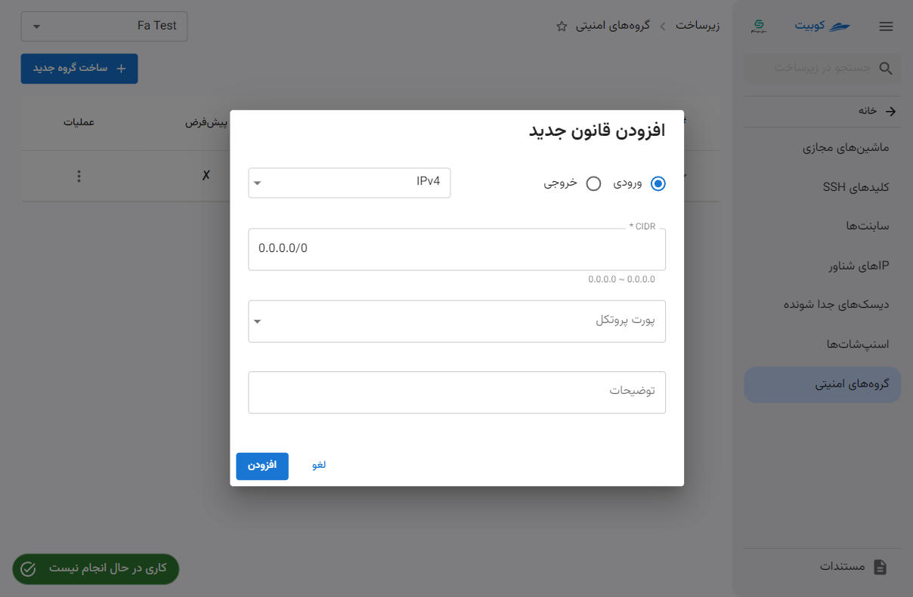
  در نهایت با کلیک روی **افزودن** قانون ایجاد شده و به گروه موردنظر تخصیص داده می‌شود.

### پاک کردن

- برای حذف گروه امنیتی، روی دکمه سه نقطه در ستون **عملیات** کلیک کرده و گزینه **پاک کردن** را انتخاب کنید.
- سپس در صورت اطمینان از حذف، روی دکمه **پاک کردن** در دیالوگ باز شده کلیک کنید.
  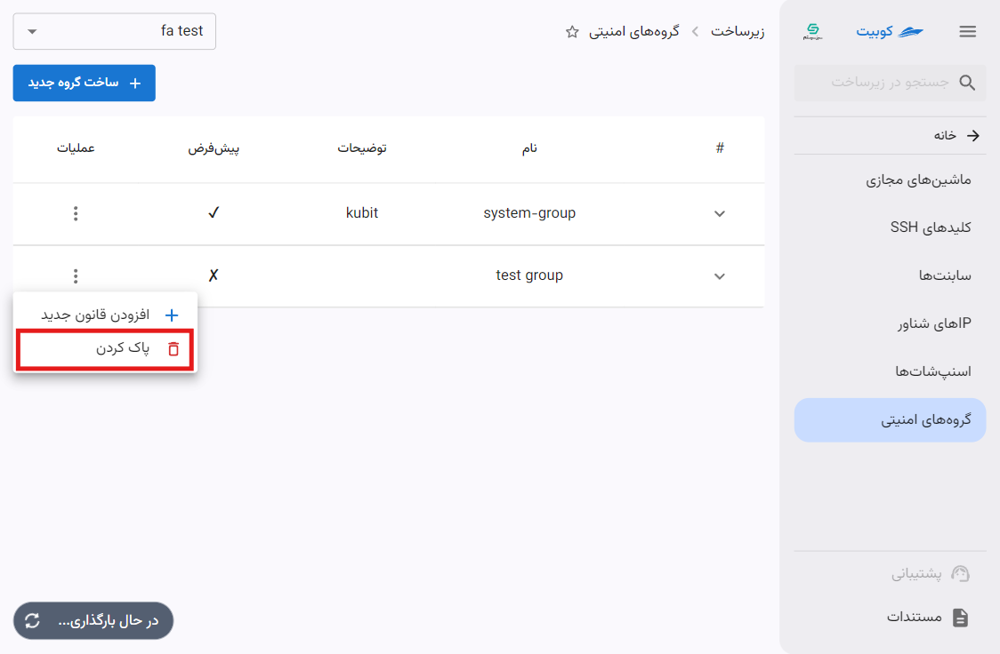
  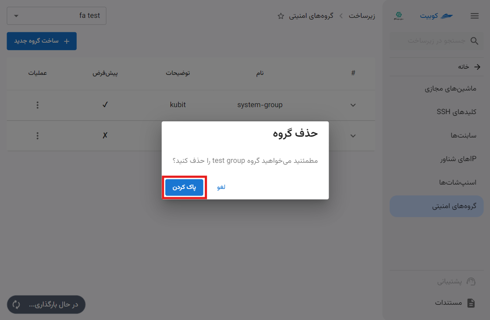
