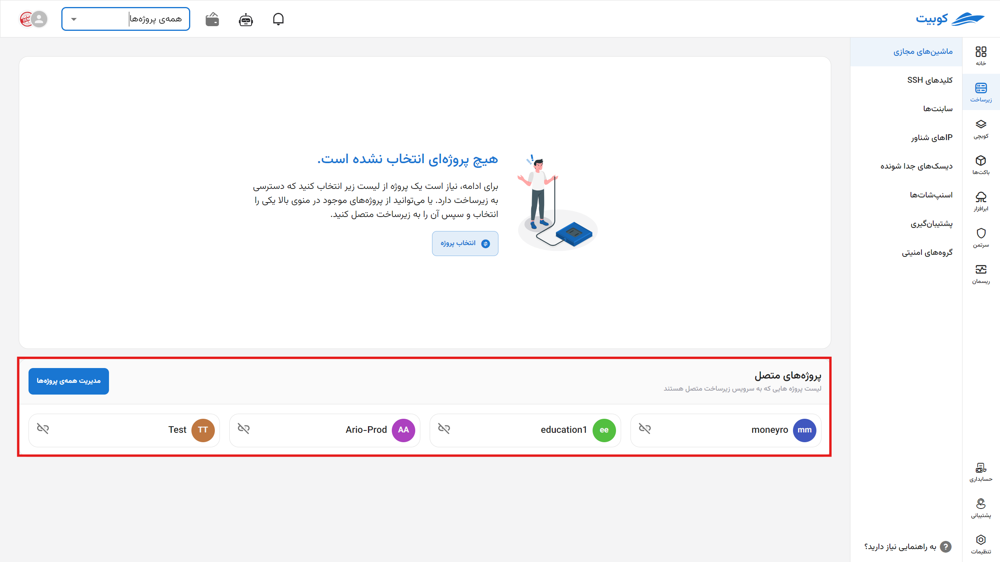

# مقدمات استفاده از سرویس زیرساخت (گام صفر)

پیش از شروع به ایجاد منابع زیرساختی مانند ماشین مجازی یا دیسک، لازم است پروژه‌ی شما به سرویس زیرساخت متصل شود. در این مرحله (گام صفر)، ابتدا با اتصال پروژه به زیرساخت، دسترسی به منابع فراهم می‌شود. سپس با **انتخاب پروژه فعال**، تمام عملیات بعدی مانند ساخت منابع یا مدیریت آن‌ها در همان پروژه انجام خواهد شد. همچنین در صورت عدم نیاز، می‌توانید اتصال پروژه به زیرساخت را **قطع** کنید. در این بخش همچنین به توضیحات مربوط به **کارها (Jobs)** برای پیگیری وضعیت اجرای عملیات زیرساختی، و اطلاعات مربوط به **سقف ظرفیت (Quota)** و نحوه مدیریت آن، دسترسی خواهید داشت.

## اتصال پروژه به سرویس زیرساخت

- از طریق گزینه **همه‌ی‌ پروژه‌ها**، لیست پروژه‌های فعلی سازمان را باز کنید.
- از میان پروژه‌ها، پروژه موردنظر خود را انتخاب کنید.
- سپس خطای عدم اتصال پروژه ظاهر می‌شود. برای اتصال پروژه، روی دکمه **اتصال** کلیک کنید.
- مکان موردنظر خود را از میان مکان‌های موجود در کوبیت انتخاب کرده و روی **اتصال** کلیک کنید.
  
  
  
  

در انتها، پروژه به سرویس زیرساخت متصل شده و به صفحه ماشین‌های مجازی پروژه هدایت می‌شوید:

:::info[تنظیمات پیش‌فرض پروژه پس از اتصال]
پس از اتصال پروژه به زیرساخت، مقادیر **ساب‌نت**، **IP شناور** و **گروه امنیتی** پیش‌فرض نیز برای آن تنظیم می‌شود.

در صورتی که پیش از این در سازمان فعلی مقادیر بالا به صورت مشترک در سازمان ایجاد شده باشند، از آن مقادیر برای پروژه جدید استفاده می‌شود و در غیر این صورت، مقادیر جدید برای پروژه جدید ساخته می‌شود.
:::

## انتخاب پروژه{#select-project}

در صفحه اول سرویس، لیستی از پروژه‌های متصل قابل مشاهده است. ابتدا باید پروژه موردنظر را از میان این لیست انتخاب کنید:

در انتها به صفحه ماشین‌های مجازی هدایت خواهید شد.

### لیست ماشین‌های مجازی

پس از انتخاب پروژه، به صفحه ماشین‌های مجازی آن پروژه هدایت می‌شوید. در این لیست، اطلاعاتی از هر ماشین قابل نمایش است که در ادامه به شرح و عملکرد آنها می‌پردازیم.

- **وضعیت**: نمایش وضعیت خاموش/روشن بودن ماشین با رنگ خاکستری/سبز
- **نام و مشخصات**: نمایش نام ماشین به همراه، اندازه ماشین و دیسک
- **سیستم عامل**: نمایش نام و نسخه سیستم عامل ماشین
- **IP** **عمومی**: نمایش IPهای عمومی تنظیم شده برای ماشین
- **برچسب‌ها**: نمایش برچسب‌های ماشین
- **عملیات**: دسترسی به خاموش/روشن کردن، هدایت به کنسول، راه‌اندازی مجدد، ویرایش نام، تغییر اندازه، قطع برق، پاک کردن
  

برای مطالعه و توضیحات بیشتر، به سند [ماشین‌های مجازی](../vms) مراجعه کنید.

:::tip[ساخت پروژه]
همچنین اگه تمایل به ایجاد پروژه جدید دارید، می‌توانید از طریق گزینه **ایجاد پروژه جدید** اقدام کنید:
سپس **عنوان** و **کلید** پروژه را وارد کرده و روی **ایجاد** کلیک کنید:

:::

## قطع اتصال پروژه

- برای قطع اتصال پروژه از سرویس زیرساخت، می‌توانید از آیکون قطع اتصال روی کارت پروژه موردنظر اقدام کنید.
- سپس در صورت اطمینان، روی دکمه **تایید** دیالوگ باز شده کلیک کنید.
  
  

## کارها {#jobs}

دکمه پایین صفحه زیرساخت، دسترسی سریع به لیستی از کارهای انجام شده/در حال انجام فراهم می‌کند. در صورت وجود کار جاری، وضعیت آن را نشان داده و در غیر این صورت، وضعیت آخرین کار انجام شده را نمایش می‌دهد.

:::tip[کارها در سطوح مختلف]
کارها در دو سطح مختلف **پروژه** و **ماشین** وجود دارند. متناسب با صفحه‌ای که در آن هستید، می‌توانید به کارهای همان صفحه و سطح دسترسی پیدا کنید.
:::
کاربران می‌توانند با استفاده از فیلترهای زیر، نتایج فهرست کارها را بر اساس وضعیت اجرا یا نوع منبع محدود کنند:

۱. **وضعیت اجرای کار (Task Status)**

امکان انتخاب یکی از وضعیت‌های زیر جهت نمایش فقط کارهای با وضعیت خاص:

- **همه (All)**: نمایش تمامی کارها بدون توجه به وضعیت اجرا
- **ناموفق (Failed)**: نمایش کارهایی که به‌دلایلی به پایان نرسیده‌اند یا با خطا مواجه شده‌اند
- **در انتظار (Pending)**: کارهایی که هنوز آغاز نشده‌اند
- **در حال اجرا (Running)**: کارهایی که در حال حاضر در حال انجام هستند
- **موفق (Success)**: کارهایی که با موفقیت به پایان رسیده‌اند

2. **نوع منبع (Resource Type)**

با استفاده از این فیلتر، می‌توان نوع منبع مرتبط با کارها را محدود کرد:

- **همه (All)**
- **ماشین مجازی (Virtual Machine)**
- **ابر خصوصی مجازی (VPC)**
- **دیسک (Disk)**
- **بکاپ (Backup)**
- **زیرشبکه / ساب‌نت (Subnet)**
- **پروژه (Project)**
- **اسنپ‌شات (Snapshot)**

- **قوانین بک‌آپ (BackupRule)**
- **IP شناور (Floating IP)**
- **کارت شبکه (Interface)**
- **امنیت (Security)**
  
- نمونه کارها در سطح پروژه
  

- نمونه کارها در سطح ماشین
  

## سقف ظرفیت منابع (Quota)

**سقف ظرفیت (Quota)** محدودیتی است که برای هر پروژه یا سازمان در استفاده از منابع زیرساختی ابری تعیین می‌شود. این سقف‌ها برای جلوگیری از مصرف بیش از حد منابع و حفظ پایداری سیستم استفاده می‌شوند.

### منابع تحت محدودیت

سقف ظرفیت شامل موارد زیر است:

| نوع منبع               | پارامتر کنترل‌شده                       |
| ---------------------- | --------------------------------------- |
| ماشین مجازی (VM)       | تعداد VMهای قابل ایجاد                  |
| حافظه (RAM)            | مجموع گیگابایت قابل تخصیص               |
| پردازنده (vCPU)        | مجموع تعداد vCPU قابل استفاده           |
| شبکه (Network)         | تعداد شبکه‌های مجازی قابل ایجاد         |
| IP شناور (Floating IP) | تعداد IP قابل تخصیص                     |
| دیسک جداشونده (Volume) | تعداد دیسک و مجموع فضای ذخیره‌سازی مجاز |

### رفتار سیستم هنگام رسیدن به سقف

اگر هنگام ایجاد یا تغییر منابع، مصرف از سقف عبور کند:

- عملیات متوقف می‌شود
- پیام خطا نمایش داده می‌شود
- کاربر باید ظرفیت پروژه را افزایش دهد یا منابع را آزاد کند

### مدیریت سقف

مدیر سازمان می‌تواند از طریق **پنل مدیریتی** یا **پشتیبانی**، درخواست افزایش سقف ظرفیت دهد. وضعیت مصرف و سقف فعلی نیز در پنل قابل مشاهده است.
