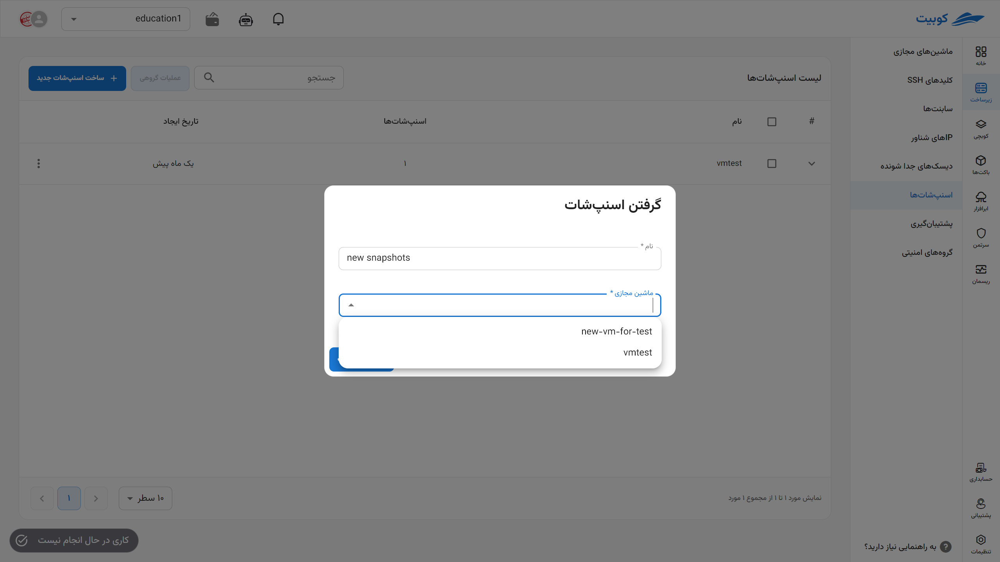
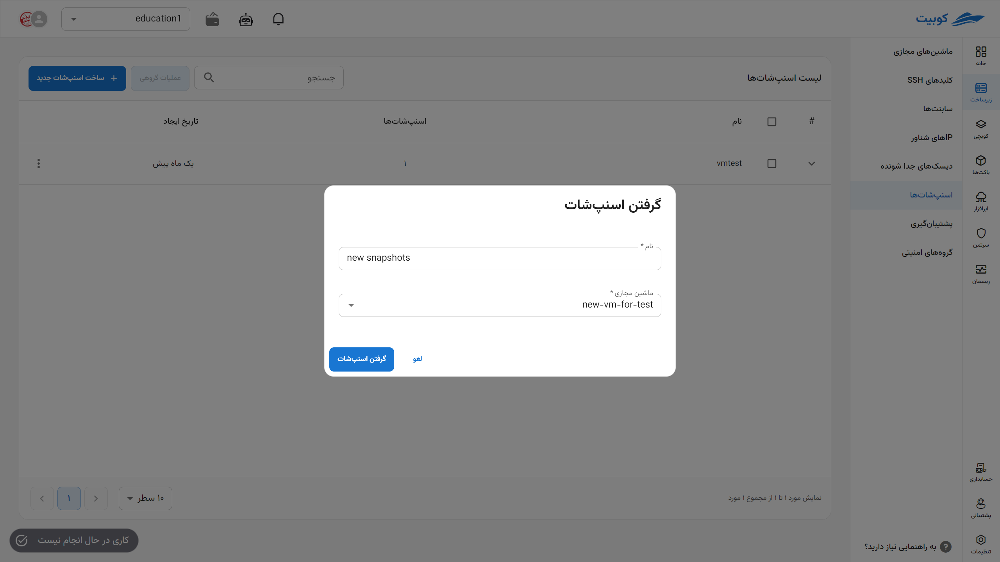
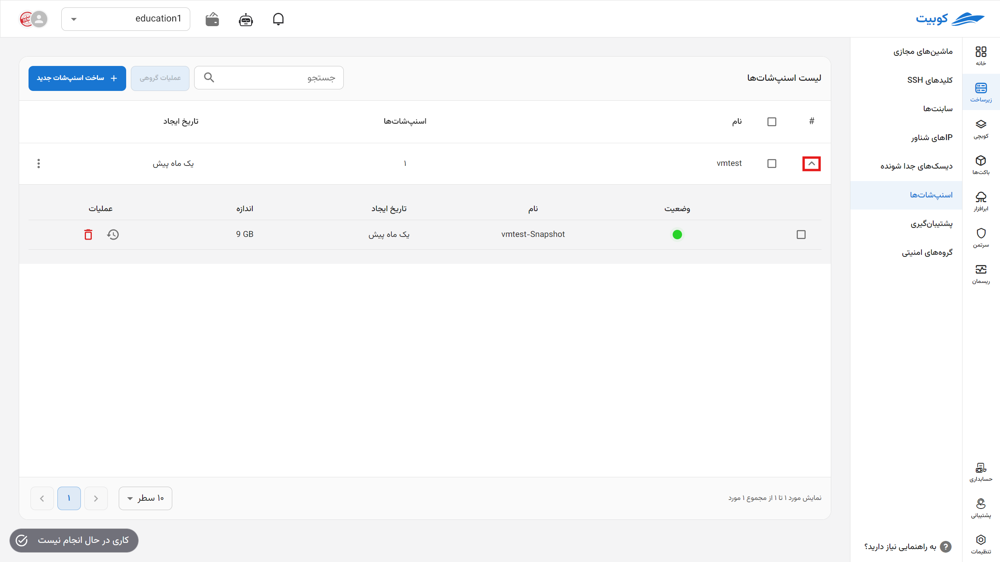
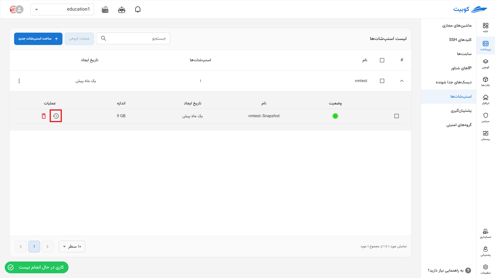
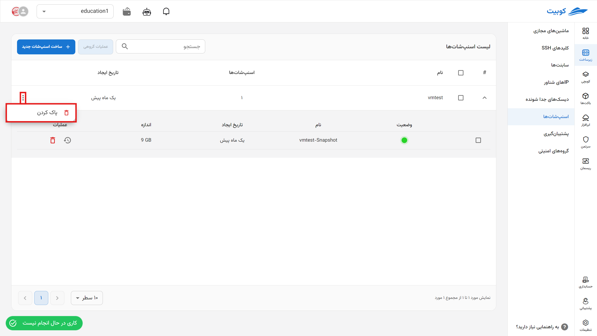
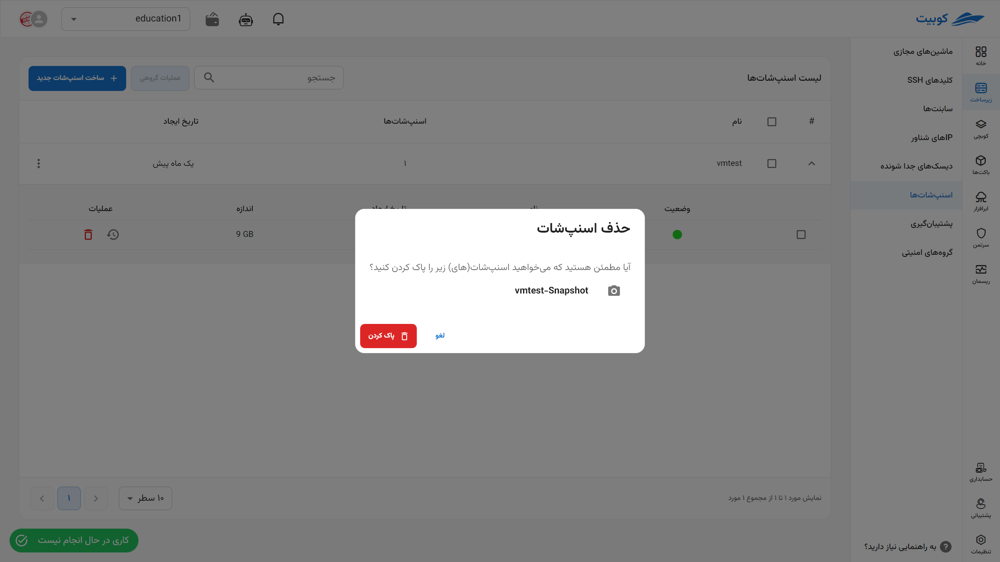
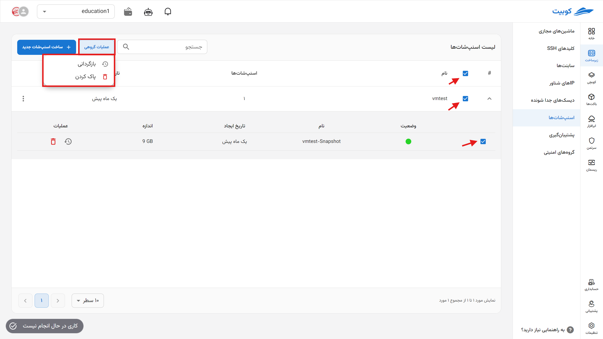

# اسنپ‌شات‌ها (Snapshots)

در این بخش، به لیست اسنپ‌شات‌های ماشین‌های مجازی موجود در پروژه، مدیریت آنها از جمله **ساخت**، **حذف** و **بازگردانی** اسنپ‌شات، دسترسی خواهید داشت.

## ساخت اسنپ‌شات

- ابتدا روی دکمه **ساخت اسنپ‌شات جدید** کلیک کنید.
- سپس **نام** را وارد کرده و **ماشین مجازی** موردنظر خود را از لیست ماشین‌ها انتخاب کنید.
- در انتها روی **گرفتن اسنپ‌شات** کلیک کنید.

  
  
  

## جزئیات اسنپ‌شات‌های یک ماشین

برای مشاهده جزئیاتی از قبیل **نام** و **تاریخ ایجاد** اسنپ‌شات و امکان انجام عملیات‌هایی روی آنها، روی آیکون (▼) کلیک کنید:

### بازگردانی

- برای بازگردانی یک اسنپ‌شات، روی آیکون **بازگردانی** آن کلیک کنید.
- سپس در صورت اطمینان، روی دکمه **تایید** در دیالوگ باز شده کلیک کنید.
  

### حذف

- برای حذف یک اسنپ‌شات، روی آیکون **سطل زباله** آن کلیک کنید.
- سپس در صورت اطمینان از حذف، روی دکمه **پاک کردن** در دیالوگ باز شده کلیک کنید.
  

## حذف اسنپ‌شات‌های یک ماشین

- برای حذف تمام اسنپ‌شات‌های یک ماشین، روی آیکون سه نقطه در ستون عملیات ماشین مربوطه کلیک کنید.
- سپس روی گزینه **پاک کردن** کلیک کنید.
- و در صورت اطمینان، روی دکمه **پاک کردن** در دیالوگ باز شده کلیک کنید.
  

  

## عملیات گروهی اسنپ‌شات‌ها

برای سهولت، اجرای عملیات همزمان روی چند اسنپ‌شات از طریق گزینه **عملیات گروهی** فراهم شده است. ابتدا یک یا چند گزینه را انتخاب کنید. پس از انتخاب، دکمه‌ی **عملیات گروهی** فعال می‌شود:

