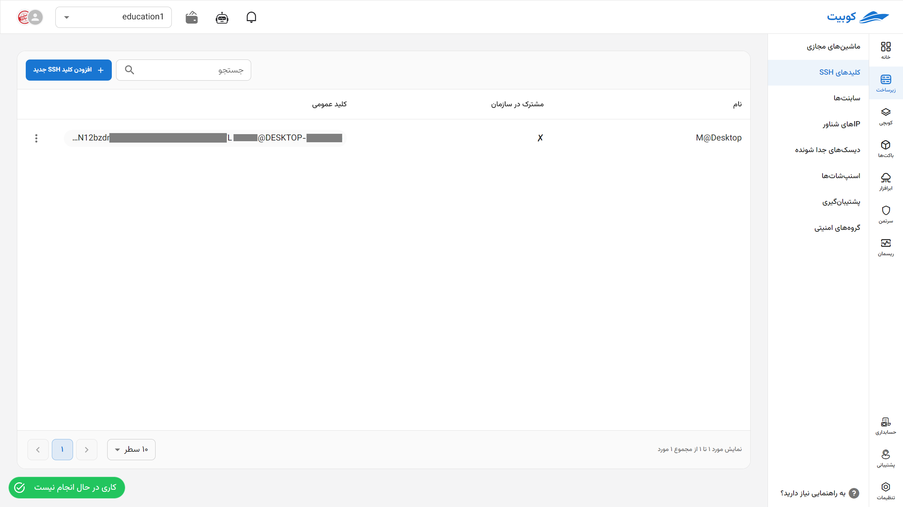
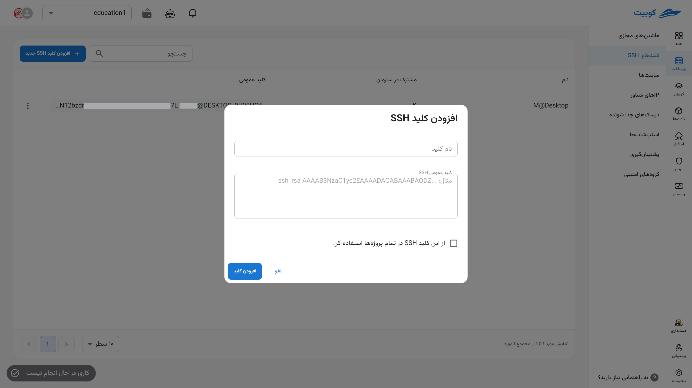
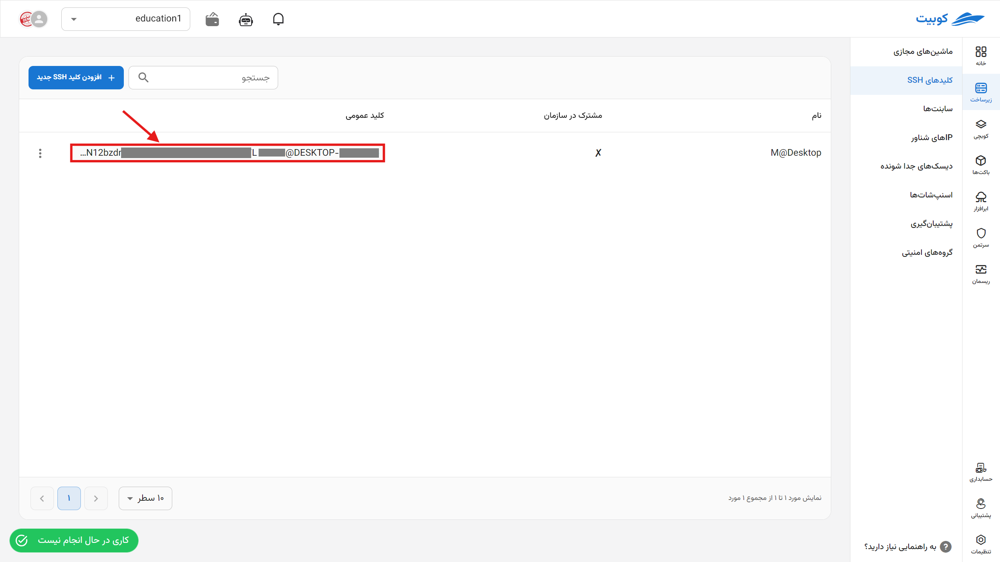
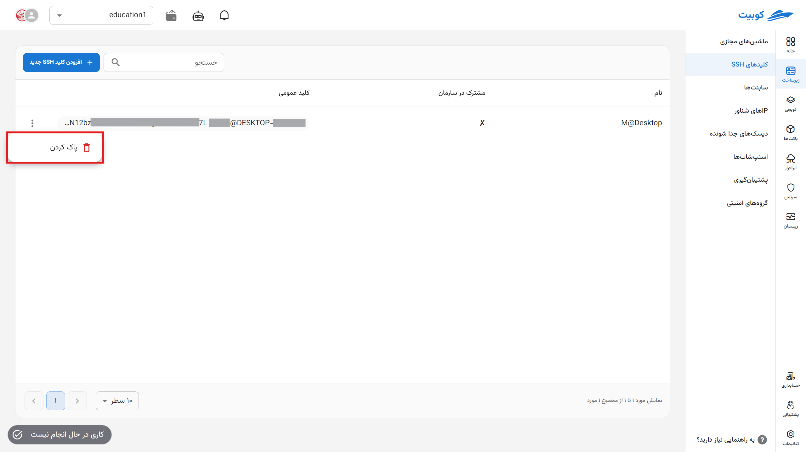

# کلیدهای SSH (‎‏SSH Keys)

در صفحه کلیدهای SSH، لیستی از کلیدهای پروژه انتخاب شده و کلیدهای مشترک در سازمان به همراه امکان افزودن کلید جدید و پاک کردن کلیدهای فعلی، وجود دارد.

## افزودن کلید SSH

برای افزودن کلید جدید، روی دکمه **افزودن کلید SSH جدید** کلیک کنید:

سپس مقدار کلید خود را در قسمت **کلید عمومی SSH** به همراه یک نام، وارد کرده و روی **افزودن کلید** کلیک کنید:
:::tip[اشتراک گذاری کلید در تمام پروژه‌ها]
برای استفاده از این کلید و به اشتراک گذاری آن در سازمان (در تمام پروژه‌ها)، گزینه **از این کلید SSH در تمام پروژه‌ها استفاده کن** را انتخاب کنید.
:::

در انتها، کلید جدید افزوده شده و به لیست کلیدهای SSH هدایت خواهید شد.

### کپی کلید

برای کپی مقدار کلید SSH، تنها کافیست روی مقدار **کلید عمومی** کلید موردنظر خود کلیک کنید:

### حذف کلید

- برای حذف کلید، روی دکمه سه نقطه در ستون **عملیات** کلیک کرده و گزینه **پاک کردن** را انتخاب کنید.
- سپس در صورت اطمینان از حذف، روی دکمه **پاک کردن** در دیالوگ باز شده کلیک کنید.
  

  :::caution[عدم دسترسی به حذف کلیدهای SSH مشترک در سازمان]
  توجه داشته باشید که کلیدهای SSH که به صورت مشترک در سازمان و بین تمام پروژه‌ها استفاده می‌شوند، تنها توسط سازنده کلید می‌توانند حذف شوند.
  :::
