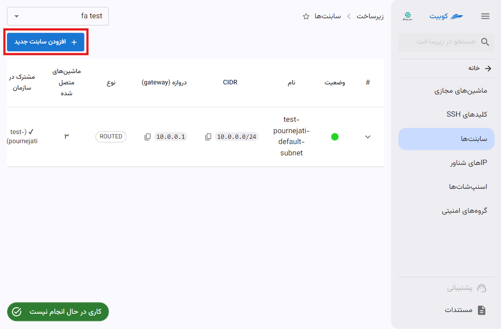
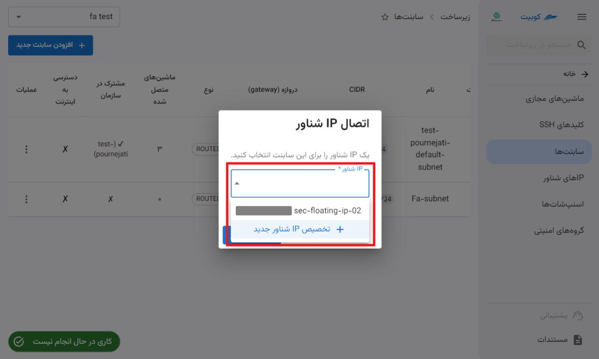
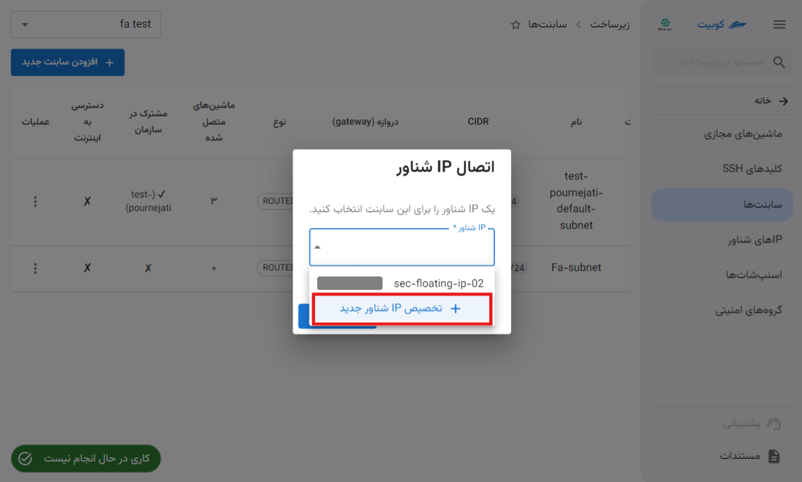

# سابنت‌ها

در صفحه ساب‌نت‌ها لیست ساب‌نت‌های پروژه و مشترک در سازمان، به همراه امکان **افزودن ساب‌نت جدید** و عملیات‌هایی چون **ویرایش**، **اتصال به اینترنت**، **افزودن گروه امنیتی** و **حذف** وجود دارد.

## افزودن سابنت جدید{#add-new-subnet}

- برای افزودن یک ساب‌نت، روی دکمه **افزودن ساب‌نت جدید** کلیک کنید.
- سپس اطلاعات خواسته شده چون **نام**، **CIDR** و **دروازه** را وارد کنید.
- در انتها در صورت تمایل به اشتراک گذاری این ساب‌نت در سازمان، گزینه **از این ساب‌نت در تمام پروژه‌ها استفاده کن** را انتخاب کرده و روی **ساخت ساب‌نت** کلیک کنید.
  
  

## مشاهده جزئیات و وضعیت

برای مشاهده جزئیاتی از قبیل ماشین‌های متصل، آدرس‌های تخصیص داده شده به هر ماشین و امکان انجام عملیات‌هایی روی آنها، روی آیکون مشخص شده در تصویر زیر، کلیک کنید:

سپس به ازای ساب‌نت انتخاب شده، لیستی از اطلاعات ذکر شده نمایش داده می‌شود:

### حذف کارت شبکه

- برای حذف کارت شبکه تخصیص داده شده به ماشین مجازی، روی آیکون **سطل زباله** ماشین مربوطه کلیک کنید.
- سپس در صورت اطمینان از حذف، روی دکمه **پاک کردن** در دیالوگ باز شده کلیک کنید.

### هدایت به ماشین مجازی

برای هدایت مستقیم به صفحه نمای کلی ماشین مجازی متصل به ساب‌نت، روی آیکون مشخص شده کلیک کنید:

## عملیات‌های یک سابنت‌

برای مشاهده عملیات‌های ممکن برای یک ساب‌نت، روی دکمه سه نقطه در ستون **عملیات** کلیک کنید تا لیستی از عملیات‌ها نمایش داده شود:

### ویرایش

- برای ویرایش ساب‌نت، روی گزینه **ویرایش** کلیک کنید.
- در دیالوگ باز شده، تنها امکان ویرایش **نام** و **وضعیت اشتراک گذاری** ساب‌نت وجود دارد. پس از وارد کردن تغییرات موردنظر، روی گزینه **به‌روزرسانی ساب‌نت** کلیک کنید.
  
  

### اتصال به اینترنت

- برای اتصال یک ساب‌نت به اینترنت، روی گزینه **اتصال به اینترنت** کلیک کنید.
- سپس برای اتصال، به یک IP شناور نیاز است. در صورت وجود IP شناور می‌توانید از لیست IPهای شناور تخصیص داده نشده انتخاب کنید یا یک IP شناور جدید ایجاد کنید.
  
  

#### انتخاب از میان IP شناورهای موجود

#### تخصیص IP شناور جدید

در هر دو شیوه، پس از کلیک روی **اتصال IP شناور**، یک کار مرتبط با این عملیات ایجاد شده و در صورت موفق بودن این کار، اتصال ساب‌نت به اینترنت انجام می‌شود.

### افزودن گروه امنیتی

- برای افزودن گروه امنیتی به ساب‌نت، روی گزینه **افزودن گروه امنیتی** کلیک کنید:
- سپس از لیست گروه‌های امنیتی پروژه و مشترک در سازمان، گروه موردنظر خود را انتخاب کرده و روی **تایید** کلیک کنید:
  

### حذف ساب‌نت

- برای حذف سابت‌نت، روی گزینه **پاک کردن** کلیک کنید.
- سپس در صورت اطمینان از حذف، روی دکمه **پاک کردن** در دیالوگ باز شده کلیک کنید.
  
  
