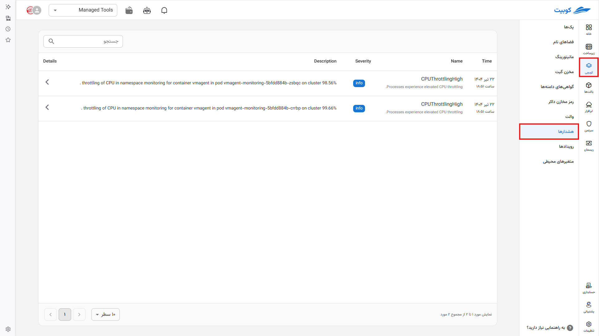
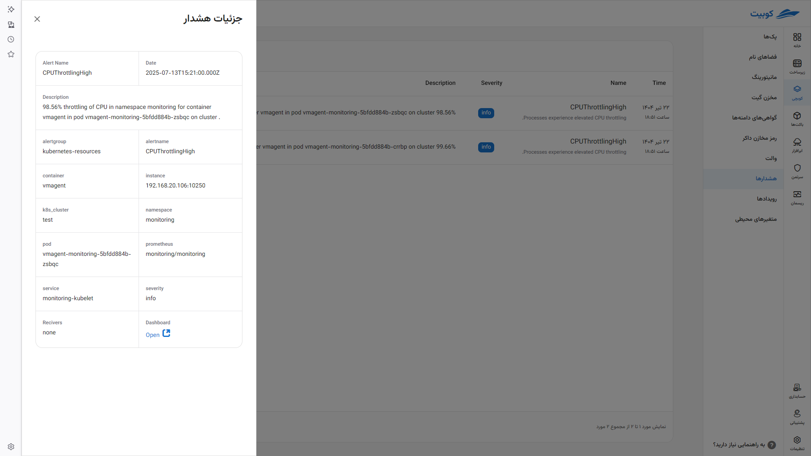

# هشدارها

پیام‌های هشداری که توسط [پرومتئوس](../concepts/#service-monitor) در سطح **کلاستر** صادر شده (هنگامی که یک rule در پرومتئوس فعال یا fire می‌شود) و می‌توانند به مشکلات احتمالی منجر شده یا یک ناهنجاری در سیستم را مشخص می‌کنند (به عنوان مثال رسیدن به یک شرایط خاص یا حد نصاب) به صورت **هشدار** در این بخش طبقه‌بندی شده‌اند. برای تمام اپلیکیشن‌های (پک‌ها در سیستم کوبچی به عنوان مثال دیتابیس postgres و redis و اپلیکیشن‌های داکری) پراستفاده تمام هشدارهای لازم توسط **کوبیت** تعریف شده و فعال هستند. همچنین می‌توانید هشدارهای خود را تعریف کنید. **سطح الویت** هر هشدار در سیستم مشخص می‌باشد.

این پبام‌ها موقت هستند و پس از رفع شدن پاک می‌شوند.

با کلیک روی هر هشدار به جزئیات آن دسترسی پیدا می‌کنید.

