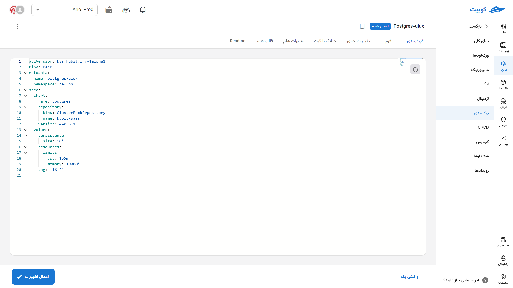
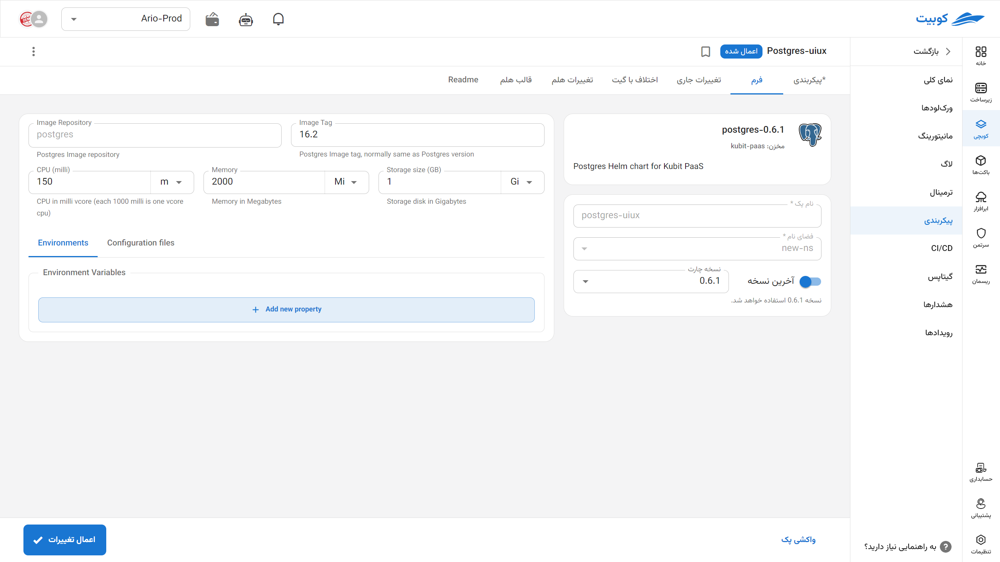
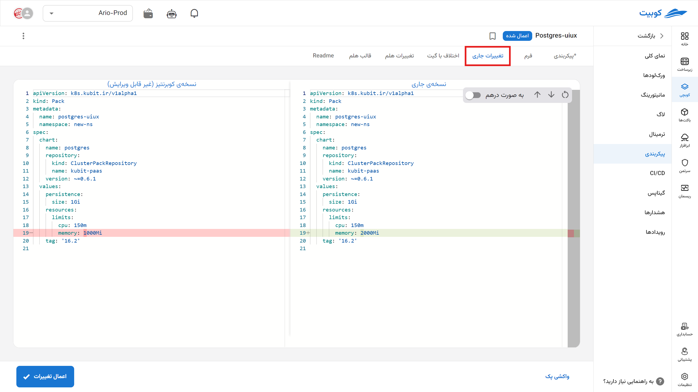
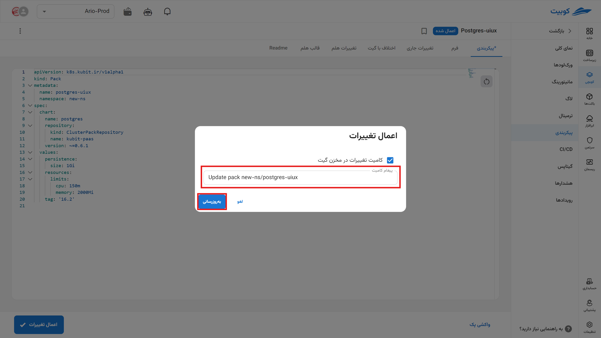
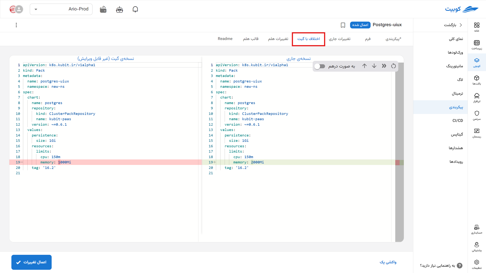
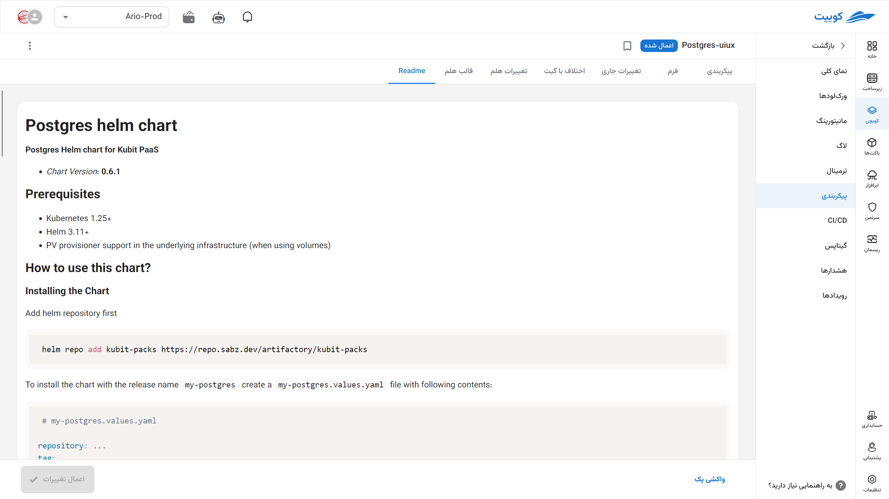

# پیکربندی

[پیکربندی‌های](../concepts/#manifest-config) عمومی پک شما در این بخش قابل مشاهده و ویرایش می‌باشد.
با **واکشی پک** ابتدا آخرین نسخه موجود در کلاستر کوبرنتیز را وارد کنید (اگر از روش دیگری به عنوان مثال `kubctl` قبلا فایل‌ها را تغییر دادید). حال می‌توانید تغییرات مد نظر را اعمال کنید.

## فرم

در قسمت فرم تنظیمات پک را به صورت گرافیکی مشاهده کرده و تنظیم کنید. این نوع ویرایش برای تغییرات پرکاربرد و معمول استفاده می‌شود و تنها برخی از پارامترهای پک را می‌توان تغییر داد. بدین منظور:

- به گزینه‌ی پیکربندی در تب پک موردنظر بروید.
- مقادیر موردنظر خود را تغییر دهید.
- دکمه به‌روزرسانی پک را بزنید.

در صورت موفقیت‌آمیز بودن تغییرات شما در پک ثبت شده و البته برای تغییر واقعی در کلاستر مدتی زمان لازم است.

## پیکربندی یا مانیفست

در این قسمت تنظیمات فرم به صورت **فایل مانیفستی** که به طور خودکار توسط **پک اپراتور** با مقادیر تنظیم شده جدید خوانده شده و چارت جدید را تولید می‌کنند، نمایش می‌شود.

می‌توانید مطابق نیاز خود آن را تغییر دهید و در تب **تغییرات جاری** این اخلافات با فایل اجرایی کوبرنتیز را ببینید.

این بخش با [گیت‌آپس](../gitops) بهتر معنی پیدا می‌کند. ابتدا آن را تنظیم کنید تا از امکانات کامل این بخش بهره‌مند شوید.

### کامیت تغییرات پک در Gitops

در هنگام به‌روزرسانی پک، اگر تنظیمات گیتاپس پک را انجام داده باشید (مستندات تنظیم [گیتاپس (Gitops)](../gitops) و [CICD](../conint) را ببینید)، دیالوگی می‌آید تا تغییراتی که در پک انجام می‌دهید در مخزن گیت تنظیم‌شده‌ی آن پک کامیت شود.

شما می‌توانید متن پیام کامیت را هم در همان دیالوگ تعیین کنید یا از پیام تعریف شده پیشفرض سیستم استفاده کنید.

اگر تمایل دارید که تغییرات کامیت نشود کافی است که تیک «کامیت تغییرات در مخزن گیت» را بردارید. در این صورت پس از این تغییرات گیت نیز در این پک اعمال نمی‌شود.

اگر پک در حالتی باشد که تغییرات کامیت نشده داشته باشد شما می‌توانید بافشردن دکمه «کامیت تغییرات در گیت»، وضعیت جاری پک را در گیت کامیت کنید. در این صورت دوباره تغییرات گیت در این پک اعمال می‌شود.

:::tip[وقتی هشدار "پک با فایل GitOps تفاوت دارد" می آید چه باید کرد؟]

برای رفع این هشدار ۳ راه وجود دارد:

- یا آنچه در گیت است را در کوبیت باید اعمال کرد.

- یا آنچه در کوبیت است را باید در گیت اعمال کرد.

- یا ترکیبی از این دو را ایجاد کرد و در هر دو اعمال کرد.

:::

در تب‌های دیگر می‌توانید **هلم** چارت (helm chart) نهایی تولید شده را به همراه تغییرات که ایجاد شده را در تب **تغییرات هلم** ببینید.

در تب آخر نیز فایل **README** آن پک را مشاهده می‌کنید.

