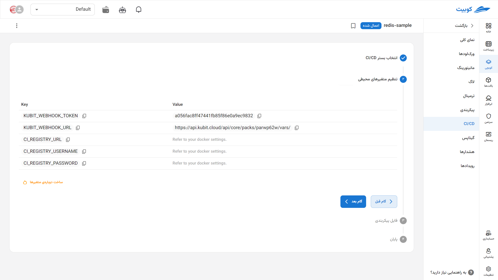
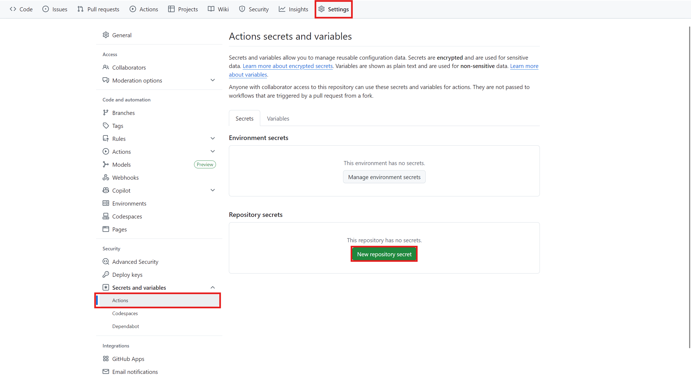
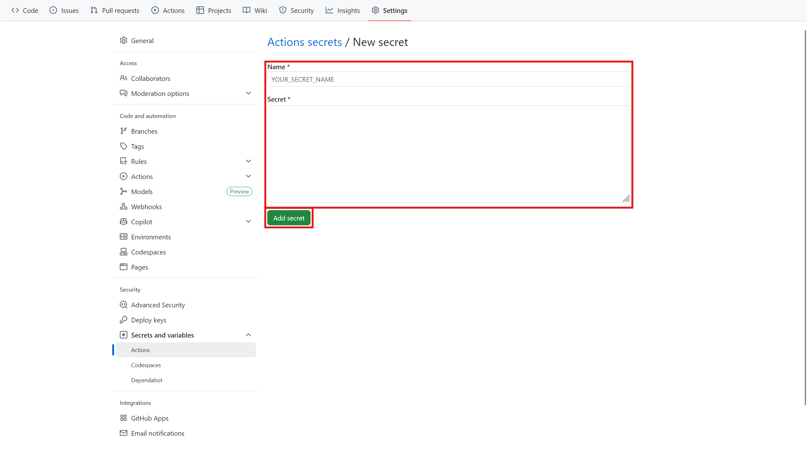
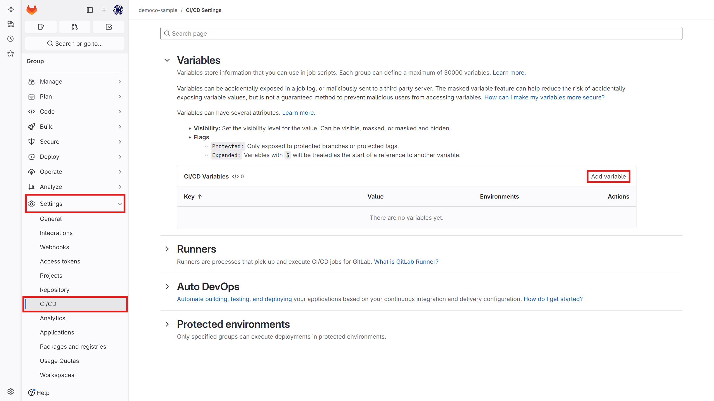
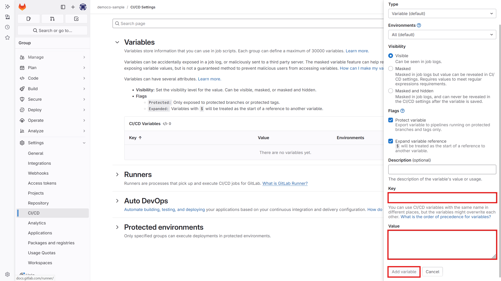
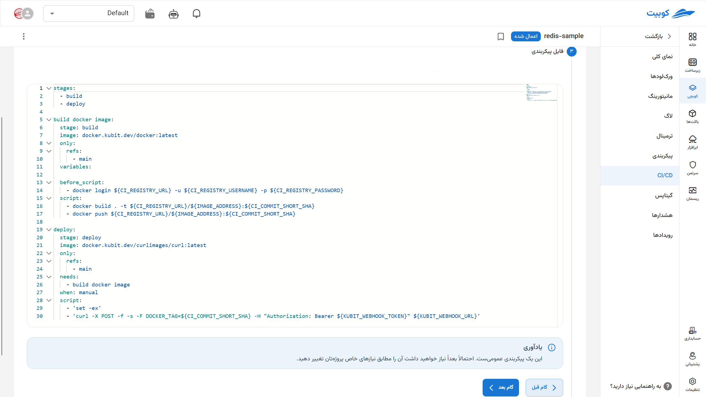

# توسعه و استقرار مداوم (CI/CD)

به طرز عجیبی با کلمه ci و CI مشکل دارد به عنوان سرنام

در این بخش یک Wizard وجود دارد که **یک قالب عمومی (Template)** را با استفاده از ابزار `curl` و اطلاعات دریافتی از **webhook گیت‌هاب یا گیت‌لب**، به‌صورت خودکار **متغیرهای [فایل کانفیگِ پک](../config)** شما را به‌روزرسانی می‌کند. این تغییرات معمولاً شامل نسخه ایمیج، منابع، یا وابستگی‌های جدید (new dependency) است و منجر به **استقرار خودکار (Auto Deploy) نسخه جدید اپلیکیشن** روی کلاستر می‌شود.

مراحل به طور خلاصه شامل:

1. ابتدا توسعه‌دهنده **تغییرات کد (commit)** خود را به مخزن گیت‌هاب (GitHub) یا گیتلب (GitLab) پوش می‌کند.

2. سپس گیت‌هاب، یک **درخواست POST** به سرور ما ارسال می‌کند؛ این درخواست به مسیر خاصی که به عنوان **webhook** تعریف شده فرستاده می‌شود و شامل متغییرهای لازم مثل نام است که اطلاعات مربوط به همان push اخیر را در بر دارد.

3. در مرحله‌ی بعد، سرور **درخواست دریافتی را به‌عنوان سیگنالی مبنی بر وجود تغییرات جدید در پروژه** تفسیر می‌کند. سپس، اقدام به اجرای دستور دریافت آخرین ایمیج کانتینر و تنظیمات می‌کند.

4. در نهایت، ورک‌لود **با تغییرات جدید راه‌اندازی مجدد (restart)** می‌شود تا تغییرات به‌روزرسانی‌شده اعمال گردد.

به عنوان مثال نسخه جدید یک فایل را در کد خود استفاده می‌کنید در پایپ‌لاین خود یک فایل ایمیج با منابع و وابستگی‌های جدید می‌سازید و در داکر رجیستری خود (داکرهاب یا اختصاصی) پوش می‌کنید. حال می‌خواهید اپلیکیشن شما با نسخه جدید کار کند. به صورت خودکار با استفاده از این بخش نسخه جدید ایمیج در کانفیگ ثبت می‌شود و کوبرنتیز به صورت خودکار این فایل را خوانده و پادی جدید با مشخصات جدید ثبت شده در فایل کانفیگ، ساخته می‌شوند. در بخش ورک‌لودها و همچنین بخش رویدادها می‌توان این تغییرات را مشاهده کرد.

فرض کنید نسخه جدیدی از اپلیکیشن خود را با ایمیج `my-app:v2.0.1` ساخته‌اید و در Docker Registry منتشر کرده‌اید. با استفاده از این سیستم:

- شماره نسخه جدید در فایل کانفیگ به‌صورت خودکار ثبت می‌شود.
- کوبیت با خواندن این کانفیگ، **ورک‌لود جدیدی** با ایمیج به‌روزشده اجرا می‌کند.
- در بخش **Workloads** و **Events** می‌توانید مشاهده کنید که پاد جدید به‌درستی و بدون دخالت دستی، **Deploy شده است.**

## مراحل تنظیم CI/CD پروژه‌ها بر اساس کوبیت {#setup-cicd}

برای اینکه deploy شدن پروژه‌های شما به‌صورت مستقیم از طریق کوبیت انجام شود لازم است که CI/CD پروژه‌های در حال توسعه‌ی خود را به کوبیت متصل کنید. بدین منظور گام‌های زیر را انجام دهید.

### تنظیم متغیر تگ در پک

- در ابتدا وارد قسمت **پیکربندی** شوید. در قسمت vars، یک متغیر با نام DOCKER_TAG بسازید.

- سپس در قسمت tag در بخش image کانتینر اصلی پکتان، از این متغیر استفاده کنید.

`sample-django-pack.yaml`:

```yaml

apiVersion: k8s.kubit.ir/v1alpha1

kind: Pack

metadata:

  name: sample-django-app

  namespace: samples

spec:

  ...

  values:

    ...

    workloads:

      web:

        containers:

          web:

            ...

            image:

              pullPolicy: IfNotPresent

              registry: '{{ vars.DOCKER_REGISTRY }}'

              repository: '{{ vars.DOCKER_IMAGE }}'

              tag: '{{ vars.DOCKER_TAG }}'

            ...

        initContainers:

          wait-for-db:

            args:

              - wait_for_db

            image:

              pullPolicy: IfNotPresent

              registry: '{{ vars.DOCKER_REGISTRY }}'

              repository: '{{ vars.DOCKER_IMAGE }}'

              tag: '{{ vars.DOCKER_TAG }}'

    postgresql:

      enabled: false

  vars:

    DOCKER_REGISTRY: registry.sample.dev

    DOCKER_IMAGE: mydjangoproject

    DOCKER_TAG: master-3bafc239

    ...

```

### مراحل دریافت متغییر و فایل کانفیگ در قالب آماده

وارد تب CI/CD پک موردنظر شوید و بستری که فرایندهای CI/CD شما در آن اتفاق می‌افتد را مشخص کنید.
کوبچی از هردو پلتفرم GitHub Actions و GitLab CI/CD پشتیبانی می‌کند. پس از انتخاب روی گزینه گام بعد بزنید.

### دریافت متغیرهای لازم از کوبیت

- یک آدرس و توکن برای این پک ایجاد شده و به شما نمایش داده می‌شود.



- وارد پروژه‌ی توسعه موردنظرتان در گیت شوید و این متغییرها را در پنل خود تنظیم کنید.

- سپس از بخش settings وارد قسمت CI/CD شوید و در بخش Variables متغیر `KUBIT_WEBHOOK_TOKEN` را تعریف کنید. و با توکنی که در مرحله‌ی قبل از کوبیت دریافت کردید، مقداردهی کنید.

  1. نسخه گیتهاب:

  
  

2. نسخه گیتلب:

   
   

- وارد بخش editor در قسمت CI/CD مخزن شوید (در گیتهاب فایل `.github/workflows/main.yaml` و در گیتلب فایل `.gitlab-ci.yml`) و قطعه کدی مشابه کد زیر را در آن قرار بدهید.

- کوبیت به طور خودکار یک فایل sample برای شما ایجاد می‌کند و که میتوانید با توجه به نیاز خود آن را تغییر دهید. تمام فایل‌های بالا هنگامی که در کوبیت روی گزینه ‌CI/CD کلیک می‌کنید قابل دریافت به صورت قالب آماده هستند.
  

**نکته مهم**:

اگر فایل گیتاپس پک، در ساختار پروژه توسعه (در یک مخزن با پروژه قرار دارد) است، حتما شرطی در CI/CD وارد کنید که با تغییر فایل گیتاپس، این وب هوک فراخوانی نشود. در غیر این صورت این سناریو در حلقه می افتد.

`cicd.yaml`:

```yml

...


kubit webhook:

  stage: deploy

  # image: docker.sabz.dev/curlimages/curl:latest

  variables:

    KUBIT_WEBHOOK_TOKEN: "" # <access_token>


  script:

    - "curl -X POST -F DOCKER_TAG=${DOCKER_TAG} -H "Authorization: Bearer ${KUBIT_WEBHOOK_TOKEN}"  https://api.kubit.ir/api/core/packs/<pack_uid>/vars/"

```

برای این کار حالتهای زیر نیز قابل استفاده است.

```yml

script:

  - 'curl -X POST -F DOCKER_TAG=${DOCKER_TAG} -F token=${KUBIT_WEBHOOK_TOKEN}  https://api.kubit.ir/api/core/packs/<pack_uid>/vars/'

```

```yml

script:

  - 'curl -X POST -F variables[DOCKER_TAG]=${DOCKER_TAG} -F token=${KUBIT_WEBHOOK_TOKEN}  https://api.kubit.ir/api/core/packs/<pack_uid>/vars/'

```

:::info

برای استفاده از curl در فایل cicd میتوانید از [این ایمیج](docker.sabz.dev/curlimages/curl:latest) به عنوان image استفاده کنید.

:::

:::info[متغییرهای دیگر]
**نکته:**

برای ارسال متغیرهای دیگر به پک، آنها را به فرمت زیر به پارامترهای درخواست اضافه کنید. البته در نسخه جاری، اگر نام متغیر با عبارت منظم `DOCKER_TAG[\w.-]*` منطبق نباشد باید برای تایید آن با پشتیبانی کوبیت تماس بگیرید.

     variables[VARIABLE]=VALUE

:::

پس از تنظیم فایل‌ها در این مرحله CI/CD شما آماده شده است.

تغییرات خود را commit کنید و منتظر اجرای خودکار jobهای pipeline پروژه‌تان بمانید.

برای اطلاعات و سفارشی‌سازی‌های بیشتر، به مستندات [رسمی](https://docs.gitlab.com/ee/ci/) مراجعه کنید.
