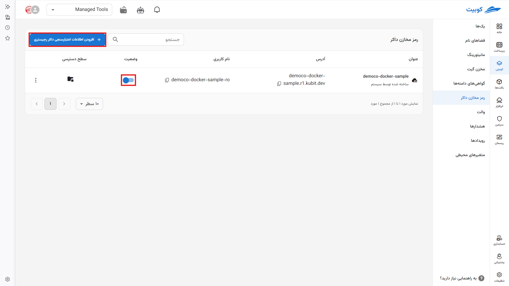
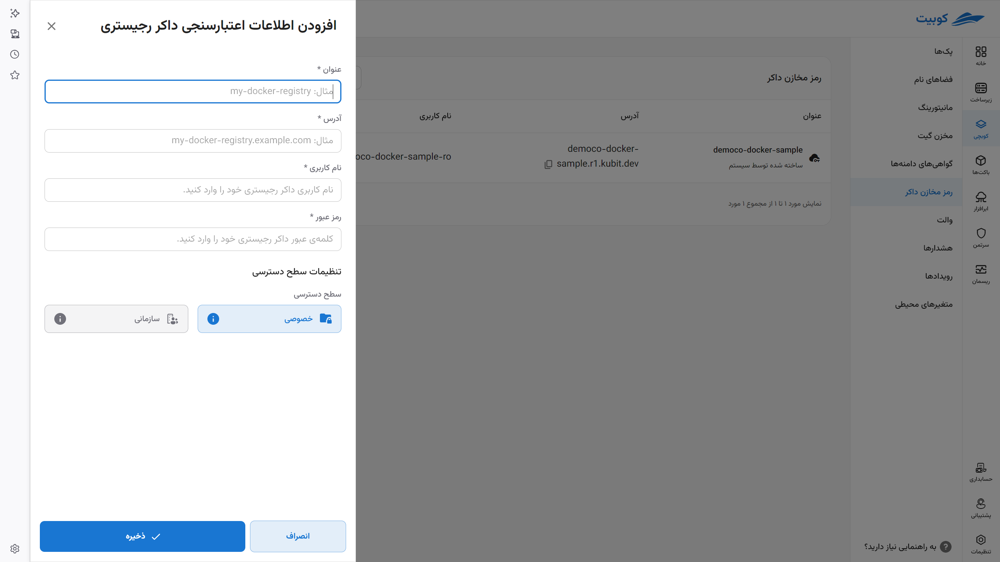
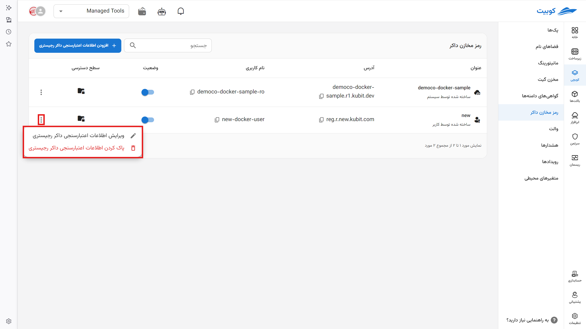

# رمز مخازن داکر

مشخصات مخزن داکر رجیستری خود را در بخش مشاهده می‌کنید. هنگامی که می‌خواهید یک پک جدید نصب کنید از این بخش مشخصات مخزن خود را ذخیره کرده و سپس از قسمت نصب پک‌ها به آن دسترسی داشته باشید.

## اتصال مخزن جدید

مخازنی که در بخش [**ابرافزار**](../../saas/docker) ایجاد کرده‌اید به صورت خودکار و سیستمی به این بخش افزوده می‌گردند. **نام** ، **آدرس**، **نام کاربری** رجیستری، **وضعیت** (نشان می‌دهد که از طریق کوبچی قابل دسترس است یا خیر) و **سطح دسترسی** (خصوصی یا سازمانی) هر مخزن نمایان است.

برای افزودن دستی مخزن جدید:

- روی **افزودن اطلاعات اعتبارسنجی داکر رجیستری** کلیک کنید.

- در فرم نمایش شده اطلاعات رجیستری خود را وارد کنید.

رجیستری شما به لیست رجیستری‌ها افزوده شد.

- با کلیک روی آیکون سه نقطه می‌توانید آن را حذف کنید یا اطلاعاتش را ویرایش کنید.

