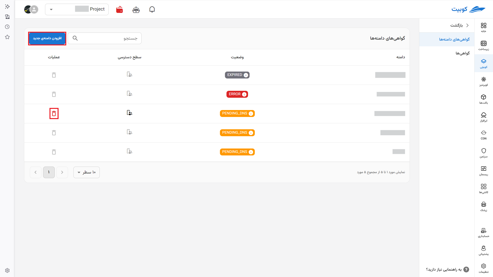
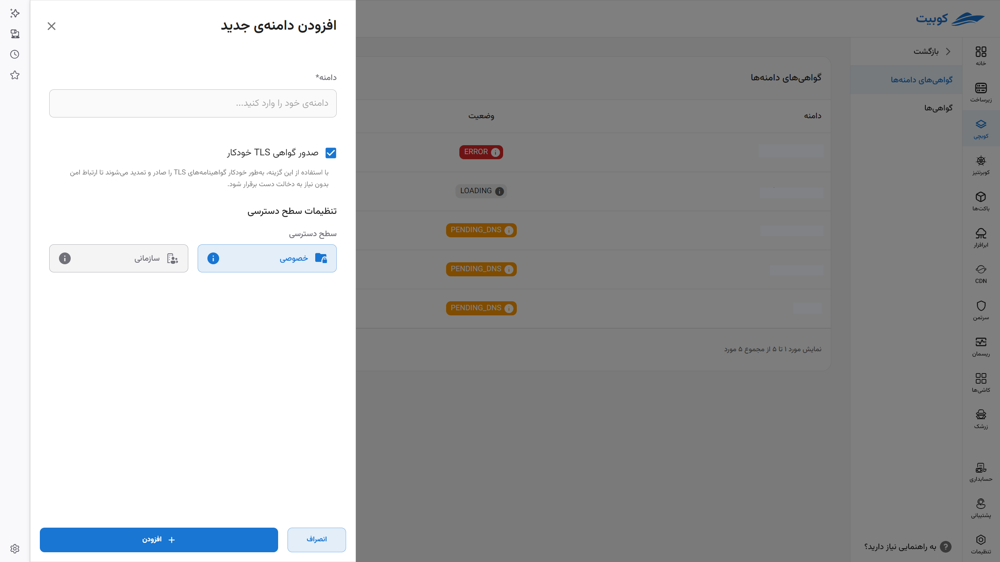
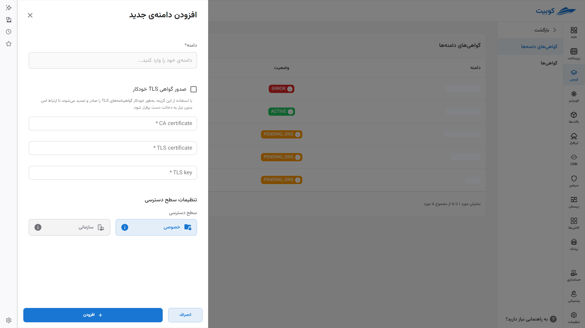
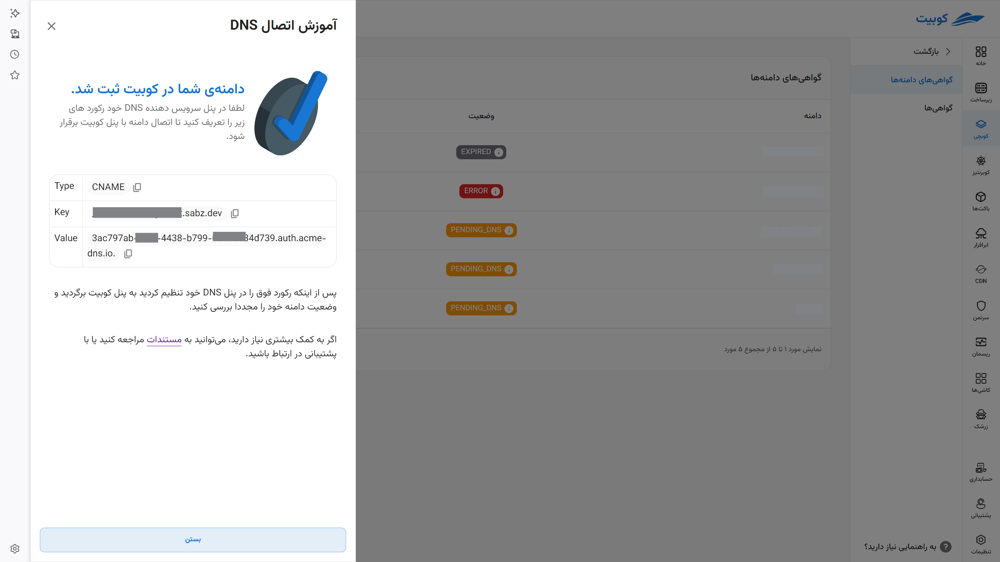
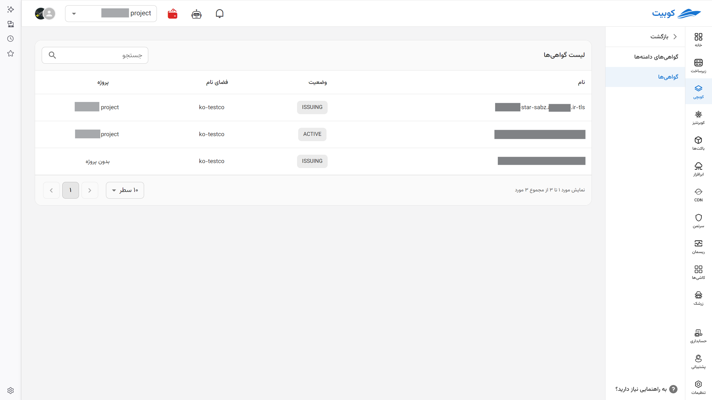

# گواهی‌های دامنه‌ها

قابلیت [اتصال دامنه به کلاستر کوبرنیتیز](../concepts#ingress) از طریق گواهی‌های **TLS/SSL** به‌صورت **خودکار یا دستی** فراهم شده است. این ویژگی به شما امکان می‌دهد تا اپلیکیشن‌های خود را به‌سادگی از طریق یک دامنه اختصاصی، **ایمن و قابل اطمینان** در دسترس کاربران قرار دهید.

بدون نیاز به پیکربندی‌های پیچیده:

- ابتدا دامنه خود را در یک DNS Service ثبت کنید.

- سپس از طریق این تب یک دامنه جدید به سرور خود بیافزایید.

## گواهی‌های دامنه

در این قسمت دامنه های خود را به همراه وضعیت آن‌ها مشاهده می‌کنید.

- برای افزودن دامنه جدید روی گزینه افزودن دامنه جدید کلیک کنید. همچنین با کلیک روی آیکون جذف می‌توانید آن‌ها را حذف کنید.

- در منوی باز شده، دامنه خود را وارد کنید.
- می‌توانید به صورت دستی مشخصات مجوز TLS/SSL را از ارائه دهنده مجوز دریافت کرده و اینجا وارد کنید. همچنین کوبیت به شما امکان می‌دهد تا با کلیک روی گزینه دریافت TLS خودکار از ارائه دهنده رایگان مجوز _[Let's Encrypt](https://letsencrypt.org/)_ از طریق پروتکل ACME آن را دریافت کرده و روی دامنه خود تنظیم کنید.

در بخش وضعیت حالت‌های زیر را می‌بینید:

- active: سرویس و مجوز tls روی دامنه فعال است.
- error: در تنظیم روی دامنه به مشکلی برخورده است. با کلیک روی گزینه خطا را مشاهده می‌کنید.
- pending dns: منتظر تنظیم روی سرور dns است.
- expired: مجوز tls منقضی شده.
- unknown: به خطای ناشناخته برخورد کرده. با تیکتینگ تماس بگیرید.
  با کلیک روی هر پیغام وضعیت وارد راهنمایی برای رفع آن می‌شوید.

## گواهی‌ها

این تب اطلاعاتی مانند **نام** **گواهی (certificate)** صادر شده، **وضعیت** آن (دو وضعیت `ACTIVE` در صورت فعال بودن و `ISSUING` در صورت بروز هرگونه مشکل)، **فضای‌نامی** که زیرمجموعه آن است، **پروژه‌ای** که به آن متصل است را ببینید.

