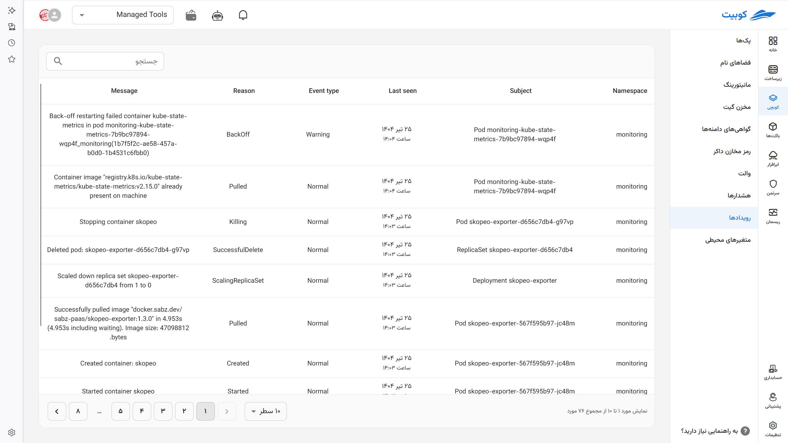

# رویدادها

در کوبرنتیز، **[رویدادها](../concepts/#event) (Events)** پیام‌هایی هستند که بینش و اطلاعاتی درباره‌ی وضعیت و فعالیت‌های جاری کلاستر ارائه می‌دهند. این پیام‌ها برای **درک دلایل وقوع یا شکست عملیات‌ها** حیاتی‌اند و معمولاً به عنوان لاگ‌های قابل مشاهده در ابزارهایی مانند `kubectl describe` یا رابط‌های کاربری کوبرنتیز قابل استفاده‌اند.

دسترسی به رویدادها از طریق مسیر `کوبچی > رویدادها` برای بررسی رویدادهای سطح کلاستر و از مسیر `[انتخاب پک مورد نظر] > رویدادها`، می‌توان رویدادهای پک و ورک‌لودهای مربوطه را مشاهده کرد.

علاوه بر این رویدادها را در به طور خلاصه در ورک‌لود مشاهده می‌کنید در این بخش به تفصیل قابل مشاهده هستند. هر رویداد با برچسب‌های مختلفی مشخص شده که به شما در درک بهتر اتفاقاتی که در پاد می‌افتد کمک می‌کند.
