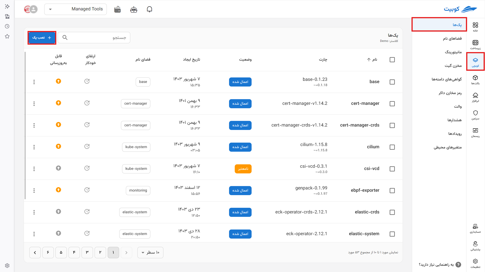
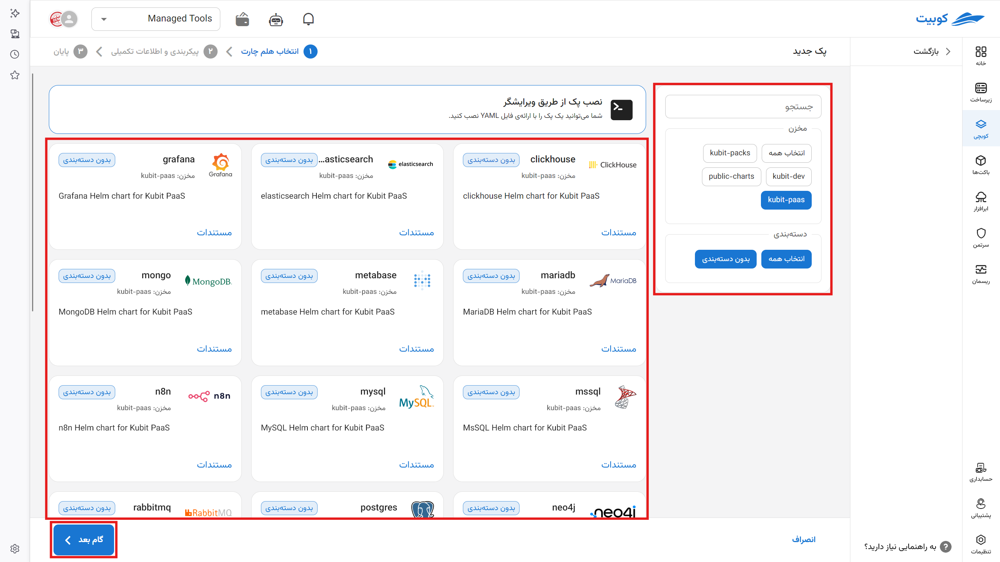
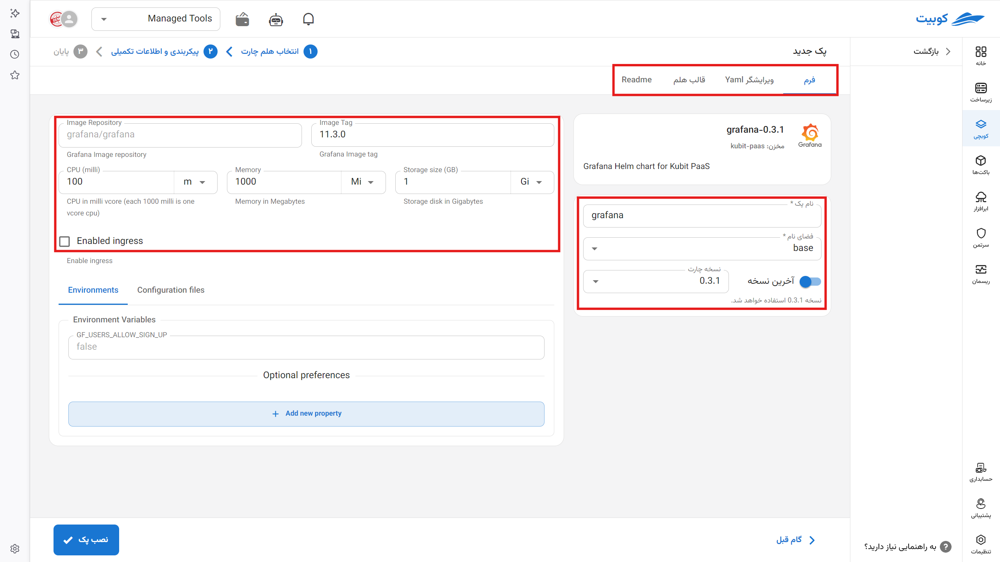
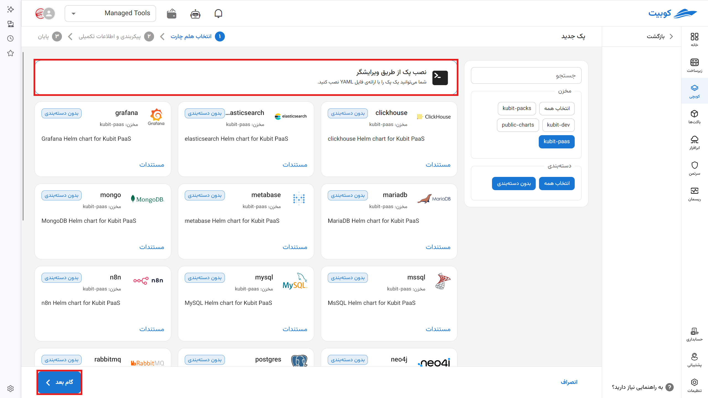
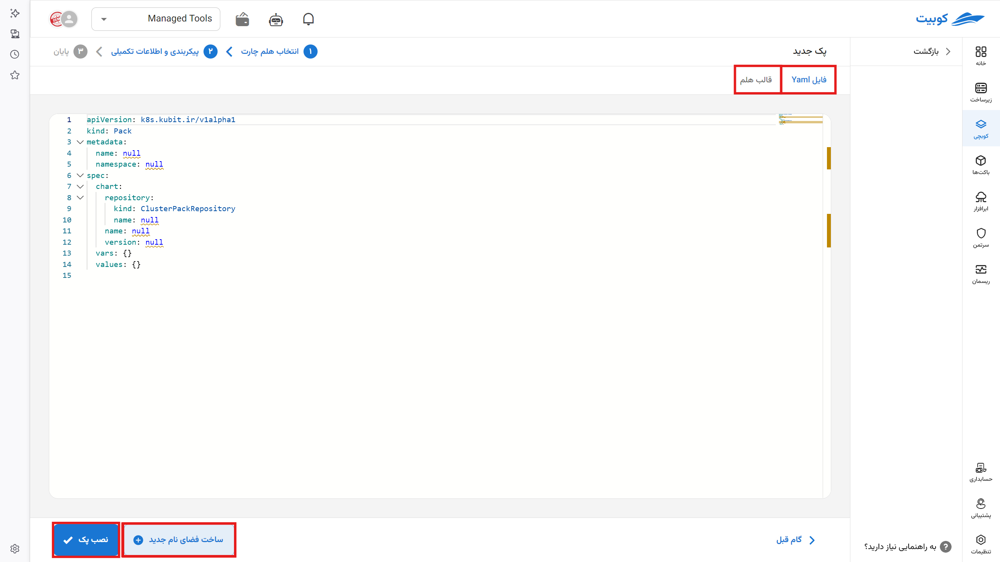
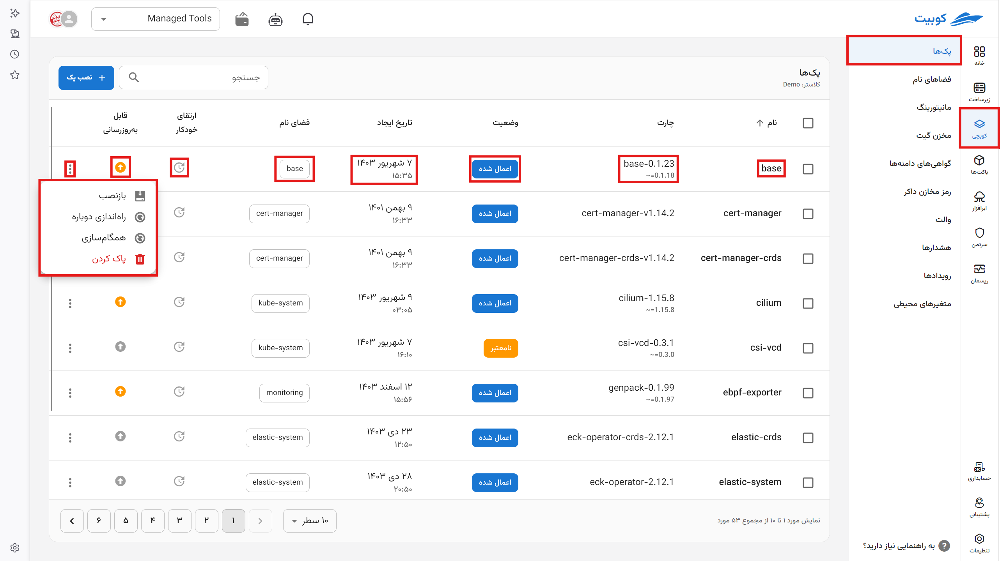
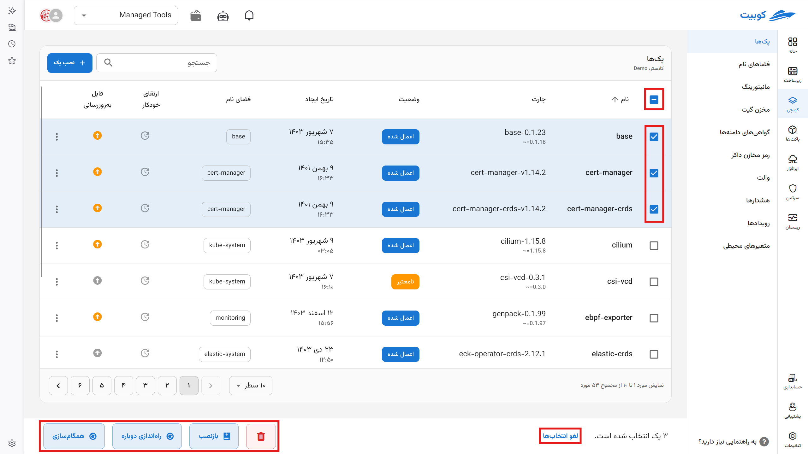
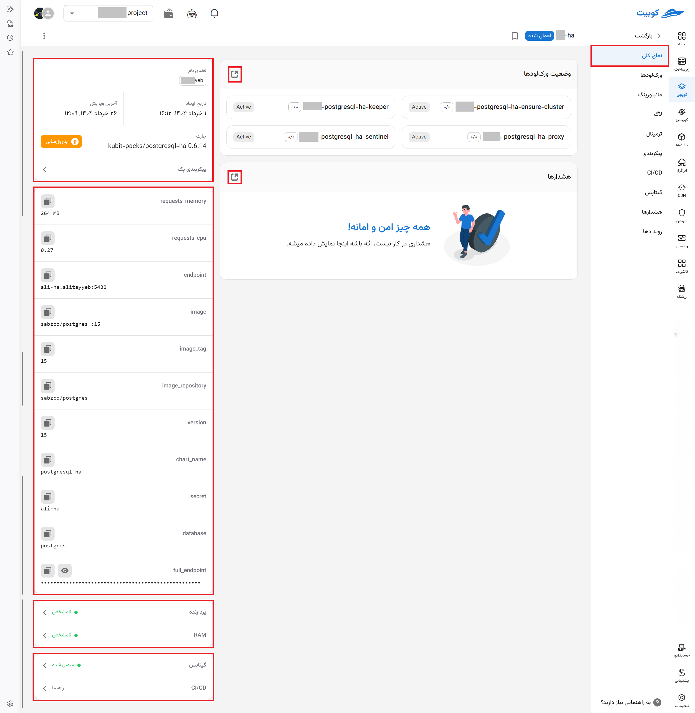

# شروع کار (گام یک)

:::warning[کلاستر زیرساخت]

**سرویس کوبچی** قابلیت فعالسازی روی انواع کلاسترهای کوبرنتیز را دارد. در صورتی که از **کلاسترها مدیریت شده توسط کوبیت** استفاده می‌کنید، این سرویس به طور پیشفرض برای استفاده شما آماده است. اگر از کلاسترهای دیگری استفاده می‌کنید از طریق [پشتیبانی](../../ticketing) برای اتصال این سرویس روی کلاستر خود اقدام کنید.

:::

محتوای این صفحه شامل معرفی جزئیات صفحه پک‌ها و نحوه نصب پک می‌باشد.

## نصب پک

وارد بخش [**پک‌ها**](../concepts/#pack) شوید و برای نصب پک جدید روی گزینه **نصب پک** کلیک کنید. می‌توانید به دو صورت پک‌ها را نصب کنید.

برای نصب پک‌های آماده از طریق فرم UI با انتخاب یک پکیج آماده وارد بخش فرم پکیج می‌شوید و مشخصات آن را مطابق نیاز تغییر می‌دهید.

همچنین می‌توانید مشخصات مورد نیاز خود را از طریق ویرایشگر متنی یا یک فایل ‌`yml` وارد کرده و سیستم [**پک‌اپراتور**](../concepts/#pack-operator) به صورت خودکار فایل را خونده و پکیج شما را نصب و راه‌اندازی می‌کند.

### نصب از طریق فرم

از طریق بخش جستجو و دسته‌بندی، پک خود را پیدا کنید. لیست پک‌های آماده به همراه توضیح هر پک نمایان می‌باشد.

پس از انتخاب پک مورد نظر در این قسمت:

- نام پک را مشخص کنید

- [فضای نام](../namespace) پروژه را مشخص کنید. همچنین می‌توانید یک مورد جدید تعریف کنید.

- نسخه نصبی پک را انتخاب یا آخرین نسخه موجود را نصب کنید.

:::info[ذخیره سازی در فضای کوبرنتیز]

در کوبرنتیز، مقدار حافظه برای کانتینرها برحسب **بایت (Bytes)** تعریف می‌شود و می‌توان آن را با عدد یا پسوند مشخص کرد.

#### انواع پسوندها:

- **اعشاری (پایه ۱۰):**  
   `k`, `M`, `G`, `T`, `P`, `E`  
   مثال: `400M` یعنی ۴۰۰ مگابایت
- **باینری (پایه ۲):**  
   `Ki`, `Mi`, `Gi`, `Ti`, `Pi`, `Ei`  
   مثال: `400Mi` یعنی ۴۰۰ مِبی‌بایت (تقریباً ۴۲۰ مگابایت)

#### نکته مهم:

:::warning[حروف کوچک/بزرگ]

واحدها **حساس به حروف بزرگ و کوچک** هستند. مثلاً:

- `400m` یعنی ۰٫۴ بایت
- `400M` یا `400Mi` مقدار واقعی حافظه

برای دقت بیشتر، از واحدهای باینری مثل `Mi` و `Gi` استفاده کنید و همیشه به حروف بزرگ/کوچک دقت داشته باشید.

:::

- به صورت پیش‌فرض کوبیت پسوندها را بر مبنای 2 (به عنوان مثال gib) در نظر می‌گیرد. اما میتوانید با انتخاب گزینه - در مقادیر، به صورت دستی مقداردهی را انجام دهید مثلا 1000mb (هر mb بر مبنای 10 است)
- مقدار رم را همچنان با استاندارد گفته شده وارد کنید (مقادیر پیشفرض بیتی هستند).
- مقدار هسته‌های اخصاص شده. (هر هزار میلی هسته یک هسته است و نوع هسته، از نوع زیرساخت شما مشخص می‌شوند)
- با انتخاب گزینه Enabled Ingress دامنه های خود را به سرویس [ingress](../domains) متصل کنید و از این طریق به اپلیکیشن‌های خود دسترسی داشته باشید.

:::info[اتصال دامنه]

برای اتصال به دامنه مقادیر خواسته‌شده را از پنل DNS خود برداشته و اینجا وارد کنید.

:::

- مخزن داکر را برای نصب کانتینرهای خود انتخاب کنید.

:::info[تنظیم مخزن کاستوم]

کوبچی به صورت پیشفرض از داکر هاب برای دریافت ایمیج های داکر استفاده می‌کند. مخازن داکری که در همین پروژه از بخش [ابرافزار]() تنظیم کردید نیز به صورت سیستمی در این بخش فعال و در دسترس هستند. همچنین برای تنظیم مخزن اختصاصی خود از طریق تب [رمز مخازن داکر](../docker) اقدام کنید.

:::

- دیگر مشخصات با توجه به بسته‌ای که نصب می‌کنید متفاوت خواهد بود.

در تب های دیگر میتوانید خروجی چارت هلم (helm) و پیکربندی (مانیفست) را ببینید:

- تب ویرایشگر yaml: ویرایش فایل مانیفست به صورت دستی و افزودن مقادیر در صورت نبود امکان انجام عملیات از طریق فرم.

:::info[ویرایشگر کوبیت]

کوبیت از نسخه وب ویرایشگر vs code استفاده می‌کند. کلید های میانبر (HotKeys) مانند vs code است و قابلیت‌های آن را ارائه می‌دهد.

:::

- تب قالب هلم: قالب هلم (release helm chart) نهایی که این اپلیکیشن بر اساس آن نصب می‌شود.

:::info[Helm template]

با استفاده از تب «تغییرات هلم» می‌توانید فایل‌های helm نهایی ایجاد شده توسط **پک اپراتور** و براساس تنظیماتی که اعمال کردید را مشاهده کنید. قبل از نصب این بخش را مشاهده کنید تا از پیکربندی پک خود مطمئن شوید.

:::

- تب ReadMe: فایل readme هر اپلیکیشن

### نصب با YAML

:::info[ویرایشگر کوبیت]

کوبیت از نسخه وب ویرایشگر vs code استفاده می‌کند. کلید های میانبر (HotKeys) مانند vs code است و قابلیت‌های آن را ارائه می‌دهد.

:::

با توجه به اینکه همه‌ی چارت‌ها دارای فرم نیستند،امکان نصب هر چارتی با استفاده از نوشتن YAML مربوطه در کوبیت وجود دارد.

بدین منظور فایل YAML پک را طبق الگوی زیر ایجاد کنید:

- گزینه‌ی «نصب پک از طریق ویرایشگر» را انتخاب کنید.

  - اگر فضای نام جدیدی می‌خواهید، از تب فضای نام (Namespace) فضای‌نام مدنظرتان را ایجاد کنید.

- در ویرایشگر نمایش داده شده YAML پک خود را وارد کنید.

- برای راحت‌تر شدن کار ساختار کلی پک به‌صورت آماده در آن قسمت به شما نمایش داده می‌شود.

- در مقابل تگ namespace باید نام فضای ‌نام خود را وارد کنید، امکان تکمیل خودکار هم به شما داده می‌شود. از گزینه **ساخت فضای نام جدید** برای ساخت یک فضای نام استفاده کنید.

- در تگ مخازن، نام مخزن ثبت شده را برای اتصال و دریافت چاvت (helm chart) انتخاب کنید.

:::info[Helm template]

با استفاده از تب «تغییرات هلم» می‌توانید فایل‌های helm نهایی ایجاد شده توسط **پک اپراتور** و براساس تنظیماتی که اعمال کردید را مشاهده کنید. قبل از نصب این بخش را مشاهده کنید تا از پیکربندی پک خود مطمئن شوید.

:::

## صفحه‌ی پک‌ها در کوبچی

با انتخاب سرویس کوبچی، لیست پک‌های یک پروژه در صفحه‌ی خاص آن نمایش می‌شود. این صفحه دارای اطلاعات مختلفی در مورد پک‌هاست که به‌صورت تب‌هایی در آن تعبیه شده است.

### عملیات مهم روی پک

- **راه‌اندازی دوباره پک**

با فشردن دکمه‌ی «راه‌اندازی دوباره پک»، همه‌ی ورک‌لودهای پک دوباره راه انداخته می‌شوند و نسخه‌ی موجود آن‌ها در کلاستر از بین می‌رود.

- **نصب دوباره‌ی پک**

انتخاب «نصب دوباره پک» باعث ایجاد دوباره‌ی پک و به‌روزرسانی مشخصات چارت از روی پیکربندی (مانیفست) پک می‌شود.

با این کار تغییرات چارت و ویژگی‌های تنظیمی در پیکربندی کوبچی در کلاستر اعمال می‌شود.

- **تازه‌سازی اطلاعات پک**

با فشردن دکمه‌ی «همگام‌سازی پک» اطلاعات پک را بر اساس آخرین داده‌ها و وضعیت پک در کلاستر به‌روز می‌کند.

عملیات‌های بالا را می‌توان به صورت دسته جمعی نیز روی پک‌ها انجام داد.

#### نمای کلی پک

با کلیک روی هر پک، در تب اول این صفحه اطلاعات کلی شامل نام و فضای‌ نام و چارت آن پک آمده است.

- در ادامه لیست ورک‌لودها و پادهای آن پک و اطلاعات خلاصه‌ای از هر کدام مشاهده می‌شود.
- هشدارهای اخیر و دکمه دسترسی سریع به هشدارها
- اطلاعاتی راجع به نسخه نصب شده چارت (chart release) و امکان به روزرسانی و تغییر پیکربندی
- اطلاعاتی از هلم چارت پک که این اطلاعات در تب [پیکربندی > هلم](../config) در دسترس هستند.
- لینک به صفحات [مانیتورینگ](../monitoring) پردازنده و رم و نوع آن‌ها
- لینک به [گیتاپس](../gitops) و وضعیت اتصال
- لینک به نحوه [اتصال CI/CD](../CI/#setup-cicd) به پروژه

