# مخزن گیت (GitOps)

در معماری **GitOps**، یک **مخزن گیت (Git Repository)** به‌عنوان منبع اصلی حقیقت (Single Source of Truth) عمل می‌کند و تمامی فایل‌های پیکربندی سیستم که حالت زیرساخت به صورت کد (Infrastructure as Code یا configurations files stored as code) دارند در آن ذخیره می‌شوند.

این مخزن به سرویس‌ **کوبچی (Kubchi)** متصل می‌شود تا:

- به‌صورت خودکار تغییرات فایل‌های [پیکربندی](../config) مختلف را ردگیری کند
- هر تغییری را به‌صورت یک **کامیت خودکار (automated commit)** ثبت کند
- وضعیت جاری سیستم را با وضعیت تعریف‌شده در Git همگام نگه دارد

## تنظیم GitOps

ابتدا از منوی کوبچی وارد تب مخزن گیت شوید. با زدن گزینه **ویرایش** اطلاعات مخزن را ویرایش کنید، **بررسی دوباره وضعیت** باعث می‌شود که **وضعیت مخزن** (به عنوان مثال فعال بودن) شما بروز شود.

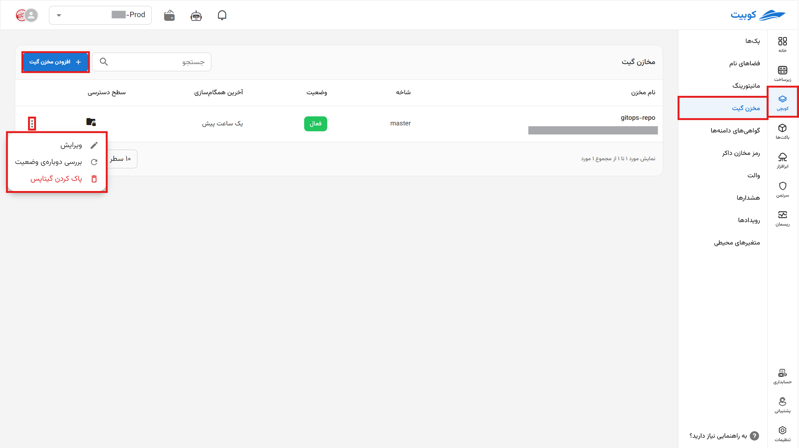

برای استفاده از مخازن خود روی بخش **افزودن مخزن گیت** کلیک کنید.

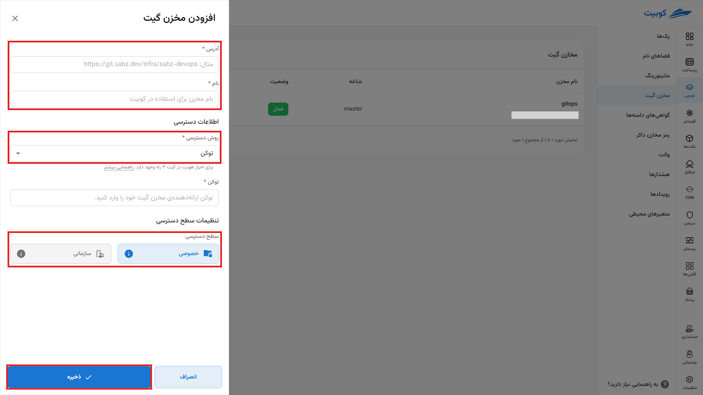

در منوی بازشده آدرس، نام مخرن که در پنل کوبیت نمایش می‌شود و روش دسترسی به مخزن را مشخص کنید.

### روش دسترسی با توکن

#### در گیتلب

- ایجاد یک توکن دسترسی در پروژه گیت
  - در پروژه به بخش `settings > access token` بروید.
  - نام توکن را وارد کنید و دسترسی‌هایی که مدنظر دارید را تیک بزنید و سپس توکن جدید را ایجاد کنید. **حتما این توکن را جایی ذخیره کنید زیرا بعداً دوباره به شما نمایش داده نمی‌شود.**
  - **برای ایجاد دسترسی‌های کامل در کوبیت لازم است که در قسمت «Select scopes» حتماً تیک «api» زده شود. اگر می‌خواهید که کوبیت به طور خودکار توکن را پس از منقضی شدن دوباره بسازد دسترسی rotate را هم فعال کنید.**
  - **در قسمت «Select a role» حتما نقش Maintainer را انتخاب کنید.**

مراحل دریافت توکن:

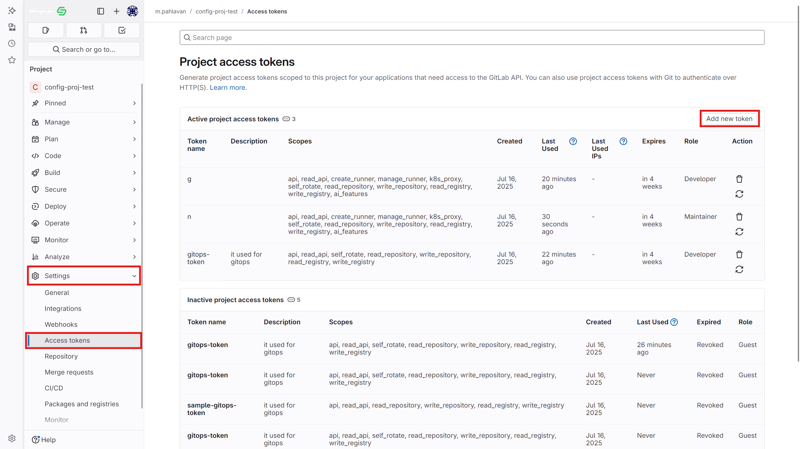
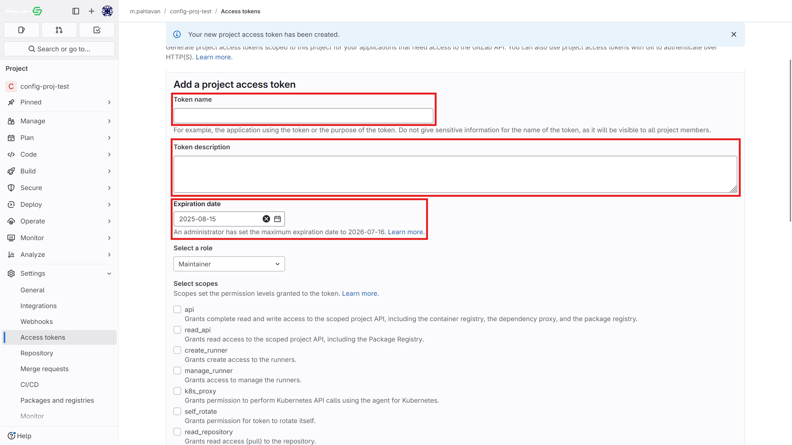
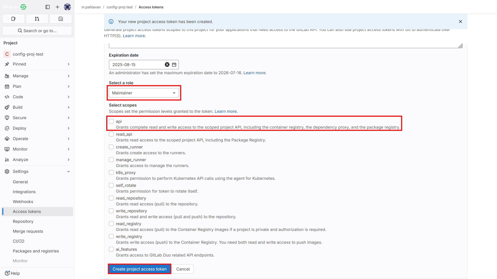
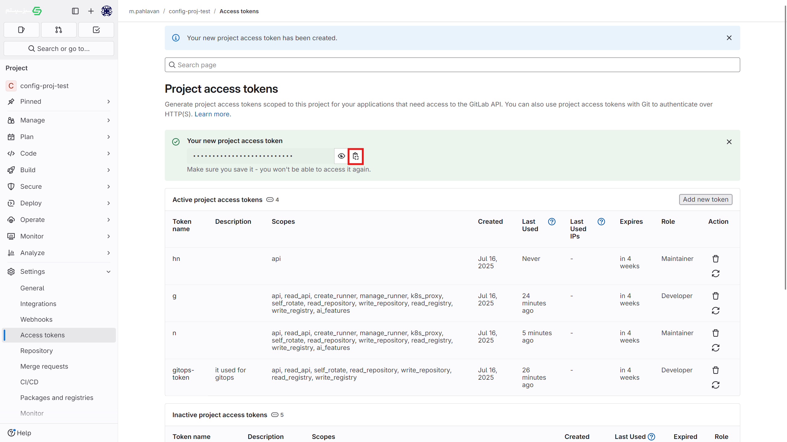

- استفاده از توکن دسترسی کاربر (همانند تصاویر بالا)
  - برای ایجاد توکن کافی است به user settings بروید
  - و از منوی کناری access token را انتخاب کنید.
  - توضیحات مربوط به این توکن همانند توکن دسترسی پروژه است که در بالا شرح آن داده شد. **پیشنهاد می‌شود که برای این کار، یک کاربر جدید در گیت ایجاد کنید و از توکن دسترسی آن کاربر استفاده کنید.**

### استفاده از username و password یک کاربر

#### در گیتلب

- اگر مایلید می توانید از نام کاربری و گذرواژه برای ارتباط با گیت استفاده کنید، **پیشنهاد می‌شود که یک کاربر به همین منظور در گیت ایجاد کنید و از user و password آن استفاده کنید.**

:::info[سطح دسترسی]

در صورتی که سطح دسترسی را سازمانی تنظیم کنید، بقیه اعضای سازمان پروژه‌های دیگر نیز می‌توانند از این مخزن استفاده کنند. اما در صورتی که دسترسی را خصوصی بگذارید، فقط اعضایی که به این پروژه دسترسی دارند می‌توانند از آن استفاده کنند.

:::

مخزن شما به کوبچی افزوده شد. برای فعال‌سازی عملیات‌های gitops مراحل بعدی را ببینید.

:::info[حذف مخزن]

برای حذف مخزن روی سه نقطه کلیک کنید و روی گزینه **پاک کردن گیتاپس** کلیک کنید. اگر گزینه حذف اجباری فعال باشد، در صورتی که حذف گیتاپس به دلیل عدم دسترسی و عدم امکان حذف وب‌هوک‌ها از گیت خطا دهد، بدون تلاش برای حذف، گیتاپس حذف می شود و وب‌هوک‌ها باید به صورت دستی حذف شوند.

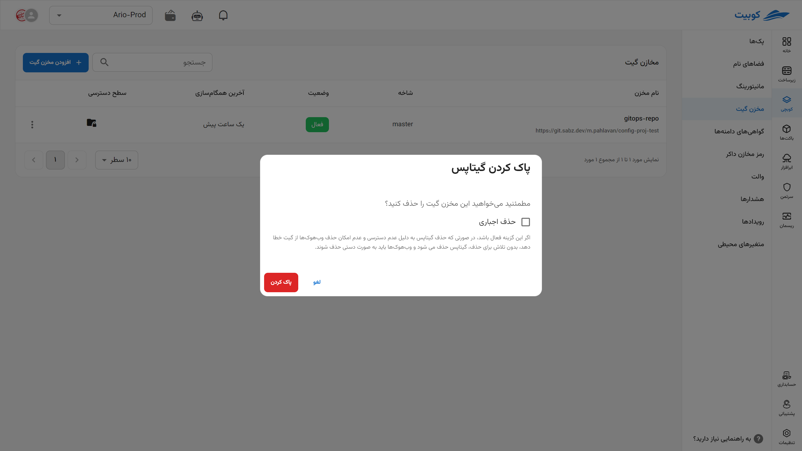

:::

## ذخیره کانفیگ‌ها در مخزن

پس از اینکه مخرن خود را از قسمت **مخزن گیت** در منوی اصلی کوبچی تنظیم کردید، وارد **پک مورد نظر شده** و روی گزینه **گیتاپس** کلیک کنید. حال از مخازنی که در بخش قبلی تنظیم کردید، یک مورد را انتخاب کرده و یک آدرس برای ذخیره فایل کانفیگ و یک نام برای فایل ذخیره‌شده انتخاب کنید. از حالا به بعد فایل‌های کانفیگ به صورت خودکار در این بخش **کامیت** و ذخیره می‌شوند.
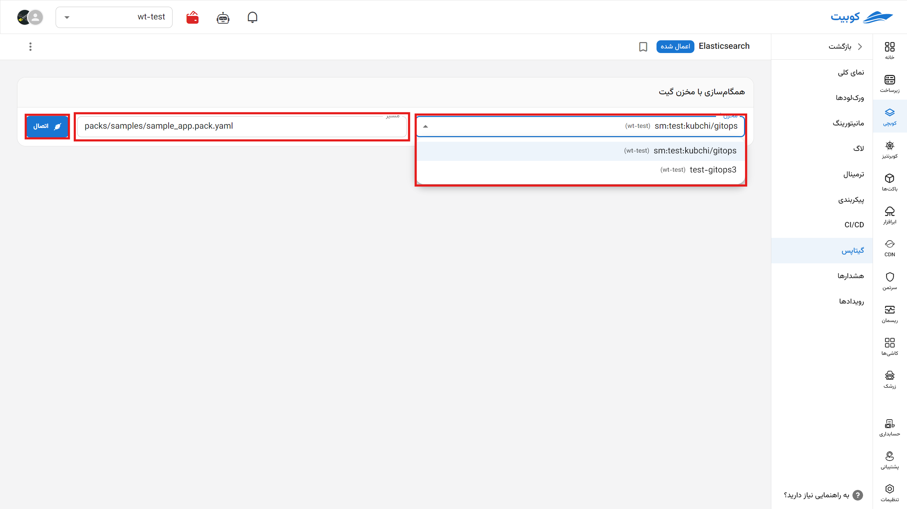

حال که مخزن شما متصل شد، لیست کامیت های کوبچی در این مخزن را به همراه جزئیات آن مشاهده می‌‌کنید. پس از هر تغییر در فایل [کانفیگ](../config) می‌توانید آن را با پیام کامیت خود یا پیام پیشفرض کوبیت کامیت کنید.

عکس کامیت و قطع اتصال

## منوی جزئیات مخزن گیت

با کلیک روی هر مخزنی که در بخش مخزن گیت تنظیم کردید، می‌توانید به تب های زیر دسترسی داشته باشید.

### نمای کلی

در این بخش **لاگ کامیت‌های اخیر**، **عنوان** مخزن در کوبچی، **شاخه** (branch) که کوبچی به آن دسترسی دارد، **روش دسترسی** به مخزن (توکن، نام‌کاربری و رمزعبور)، **سطح دسترسی** پروژه (خصوصی در سطح پروژه، سازمانی، قابل دسترسی در پروژه‌های دیگر)، **آدرس مخزن** را مشاهده می‌کنید و می‌توانید آن‌ها را در صورت لزوم تغییر دهید.

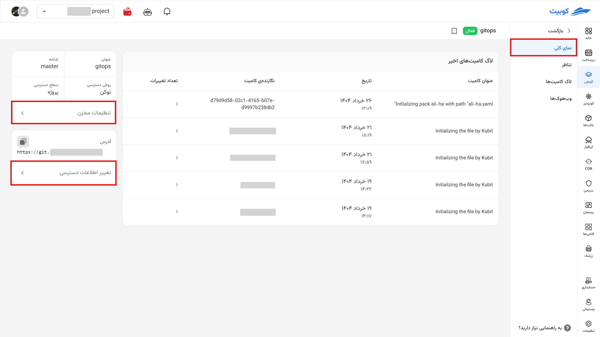
با کلیک روی این گزینه دوباره منویی همانند بخش مخزن گیت را مشاهده می‌کنید.

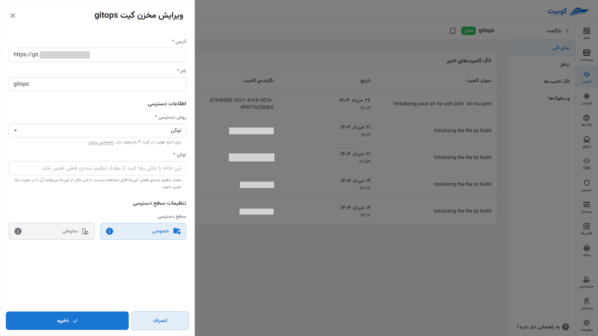

### تناظر (mapping)

این تب به شما امکان می‌دهد تا پک‌ها متصل به مخزن، وضعیت اتصال آن‌ها مسیری که فایل در آن ذخیره می‌شود را ببینید. از این بخش می‌توانید مخازن را قطع و مجدد متصل کنید.

با کلیک روی گزینه ساخت پک کوبیتی از روی فایل کانفیگی که در مخزن تنظیم کرده و موجود دارید یک پک ساخته می‌شود.
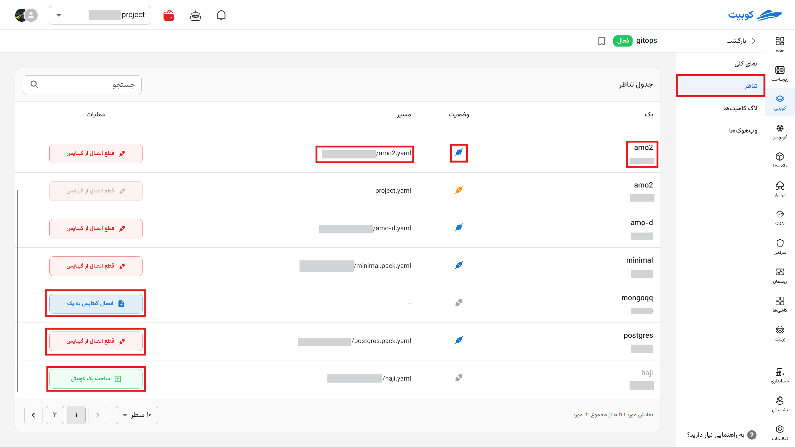

### لاگ کامیت‌ها

لاگ‌های کامیت‌های شما از طریق سیستم کوبچی به طور کامل در این بخش قابل مشاهده است.
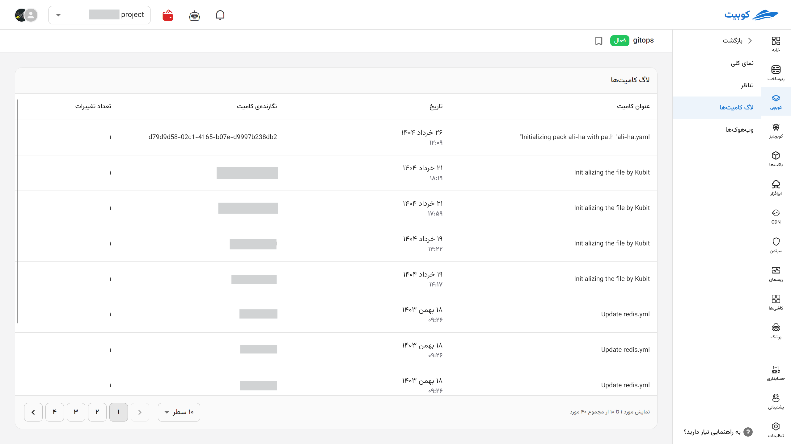

### وب‌هوک‌ها

در این بخش وب‌هوکی که کوبچی در مخزن قرار می‌دهد. مخزن از آن استفاده می‌کند تا **اعلانات** مختلف را به سامانه ارسال کند. کوبچی این اطلاعات استفاده می‌کند و به شما موفقیت آمیز بودن کامیت، برقرار بودن اتصال مخرن با کوبچی و ... را می‌گوید. می‌توانید آن را کپی کنید، یا در صورت وجود مشکل با مورد فعلی، دوباره یک وب‌هوک جدید بسازید. پس از **تاریخ انقضا** وب‌هوک جدیدی ساخته شده و به طور خودکار و در صورت دسترسی داشتن به مخزن در آن تنظیم (set) می‌شود.

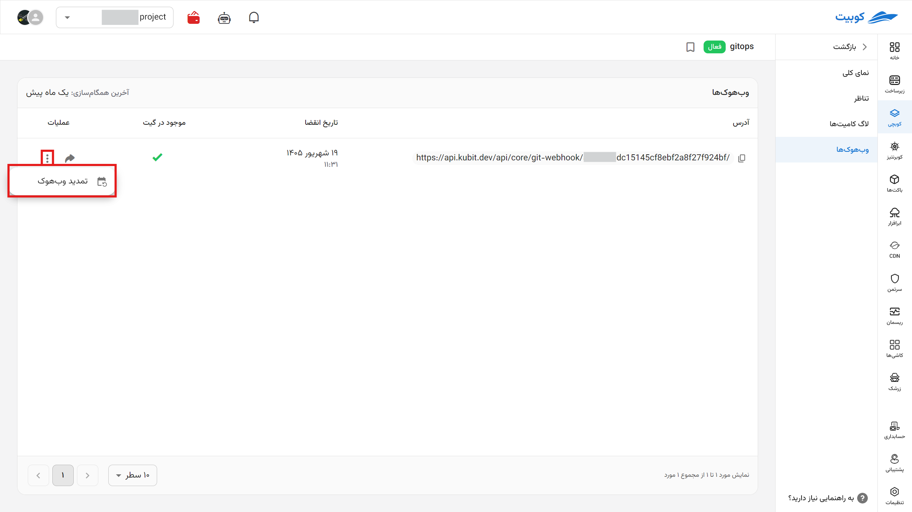
