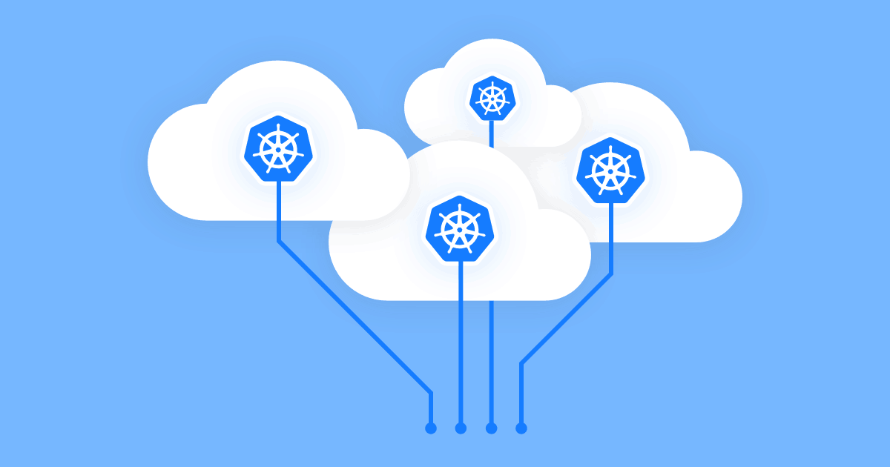

---
subDocuments:
  - concepts
  - charts
  - namespace
  - getting-started
  - config
  - workloads
  - log
  - terminal
  - monitoring
  - alerts
  - events
  - docker
  - gitops
  - CI
  - domains
  - vault
---

# کوبچی (پلتفرم ابری)

**کوبچی** یک پلتفرم ابری (**PaaS**) مبتنی بر **کوبرنتیز (Kubernetes یا K8s)** است که برای پیاده‌سازی اصول **مدیریت چابک** در توسعه نرم‌افزار طراحی شده و با هدف **ساده‌سازی مدیریت زیرساخت‌ها** توسعه یافته است. این سرویس روی کلاسترهای کوبرنتیز قابل نصب و فعالسازی است. **مزایای کوبچی** برای مدیریت پلتفرم‌های مبتنی بر کوبرنتیز شامل:

- **نصب پکیج‌های کانتینری (ایمیج‌های داکر) با فرم آماده بدون نیاز به تنظیمات دستی**
- **مدیریت منابع و اطلاع‌رسانی خودکار هشدارها و رویدادهای سیستم**
- **خودکارسازی CI/CD و GitOps**
- **مدیریت ورک‌لود و پاد از طریق پنل وب و بدون استفاده از ابزارهای ثانویه**
- **اتصال دامنه‌های مختلف به اپلیکیشن‌ها**

و ... .

پس از ایجاد [حساب کاربری](http://localhost:4000/fa/docs/account) خود در وبسایت **کوبیت** و [انتخاب پروژه](http://localhost:4000/fa/docs/organization) مربوطه، در ادامه از راهنمای گام به گام زیرسامانه‌های ارائه شده توسط کوبیت برای این سرویس استفاده کنید.

:::info[مفاهیم پیش‌نیاز]

[مفاهیم پیش‌نیاز](concepts)، معرفی کننده معماری و نحوه کار **پلتفرم کوبچی** است. پیش از شروع کار پیشنهاد می‌شود این بخش را مطالعه کنید.

:::
**دسترسی سریع به زیرسامانه‌های کوبچی:**

**[مدیریت اپلیکیشن‌ها و منابع آنها](getting-started) (Pack Management):** در این زیرسامانه به راحتی می‌توانید پکیج‌های کانتینری را با یک کلیک (one-click platform) نصب کنید

**[فضاهای نام](namespace) (namespace):** در این بخش ورک‌لودهای خود را با استفاده از فضاهای نام بهتر مدیریت کنید

**[پیکربندی](config) (Object Manifest):** تنظیم منابع مختلف و نحوه استفاده از آن‌ها در فضای مدیریت شده کوبرنتیز کوبچی

**[ورک‌لودها](workloads) (workloads):** بررسی وضعیت و مدیریت پادها و ورک‌لودها

**[لاگ‌](log) (log):** مشاهده لاگ پادها و اپلیکیشن‌ها به تفکیک

**[ترمینال](terminal) (terminal):** مدیریت و دسترسی به پادها از طریق ترمینال تحت وب

**[مانیتورینگ](monitoring) (monitoring):** پایش مصرف منابع گوناگون سیستم

**[هشدارها](alerts) (alerts):** هشدارهای خودکار سیستم و اولویت آن‌ها؛ تنظیم شده توسط تیم کوبیت

**[رویدادها](events) (events):** لاگ جزئیات رویدادهای سطح کلاستر

**[رمز مخزن داکر](docker) (docker registry credentials):** اتصال داکر رجیستری خود به پلتفرم کوبچی

**[مخزن گیت](gitops) (GitOps repo):** اتصال مخزن گیت به کوبچی و کنترل تغییرات پیکربندی‌ها با گیتاپس (GitOps)

**[خودکار سازی استقرار](conint) (CI/CD):** از طریق اطلاعات ارائه شده در این بخش، تنظیمات CI/CD را به صورت خودکار تولید کرده و اپلیکیشن‌های مستقرشده (deployed) خود را با آخرین تغییرات همگام نگه دارید

**[گواهی‌های دامنه](domains) (domain certificates):** اتصال خودکار دامنه به پلتفرم برای دریافت و مدیریت گواهی‎‌های SSL/TLS

**[والت](vault) (vault):** یک ابزار برای رمزنگاری خودکار داده‌های حساس به همراه ساخت و نگهداری کلید‌ها برای استفاده در پیکربندی
