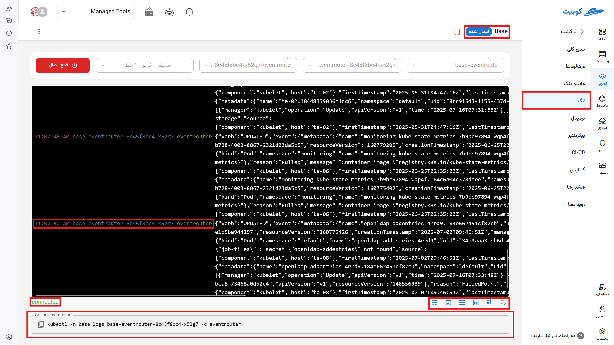

# لاگ

سابقه لاگ‌های هر ورک‌لود در این بخش نمایش می‌شود. این لاگ‌ها همان لاگ‌های خروجی پک‌ها و اپلیکیشن‌ها می‌باشند. با انتخاب ورک‌لود، پاد و کانتینر مدنظر ارسال لاگ آن شروع می‌شود.

لاگ همه‌ی کانتینرهای این پک می‌توانند به‌صورت یک‌جا نمایش داده ‌شوند یا از لیست **ورک‌لود** و **پاد** و **کانتینرها** به‌تفکیک برای نمایش انتخاب شوند. به‌ازای هر کانتینر انتخاب شده می‌توانید لاگ آن را به‌صورت مجزا مشاهده کنید.

با انتخاب گزینه **اتصال** فرستادن لاگ را شروع و با **قطع اتصال** دریافت لاگ متوقف می‌شود.
این صفحه شامل:

- نام پکی که انتخاب کردید به همراه وضعیت آن
- انتخاب نام ورک‌لود یا ورک‌لودهایی که از آن لاگ ارسال می‌شود
- انتخاب نام پاد یا پادها
- انتخاب نام کانتینر یا کانتینرها
- انتخاب تعداد خطوط نمایش شده از لاگ پک:
  - شامل **۱۰ خط، ۱۰۰ خط، ۱۰۰۰ خط** آخر
  - لاگ‌های **۱ دقیقه، ۳۰ دقیقه، ۱ ساعت، ۱۲ ساعت** گذشته

در پایین صفحه:

- وضعیت اتصال
- دستور متنی برای دریافت لاگ‌ها در ترمینال خود با استفاده از `kubctl`
- آیکون های نحوه نمایش به ترتیب از راست به چپ شامل:
  1.  دکمه پاکسازی صفحه
  2.  اسکرول خودکار با دریافت لاگ جدید
  3.  نمایش نام کانیتنر با رنگ زرد
  4.  نمایش نام پاد با رنگ آبی
  5.  نمایش زمان با رنگ قرمز
  6.  شکستن خطوط (رفتن به خط بعدی) پس از چاپ و نمایش تعدادی کاراکتر مشخص بدون انتخاب این گزینه، لاگ در یک خط نمایش می‌شود و نیاز به اسکرول به راست دارید تای آنها را بخوانید.
