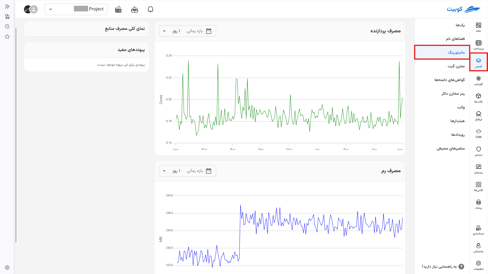

# مانیتورینگ

مشاهده مجموع مقدار منابعی که پروژه شما در سرویس کوبچی مصرف می‌کند. همچنین با کلیک روی هر پک می‌توان مصرف منابع آن پک خاص را مشاهده کرد.

## کلاستر

از صفحه کوبچی در تب مانیتورینگ نمای کلی مصرف منابع [کلاستر](../concepts/#cluster) خود را می‌بینید.

## پک

با ورود به صفحه مدیریت یک پک می‌توانید مصرف منابع آن پک را ببینید. (به تفکیک پاد و ورک‌لود)

جزئیات این صفحه شامل:

## مصرف پردازنده

در این قسمت میزان مصرف پردازنده به صورت mili core نمایش داده می‌شود. (هر mili core یک هزارم هسته پردازشی است و نوع هسته چردازشی توسط زیرساخت شما مشخص خواهد شد.)

## مصرف رم

در این قسمت میزان مصرف رم را به همراه واحد آن در مشخص می‌کنید. (نوع واحدها در پیکربندی قابل تنظیم است)

## نمای کلی مصرف منابع

## پیوندهای مفید

در صورت فعال بودن سرویس‌های مانیتورینگ خارجی (مانند grafana) لینک‌های آن‌ها در این بخش قرار می‌گیرند.
