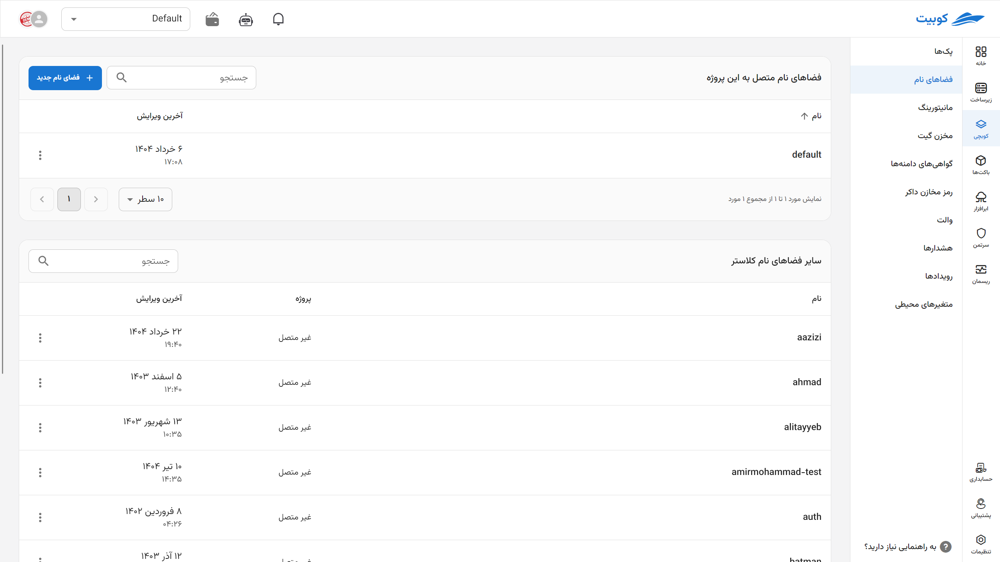

# فضای نام (گام صفر)

برای نصب پک در یک پروژه نیاز به [فضای نام](../concepts#namespace) دارید که به آن پروژه مرتبط باشد و [پک‌ها](../concepts/#pack) ذیل آن‌ تعریف شوند. از این بخش فضای نام دلخواه را انتخاب کنید. فضای نام به صورت خودکار به پروژه متصل می‌شود.

بر روی **فضای نا‌م جدید** کلیک کنید. فضای نام را وارد کرده و روی گزینه **ساخت فضای نام و اتصال به پروژه** کلیک کنید.

**نکته:** همچنین فضاهای نام در هنگام نصب پک‌ها نیز قابل تعریف هستند.

با انتخاب آیکون سه نقطه می‌توانید اتصال فضای نام و پروژه را قطع کنید. پس از این کار دیگر قادر نخواهید بود از این فضاهای نام استفاده کنید.

**توجه** داشته باشید که پک‌های نصب شده همچنان موجود هستند و به صحت کار می‌کنند.

