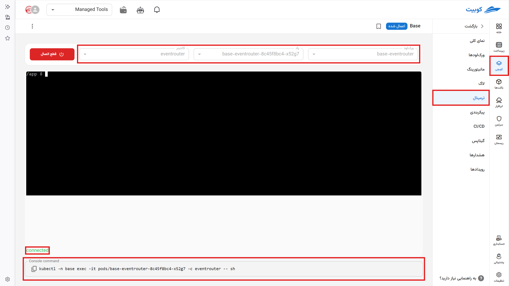

# ترمینال

به کمک این ابزار امکان دریافت ترمینال تعاملی (interactive) تحت وب برای کانتینرهای هر پاد وجود دارد. مثل یک ابزار خط فرمان سیستم کار می‌کند.

به عنوان مثال دستورات مربوط به یک سرور nginx را در این بخش وارد می‌کنید و می‌توان با آن مثل یک اپلیکیشن بومی رفتار کنید.

با انتخاب گزینه **اتصال** فرستادن لاگ را شروع و با **قطع اتصال** دریافت لاگ متوقف می‌شود.

این صفحه شامل:

- نام پکی که انتخاب کردید به همراه وضعیت آن
- انتخاب نام ورک‌لود یا ورک‌لودهایی که از آن لاگ ارسال می‌شود
- انتخاب نام پاد یا پادها
- انتخاب نام کانتینر یا کانتینرها

در پایین صفحه:

- وضعیت اتصال
- دستور متنی برای اتصال از ترمینال خود با استفاده از `kubctl`
