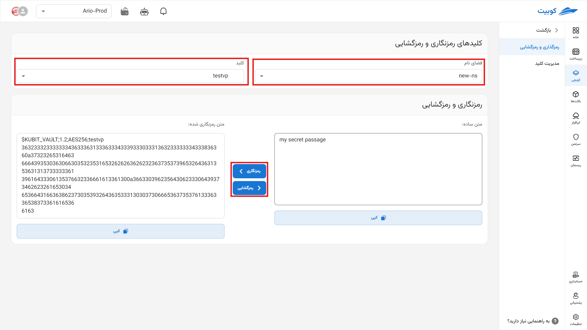
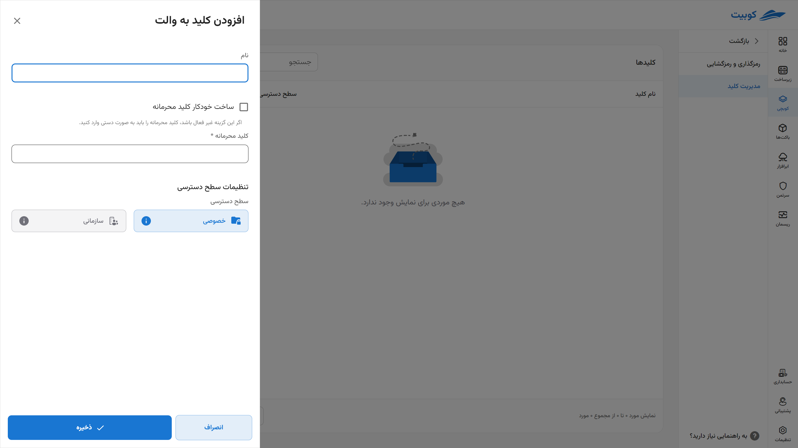

# والت

والت یک رمزنگار خودکار است که بر اساس کلیدهای تولید شده توسط کاربر، داده‌های حساس را رمزنگاری می‌کند.

می‌توانید از این ابزار برای رمز نگاری اطلاعات حساس خود استفاده کرده و برای استفاده مجدد در [پیکربندی](../config) ذخیره سازی کنید. سیستم قابلیت این را دارد که به صورت خودکار از کلید های این بخش استفاده کند.

پس از تنظیم [گیتاپس](../gitops) این بخش معنا پیدا می‌کند.

به عنوان مثال رمز دیتابیس‌های خود را در این بخش تنظیم می‌کنید و در فایل کانفیگِ پک استفاده می‌کنید.

## رمزگذازی و رمزگشایی

در این بخش با انتخاب **فضای‌نام** و **کلید** موجود در آن می‌توانید متن خود را رمزگذاری کرده و یا متن رمزی خود را رمزگشایی کنید. برای استفاده رمز داده شده را کپی کنید و در متغییر مورد نیاز (در بخش [پیکربندی](config)) الحاق کنید.

## مدیریت کلید

از این بخش کلیدهای جدید می‌سازید **نام کلید**، **کلید محرمانه** را وارد کنید یا یک مورد جدید به طور خودکار ایجاد کنید و **سطح دسترسی** (شخصی یا سازمانی) به آن را مشخص می‌کنید را مشخص کنید.

