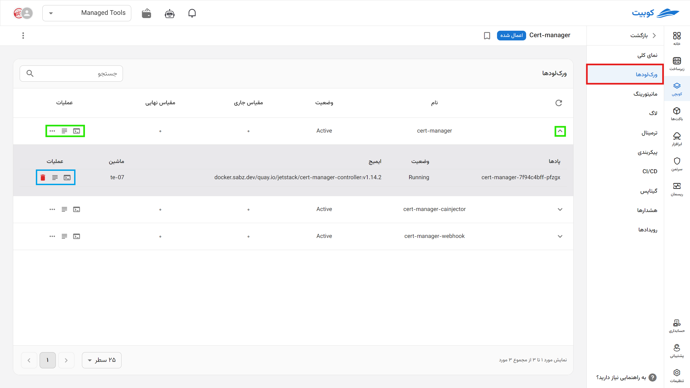
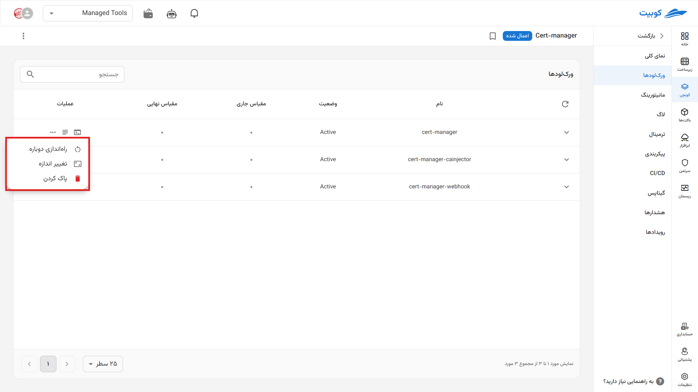

# ورک‌لود

در این بخش هر ورک‌لود و پادهای زیر مجموعه‌اش را می‌بینید.

## ورک‌لود/پاد

**تازه‌سازی اطلاعات ورک‌لودها**

با فشردن دکمه‌ی «تازه‌سازی» در بالای لیست ورک‌لودها اطلاعات نمایش‌ داده‌شده در جدول ورک‌لودها و پادهای زیر مجموعه به‌روزرسانی می‌شود.

با کلیک روی گزینه (▼)، گسترش پیدا کرده و پادهای آن را به همراه آخرین وضعیت آن بررسی کنید.

سایر اطلاعاتی که این بخش از ورک‌لود (workload)/پاد (pod) به شما می‌دهد شامل:

1. **نام**
2. **وضعیت** هر ورک‌لود بر اساس استاندارد کوبرنتیز
3. **مقیاس فعلی**:
   تعداد پادهای (pods) فعال برای هر ورک‌لود:

   مثال:
   فرض کنید ورک‌لود شما شامل پادهای زیر با تعداد `۵ بدل یا رپلیکا (Replica)` از هر کدام باشد:

   - **۲ پاد StatefulSet با `۵ رپلیکا` =>** ۲ \* ۵ = ۱۰ پاد
   - **۱ عدد DaemonSet روی ۳ نودِ ورک‌لود =>** ۳ پاد
   - **۵ پاد Deployment با `۵ رپلیکا` =>** ۵ \* ۵ = ۲۵ پاد

   **مقیاس فعلی: ۳۸ پاد**

4. **مقیاس مورد انتظار (نهایی)**:

   تعداد پادهای تعریف‌شده در **پیکربندی** را مشخص می‌کند. ممکن است که در صورتی که مشکل یا تغییری در پاد پیش نیاید (مثلا با تغییر پیکربندی دوباره از ابتدا ایجاد شوند) با مقیاس فعلی یکسان است.

5. گزینه‌ها از راست به چپ:

   - دسترسی سریع به **ترمینال** آن ورک‌لود/پاد
   - دسرسی سریع به **لاگ‌های** آن ورک‌لود/پاد

   - آیکون سه نقطه ورک‌لود:
     - **راه‌اندازی دوباره ورک‌لود:** با انتخاب عملیات راه‌اندازی در هر سطر از جدول ورک‌لودها،‌آن ورک‌لود با مدیریت کوبرنتیز دوباره راه‌اندازی می‌شود. و نمونه‌های جدید جای نسخه‌ی موجود آن را می‌گیرد.
     - **تغییر اندازه (مقیاس):** تنظیم مقیاس نهایی با مقدار جدید

:::info[پاک کردن ورک‌لود/پاد]

برای پاک کردن ورک‌لود از طریق آیکون **سه نقطه** اقدام کنید و برای پاد **آیکون سطل** روبروی نام هر پاد را بزنید.

:::
