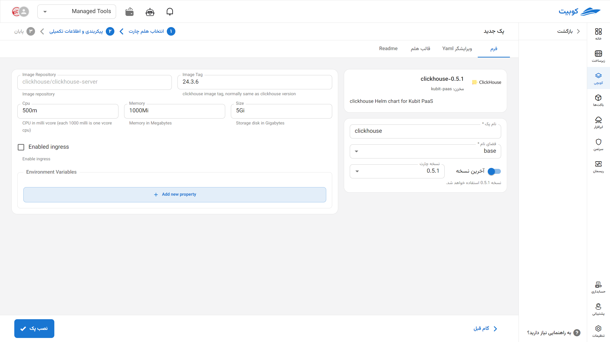
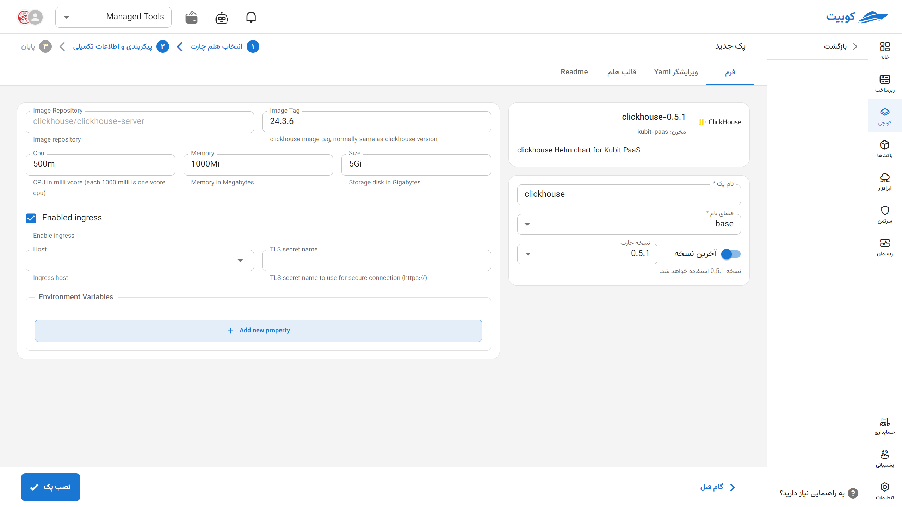

# پایگاه داده ClickHouse

ClickHouse یک پایگاه داده ستونی بسیار سریع و مقیاس‌پذیر است که برای پردازش بلادرنگ حجم بالایی از داده‌های تحلیلی طراحی شده است. این سیستم به‌صورت توزیع‌شده عمل می‌کند و به‌طور خاص برای سناریوهایی مانند تحلیل داده‌های لاگ، سیستم‌های BI، داشبوردهای مانیتورینگ و گزارش‌گیری‌های پیچیده کاربرد دارد. ClickHouse با ذخیره‌سازی ستونی و فشرده‌سازی پیشرفته، امکان اجرای کوئری‌های تحلیلی سنگین را با عملکرد بسیار بالا فراهم می‌کند.

## نصب از طریق فرم کوبچی

پس از انتخاب [`کوبچی > پک‌‌ها > نصب پک`](../../kubchi/getting-started) پک ClickHouse را انتخاب می‌کنیم.

## شیوه نصب و گزینه‌های پک

فرم نصب ClickHouse همانند [دیگر پک‌‌ها](../../kubchi/getting-started) می‌باشد.

### گزینه‌های اختصاصی پک

می‌توانید برای این پک، تنظیمات ingress را فعاخود (می‌توان از گواهی خارج کوبیت هم استفاده کرد)نید تا از طریق دامنه‌هایی که [ثبت کردید](../../kubchi/domains) به پک خود دسترسی داشته باشید.

- در بخش host از بین دامنه‌های ثبت شده خود (می‌توان از گواهی خارج کوبیت هم استفاده کرد) (می‌توان از دامنه‌ی خارج کوبیت هم استفاده کرد) انتخاب کنید
- در بخش tls، از بین گواهی‌های ثبت شده خود (می‌توان از گواهی خارج کوبیت هم استفاده کرد) یک TLS/SSL معتبر انتخاب کنید

**پیکربندی دیگر:**

- Environments: با کلیک روی بخش add new property می‌توان متغییرهای محیطی مورد نیاز برنامه را تنظیم کنید.

