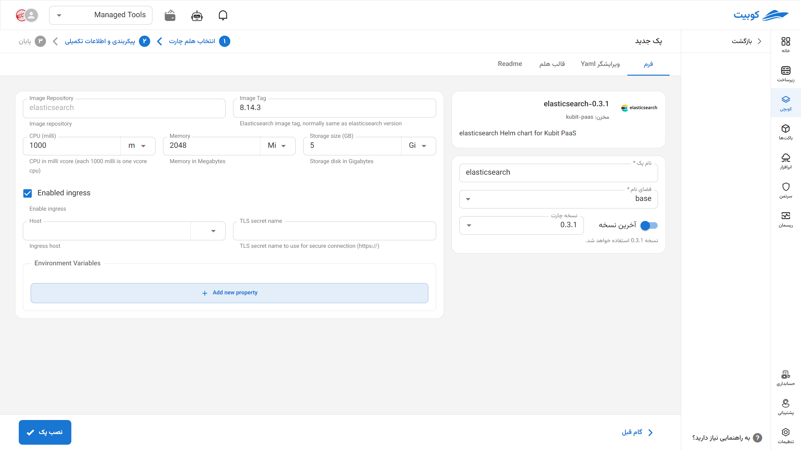

# پایگاه داده ElasticSearch

Elasticsearch یک موتور جستجو و تحلیل توزیع‌شده متن‌باز است که بر پایه‌ی Lucene ساخته شده و برای جستجوی سریع و ذخیره‌سازی داده‌های ساخت‌یافته و غیرساخت‌یافته استفاده می‌شود. این پلتفرم به‌صورت گسترده در سیستم‌های مانیتورینگ، تحلیل لاگ، جستجوی متنی و پیاده‌سازی راهکارهای SIEM به کار می‌رود. با پشتیبانی از جستجوهای Full-Text، فیلترهای پیچیده، فیلدهای تحلیلی و قابلیت مقیاس‌پذیری افقی، Elasticsearch به یکی از اجزای کلیدی در اکوسیستم‌هایی مانند ELK (Elasticsearch, Logstash, Kibana) تبدیل شده است.

## نصب از طریق فرم کوبچی

پس از انتخاب [`کوبچی > پک‌‌ها > نصب پک`](../../kubchi/getting-started) پک ElasticSearch را انتخاب می‌کنیم.

فرم نصب ElasticSearch همانند [دیگر پک‌‌ها](../../kubchi/getting-started) می‌باشد.

می‌توانید برای این پک، تنظیمات ingress را فعال کنید تا از طریق دامنه‌هایی که [ثبت کردید](../../kubchi/domains) به پک خود دسترسی داشته باشید.

- در بخش host از بین دامنه‌های ثبت شده خود (می‌توان از دامنه‌ی خارج کوبیت هم استفاده کرد) انتخاب کنید
- در بخش tls، از بین گواهی‌های ثبت شده خود (می‌توان از گواهی خارج کوبیت هم استفاده کرد) یک TLS/SSL معتبر انتخاب کنید

**پیکربندی دیگر:**

- Environments: با کلیک روی بخش add new property می‌توان متغییرهای محیطی مورد نیاز برنامه را تنظیم کنید.

