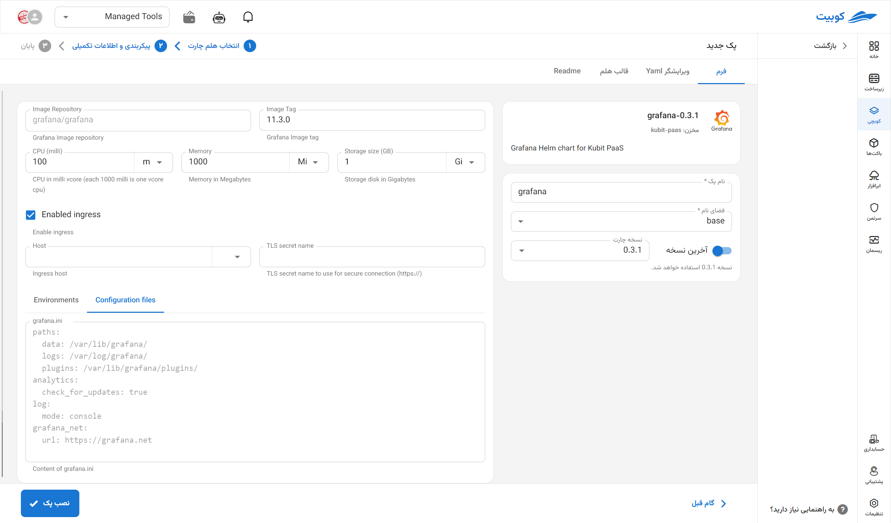

# ابزار Grafana

Grafana یک پلتفرم متن‌باز برای مصورسازی، تحلیل و مانیتورینگ داده‌های سری زمانی (time-series) است که با ابزارهای متنوعی مانند Prometheus، InfluxDB، Elasticsearch، Loki و بسیاری دیگر یکپارچه می‌شود. این ابزار امکان ساخت داشبوردهای تعاملی و قابل تنظیم را فراهم می‌کند که برای نظارت بر عملکرد سیستم‌ها، زیرساخت‌ها، اپلیکیشن‌ها و سرویس‌های مختلف در محیط‌های DevOps، SRE و Cloud بسیار کاربردی است. Grafana از هشداردهی (alerting) پیشرفته، اشتراک‌گذاری داشبورد و احراز هویت چندگانه نیز پشتیبانی می‌کند و به‌عنوان یک جزء حیاتی در معماری مانیتورینگ مدرن شناخته می‌شود.

## نصب از طریق فرم کوبچی

پس از انتخاب [`کوبچی > پک‌‌ها > نصب پک`](../../kubchi/getting-started) پک Grafana را انتخاب می‌کنیم.

بخش عمومی نصب فرم Grafana مانند [دیگر پک‌‌ها](../../kubchi/getting-started) می‌باشد.

## گزینه‌‌های اختصاصی پک

می‌توانید برای این پک، تنظیمات ingress را فعال کنید تا از طریق دامنه‌هایی که [ثبت کردید](../../kubchi/domains) به پک خود دسترسی داشته باشید.

- در بخش host از بین دامنه‌های ثبت شده خود (می‌توان از دامنه‌ی خارج کوبیت هم استفاده کرد) انتخاب کنید
- در بخش tls، از بین گواهی‌های ثبت شده خود (می‌توان از گواهی خارج کوبیت هم استفاده کرد) یک TLS/SSL معتبر انتخاب کنید

**پیکربندی‌‌‌‌‌‌‌‌های دیگر شامل:**

- Configuration File: فایل پیکربندی مخصوص پک خود را در این بخش وارد کنید. نمونه فایل در این بخش آمده است.
- Environments: با کلیک روی بخش add new property می‌توان متغییرهای محیطی مورد نیاز برنامه را تنظیم کنید.

