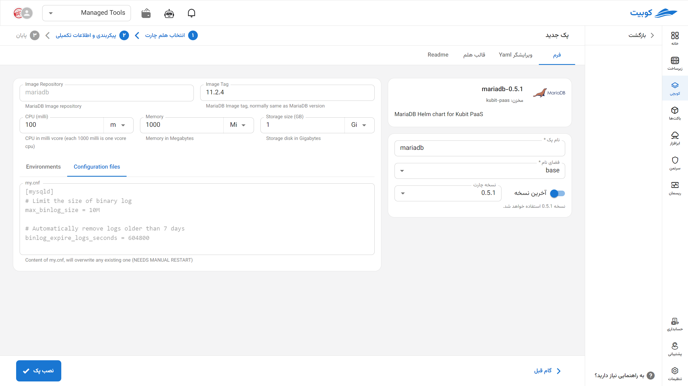

# پایگاه داده MariaDB

MariaDB یک سیستم مدیریت پایگاه داده رابطه‌ای (RDBMS) متن‌باز و قدرتمند است که به‌عنوان انشعابی از MySQL توسعه یافته و به‌مرور به یکی از جایگزین‌های اصلی آن تبدیل شده است. این پایگاه داده سازگاری بالایی با MySQL دارد اما در عین حال ویژگی‌هایی مانند موتورهای ذخیره‌سازی پیشرفته (از جمله Aria و ColumnStore)، بهینه‌سازی عملکرد، و پشتیبانی بهتر از معماری توزیع‌شده را ارائه می‌دهد. MariaDB در پروژه‌هایی با نیاز به قابلیت اطمینان، مقیاس‌پذیری و امنیت بالا به‌خوبی عمل می‌کند و توسط جامعه‌ای فعال از توسعه‌دهندگان و سازمان‌ها پشتیبانی می‌شود.

## نصب از طریق فرم کوبچی

پس از انتخاب [`کوبچی > پک‌‌ها > نصب پک`](../../kubchi/getting-started) پک MariaDB را انتخاب می‌کنیم.

بخش عمومی نصب فرم مانند [دیگر پک‌‌ها](../../kubchi/getting-started) می‌باشد.

## گزینه‌‌های اختصاصی پک

**پیکربندی‌‌‌‌‌‌‌‌ها شامل:**

- Configuration File: فایل پیکربندی مخصوص پک خود را در این بخش وارد کنید. نمونه فایل در این بخش آمده است.
- Environments: با کلیک روی بخش add new property می‌توان متغییرهای محیطی مورد نیاز برنامه را تنظیم کنید.
  
