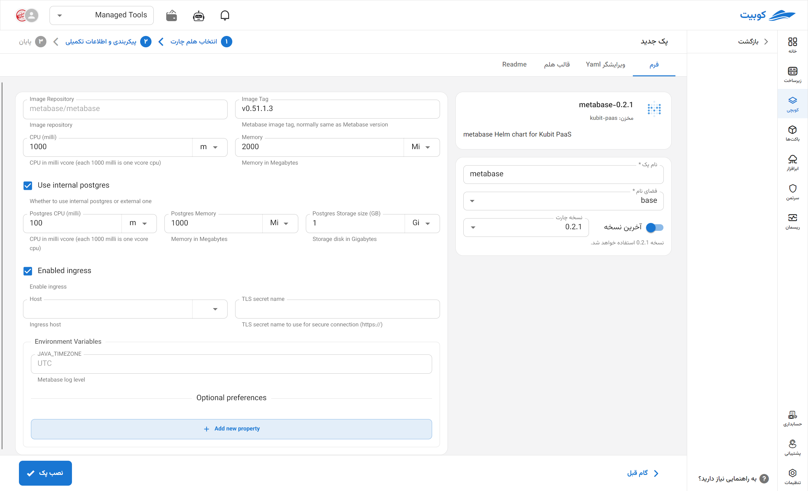

# ابزار Metabase

Metabase یک ابزار متن‌باز و ساده برای هوش تجاری (BI) است که به کاربران فنی و غیرفنی اجازه می‌دهد بدون نیاز به نوشتن کد، داده‌ها را تحلیل و مصورسازی کنند. این پلتفرم با اتصال مستقیم به پایگاه‌های داده مختلف (مانند PostgreSQL، MySQL، MongoDB و غیره) امکان ساخت سریع داشبوردها، نمودارها و گزارش‌های سفارشی را فراهم می‌سازد. رابط کاربری کاربرپسند، پشتیبانی از پرس‌وجوهای خودکار، و قابلیت زمان‌بندی ارسال گزارش از جمله ویژگی‌هایی هستند که Metabase را به گزینه‌ای مناسب برای تحلیل داده‌ها در تیم‌های محصول، بازاریابی، و عملیات تبدیل کرده‌اند.

## شیوه نصب و گزینه‌های پک

پس از انتخاب [`کوبچی > پک‌‌ها > نصب پک`](../../kubchi/getting-started) پک Metabase را انتخاب می‌کنیم.

فرم نصب عمومی Metabase همانند [دیگر پک‌‌ها](../../kubchi/getting-started) می‌باشد.

### گزینه‌های اختصاصی پک

می‌توانید برای این پک، تنظیمات ingress را فعال کنید تا از طریق دامنه‌هایی که [ثبت کردید](../../kubchi/domains) به پک خود دسترسی داشته باشید.

- در بخش host از بین دامنه‌های ثبت شده خود (می‌توان از دامنه‌ی خارج کوبیت هم استفاده کرد) انتخاب کنید
- در بخش tls، از بین گواهی‌های ثبت شده خود (می‌توان از گواهی خارج کوبیت هم استفاده کرد) یک TLS/SSL معتبر انتخاب کنید

**پیکربندی‌‌‌‌‌‌‌‌ دیگر:**

- Environment: با کلیک روی بخش add new property می‌توان متغییرهای محیطی مورد نیاز برنامه را تنظیم کنید.

